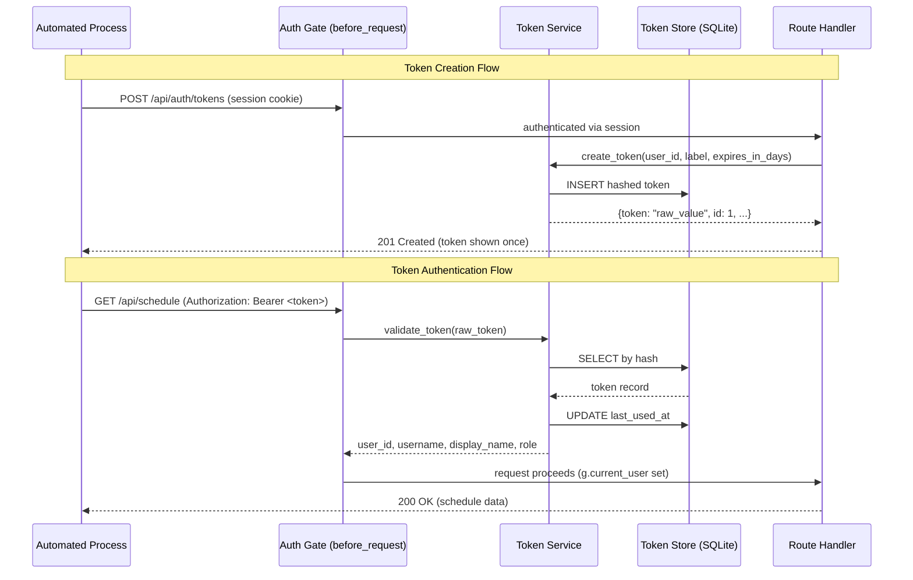
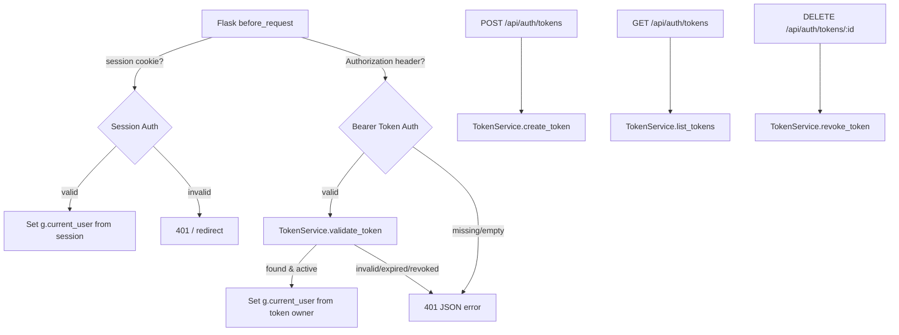

# Design Document: API Token Authentication

## Overview

This design adds long-lived API token authentication to DC ShiftMaster Pro. The feature enables automated processes (cron jobs, CI pipelines, background scripts) to authenticate against the REST API using bearer tokens instead of interactive session-based login.

The implementation integrates into the existing Flask application by:
1. Adding a new `api_tokens` table to the SQLite database
2. Extending the `before_request` auth gate to accept `Authorization: Bearer <token>` headers
3. Providing CRUD endpoints for token lifecycle management (create, list, revoke)
4. Storing only hashed token values and enforcing per-user token limits

Key design decisions:
- **Hash-only storage**: Tokens are hashed with SHA-256 before storage; plaintext is shown once at creation time only.
- **Session cookie precedence**: When both session cookie and bearer token are present, the session cookie wins to avoid ambiguity for browser-based users.
- **Per-user rate limiting on creation**: Token creation is rate-limited per user (5/minute) to prevent abuse.
- **Timing-safe comparison**: Token validation uses `hmac.compare_digest` to prevent timing side-channel attacks.

## Architecture



### Component Interaction



## Components and Interfaces

### 1. Token Service (`dc_shiftmaster_html/token_service.py`)

A stateless service class that encapsulates all token business logic.

```python
class TokenService:
    """Handles token generation, validation, and lifecycle management."""

    def __init__(self, db: DatabaseManager):
        self.db = db

    def create_token(self, user_id: int, label: str, expires_in_days: int | None = None) -> dict:
        """Generate a new API token for the user.

        Returns dict with: id, token (plaintext, shown once), label, created_at, expires_at
        Raises ValueError for invalid label, limit reached, etc.
        """

    def validate_token(self, raw_token: str) -> User | None:
        """Validate a bearer token and return the owning User, or None.

        Uses timing-safe hash comparison. Updates last_used_at on success.
        Returns None for invalid, expired, or revoked tokens.
        """

    def list_tokens(self, user_id: int) -> list[dict]:
        """Return metadata for all tokens owned by the user (no secrets).

        Sorted by created_at descending, capped at 100 records.
        """

    def revoke_token(self, user_id: int, token_id: int) -> None:
        """Mark a token as revoked.

        Raises ValueError if token not found.
        Raises PermissionError if user doesn't own the token.
        """

    def count_active_tokens(self, user_id: int) -> int:
        """Return the number of active (non-revoked, non-expired) tokens for user."""

    @staticmethod
    def hash_token(raw_token: str) -> str:
        """Compute SHA-256 hex digest of raw token for storage/lookup."""

    @staticmethod
    def generate_token() -> str:
        """Generate a cryptographically random token (32 bytes, hex-encoded = 64 chars)."""
```

### 2. Token Routes Blueprint (`dc_shiftmaster_html/routes_tokens.py`)

A Flask Blueprint registering the token management endpoints.

| Method | Path | Auth | Description |
|--------|------|------|-------------|
| POST | `/api/auth/tokens` | Session required | Create a new token |
| GET | `/api/auth/tokens` | Session required | List user's tokens |
| DELETE | `/api/auth/tokens/<token_id>` | Session required | Revoke a token |

```python
tokens_bp = Blueprint("tokens", __name__, url_prefix="/api/auth/tokens")

@tokens_bp.route("", methods=["POST"])
@limiter.limit("5/minute", key_func=lambda: session.get("user_id"))
def create_token():
    """Create a new API token. Rate limited: 5 per minute per user."""

@tokens_bp.route("", methods=["GET"])
def list_tokens():
    """List all tokens for the authenticated user."""

@tokens_bp.route("/<int:token_id>", methods=["DELETE"])
def revoke_token(token_id: int):
    """Revoke a specific token by ID."""
```

### 3. Auth Gate Enhancement (`server.py` → `require_login`)

The existing `before_request` hook is extended to:
1. Check session cookie first (existing behavior, takes precedence)
2. If no session, check for `Authorization: Bearer <token>` header
3. On valid token, set `g.current_user` with the token owner's identity
4. On invalid token, return 401 JSON with specific error reason

### 4. Database Extensions (`dc_shiftmaster/database.py`)

New methods added to `DatabaseManager`:

```python
# Token CRUD
def create_api_token(self, user_id: int, token_hash: str, label: str,
                     expires_at: str | None = None) -> int:
    """Insert a token record, return the new row ID."""

def get_api_token_by_hash(self, token_hash: str) -> dict | None:
    """Look up a token record by its hash. Returns dict or None."""

def get_api_tokens_for_user(self, user_id: int) -> list[dict]:
    """Return all token records for a user, sorted by created_at DESC, max 100."""

def revoke_api_token(self, token_id: int) -> None:
    """Set revoked=1 on the given token."""

def update_token_last_used(self, token_id: int) -> None:
    """Update last_used_at to current UTC time."""

def count_active_api_tokens(self, user_id: int) -> int:
    """Count tokens where revoked=0 AND (expires_at IS NULL OR expires_at > now)."""
```

## Data Models

### `api_tokens` Table Schema

```sql
CREATE TABLE IF NOT EXISTS api_tokens (
    id            INTEGER PRIMARY KEY AUTOINCREMENT,
    user_id       INTEGER NOT NULL REFERENCES users(id) ON DELETE CASCADE,
    token_hash    TEXT NOT NULL UNIQUE,
    label         TEXT NOT NULL CHECK(length(label) <= 128),
    created_at    TEXT NOT NULL DEFAULT (datetime('now')),
    expires_at    TEXT,
    revoked       INTEGER NOT NULL DEFAULT 0,
    last_used_at  TEXT
);

CREATE INDEX IF NOT EXISTS idx_api_tokens_hash ON api_tokens(token_hash);
CREATE INDEX IF NOT EXISTS idx_api_tokens_user_id ON api_tokens(user_id);
```

### `ApiToken` Dataclass

```python
@dataclass
class ApiToken:
    """An API token record (never contains plaintext token value)."""
    id: int
    user_id: int
    token_hash: str
    label: str
    created_at: str
    expires_at: str | None
    revoked: bool
    last_used_at: str | None
```

### Token Creation Response

```json
{
  "id": 1,
  "token": "a1b2c3d4...64_hex_chars",
  "label": "CI Pipeline",
  "created_at": "2025-01-15T10:30:00Z",
  "expires_at": "2025-04-15T10:30:00Z"
}
```

### Token Listing Response

```json
{
  "data": [
    {
      "id": 1,
      "label": "CI Pipeline",
      "created_at": "2025-01-15T10:30:00Z",
      "expires_at": "2025-04-15T10:30:00Z",
      "revoked": false,
      "last_used_at": "2025-01-20T08:15:22Z"
    }
  ],
  "meta": {
    "total": 1
  }
}
```

### Error Response Format

```json
{
  "error": "machine-readable reason string"
}
```

## Correctness Properties

*A property is a characteristic or behavior that should hold true across all valid executions of a system — essentially, a formal statement about what the system should do. Properties serve as the bridge between human-readable specifications and machine-verifiable correctness guarantees.*

### Property 1: Token generation produces unique, correctly-sized tokens

*For any* number of token generations, each generated token SHALL be exactly 64 hexadecimal characters (32 bytes) and all generated tokens SHALL be distinct from each other.

**Validates: Requirements 1.1, 1.2, 5.6**

### Property 2: Token hash storage round-trip

*For any* created token, the value stored in the database (`token_hash` column) SHALL equal `SHA-256(plaintext_token)` and SHALL NOT equal the plaintext token itself. Furthermore, calling `validate_token(plaintext_token)` SHALL locate the correct record by computing the same hash.

**Validates: Requirements 1.3, 5.1**

### Property 3: Invalid labels are rejected

*For any* string that is empty, composed entirely of whitespace characters, or longer than 128 characters, attempting to create a token with that string as the label SHALL be rejected with a 400 status code and the token count SHALL remain unchanged.

**Validates: Requirements 1.4**

### Property 4: Expiration duration produces correct expiry timestamp

*For any* integer N in [1, 365], creating a token with `expires_in_days=N` SHALL produce an `expires_at` timestamp that is exactly N days after `created_at`. For any value outside [1, 365] (zero, negative, >365, or non-integer), creation SHALL be rejected.

**Validates: Requirements 1.5**

### Property 5: Valid token authenticates as the token owner

*For any* user and *any* valid (non-revoked, non-expired) token they own, presenting that token in the `Authorization: Bearer <token>` header SHALL authenticate the request as that user, with the correct user_id, username, and display_name available to downstream handlers.

**Validates: Requirements 2.1, 2.5**

### Property 6: Revocation invalidates authentication

*For any* token that has been created and then revoked, subsequent attempts to authenticate with that token SHALL be rejected with a 401 status code indicating revocation.

**Validates: Requirements 2.3, 4.1, 4.4**

### Property 7: Expired tokens are rejected

*For any* token whose `expires_at` timestamp is in the past, attempting to authenticate with that token SHALL be rejected with a 401 status code indicating expiration.

**Validates: Requirements 2.4**

### Property 8: Token listing excludes secrets and maintains sort order

*For any* user with one or more tokens, the listing response SHALL contain no `token` or `token_hash` fields in any record, and the records SHALL be sorted by `created_at` in descending order (newest first).

**Validates: Requirements 3.1, 3.2**

### Property 9: Ownership enforcement on revocation

*For any* two distinct users A and B, if user A owns a token, user B's attempt to revoke that token SHALL be rejected with a 403 status code, and the token SHALL remain active.

**Validates: Requirements 4.2**

### Property 10: Bearer scheme is case-insensitive and non-bearer schemes are rejected

*For any* case variation of the string "Bearer" (e.g., "bearer", "BEARER", "BeArEr"), the auth gate SHALL accept it as a valid scheme. *For any* string that is not a case-insensitive match for "Bearer", the auth gate SHALL reject the request with 401 indicating an unsupported scheme.

**Validates: Requirements 7.1, 7.2**

## Error Handling

### HTTP Error Responses

All error responses use a consistent JSON format:

| Status Code | Scenario | Error Message Pattern |
|-------------|----------|----------------------|
| 400 | Invalid label | `"Label must be between 1 and 128 non-whitespace-only characters"` |
| 400 | Invalid expiration | `"Expiration must be an integer between 1 and 365 days"` |
| 400 | Token limit reached | `"Maximum of 10 active tokens reached"` |
| 400 | Invalid token ID format | `"Token ID must be a valid integer"` |
| 401 | Missing authentication | `"Not authenticated"` |
| 401 | Invalid/unrecognized token | `"Invalid API token"` |
| 401 | Revoked token | `"Token has been revoked"` |
| 401 | Expired token | `"Token has expired"` |
| 401 | Empty bearer value | `"Bearer token value is missing"` |
| 401 | Unsupported auth scheme | `"Authentication scheme not supported"` |
| 403 | Not token owner | `"You do not own this token"` |
| 404 | Token not found | `"Token not found"` |
| 429 | Rate limit exceeded | `"Rate limit exceeded. Try again in {N} seconds"` |

### Internal Error Handling

- **Database errors** during token operations are caught and returned as 500 with a generic error message (no internal details leaked).
- **Hash collision** (astronomically unlikely with SHA-256): If a UNIQUE constraint violation occurs on `token_hash`, the service retries token generation once before returning 500.
- **Concurrent revocation**: If two revoke requests arrive simultaneously for the same token, the second sees the token already revoked and returns 204 idempotently.

### Validation Order

Token creation validates in this order (first failure wins):
1. Authentication check (401 if not authenticated)
2. JSON body parsing (400 if not valid JSON)
3. Label validation (400 if invalid)
4. Expiration validation (400 if invalid)
5. Active token count (400 if at limit)
6. Token generation and storage

## Testing Strategy

### Property-Based Testing (Hypothesis)

This feature is well-suited for property-based testing because:
- Token generation/validation involves pure functions with clear input/output behavior
- Universal properties (hash correctness, format invariants, auth behavior) hold across a wide input space
- Input variation (labels, token values, user combinations) reveals edge cases

**Library**: [Hypothesis](https://hypothesis.readthedocs.io/) for Python
**Configuration**: Minimum 100 examples per property test (`@settings(max_examples=100)`)
**Tag format**: `# Feature: api-token-auth, Property {N}: {title}`

Each correctness property maps to a single Hypothesis test:

| Property | Test Description |
|----------|-----------------|
| 1 | Generate N tokens, assert all are 64 hex chars and unique |
| 2 | Create token, read DB row, assert hash matches SHA-256(plaintext) |
| 3 | Generate invalid labels (whitespace, >128 chars), assert 400 |
| 4 | Generate N in [1,365], assert expires_at = created_at + N days |
| 5 | Create user+token, send request with token, assert correct identity |
| 6 | Create+revoke token, attempt auth, assert 401 + revocation message |
| 7 | Create token with past expiry, attempt auth, assert 401 + expired |
| 8 | Create multiple tokens, list them, assert no secrets + sorted desc |
| 9 | Create two users, create token for user A, revoke as user B → 403 |
| 10 | Generate random case variations of "bearer" → accepted; random other schemes → rejected |

### Unit Tests (pytest)

Focused example-based tests for:
- Token creation with no expiration returns `expires_at: null` (Req 1.6)
- User with no tokens gets empty list with 200 (Req 3.3)
- Revoking non-existent token ID returns 404 (Req 4.3)
- Unauthenticated revocation attempt returns 401 (Req 4.5)
- Session cookie takes precedence over bearer token (Req 7.3)
- Database migration creates table idempotently (Req 6.3)
- CASCADE delete removes tokens when user is deleted (Req 6.4)

### Integration Tests

- Rate limiting: 6 rapid token creations → 6th returns 429 (Req 5.5)
- Database schema: verify table, indexes, and constraints exist (Req 6.1, 6.2, 6.5, 6.6)
- End-to-end: create token → use token → revoke → use again → rejected

### Test Infrastructure

- Tests use the existing `conftest.py` Flask test client with `TESTING=True`
- A test fixture creates an authenticated user session for token management tests
- A separate fixture provides a raw (unauthenticated) client for bearer token tests
- Database is in-memory (`:memory:`) for test isolation

