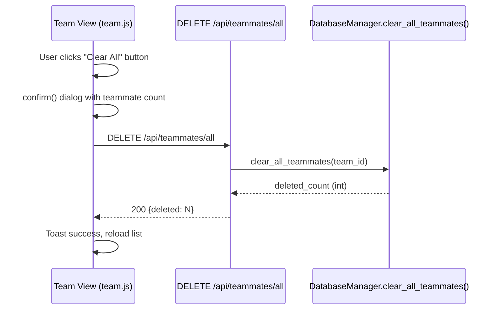

# Design Document: Clear All Teammates

## Overview

This feature adds a bulk-delete capability to remove all teammates from a team's roster in one operation. The flow is simple: a new `clear_all_teammates()` method on `DatabaseManager` executes a single scoped DELETE, a new `DELETE /api/teammates/all` route on the teammates blueprint exposes it over HTTP, and a "Clear All" button on the Team Management page triggers it with a confirmation dialog.

The feature follows the same multi-team scoping pattern already established across the codebase — when `team_id` is present in the request context (via `g.team_id`), the operation is scoped; otherwise it falls back to legacy unscoped behavior.

## Architecture



The architecture is a straight pass-through — no intermediate services, no async processing, no external dependencies. Each layer has exactly one responsibility:

| Layer | Responsibility |
|-------|---------------|
| `DatabaseManager.clear_all_teammates(team_id)` | Execute scoped `DELETE FROM teammates` in a single transaction, return row count |
| `DELETE /api/teammates/all` route | Extract team context, call DB method, return JSON |
| Frontend "Clear All" button | Gate with confirmation, call API, show feedback |

## Components and Interfaces

### Backend: DatabaseManager Method

```python
def clear_all_teammates(self, team_id: int = None) -> int:
    """Delete all teammate records, optionally scoped to a team.

    Args:
        team_id: If provided, only deletes teammates for this team.
                 If None, deletes ALL teammate records (legacy behavior).

    Returns:
        Number of rows deleted.
    """
```

This follows the exact same `team_id: int = None` pattern used by `get_teammates()`, `add_teammate()`, and `delete_teammate()`.

### Backend: API Route

Added to `dc_shiftmaster_html/routes_teammates.py`:

```python
@teammates_bp.route("/api/teammates/all", methods=["DELETE"])
def clear_all_teammates():
    """Delete all teammates for the current team. Returns deleted count."""
```

**Route ordering note:** This route MUST be registered before the `<int:tid>` routes to avoid Flask matching "all" as a path parameter.

**Response format:**
- Success: `200 {"deleted": <count>}`
- Error: `500 {"error": "<message>"}`

### Frontend: API Helper

Add to `api.js`:

```javascript
clearAllTeammates: function() {
    return fetch('/api/teammates/all', { method: 'DELETE' })
        .then(function(res) { return res.json(); });
}
```

### Frontend: Button and Confirmation

In `team.js`, add a "Clear All" button (`btn-danger` class) to the toolbar. The button:
- Is disabled when the roster is empty (0 teammates)
- Shows `confirm("Remove all N teammates? This cannot be undone.")` on click
- On confirm: calls API, shows toast, reloads list
- On cancel: no-op

## Data Models

No new tables or columns. The feature operates on the existing `teammates` table:

```sql
CREATE TABLE teammates (
    id           INTEGER PRIMARY KEY AUTOINCREMENT,
    name         TEXT NOT NULL,
    shift_type   TEXT NOT NULL CHECK(shift_type IN ('FHD','FHN','BHD','BHN','Custom')),
    custom_start TEXT NOT NULL DEFAULT '',
    custom_days  TEXT NOT NULL DEFAULT '',
    team_id      INTEGER REFERENCES team_profiles(id) ON DELETE CASCADE
);
```

The bulk delete is simply:
- Scoped: `DELETE FROM teammates WHERE team_id = ?`
- Unscoped: `DELETE FROM teammates`


## Correctness Properties

*A property is a characteristic or behavior that should hold true across all valid executions of a system — essentially, a formal statement about what the system should do. Properties serve as the bridge between human-readable specifications and machine-verifiable correctness guarantees.*

### Property 1: Clear removes all teammates and returns correct count

*For any* team with N teammates (where N ≥ 0), calling `clear_all_teammates(team_id)` SHALL result in `get_teammates(team_id)` returning an empty list, and the method SHALL return the value N.

**Validates: Requirements 1.1, 1.2, 1.3, 6.2, 6.4**

### Property 2: Team isolation — clearing one team preserves others

*For any* two distinct teams A and B, each with arbitrary teammate lists, calling `clear_all_teammates(team_id=A)` SHALL leave all teammate records for team B unchanged (same IDs, names, shift types, and count).

**Validates: Requirements 2.1, 2.3**

## Error Handling

| Scenario | Layer | Behavior |
|----------|-------|----------|
| Database exception during DELETE | `routes_teammates.py` | Catch generic `Exception`, return `500 {"error": "..."}` |
| No teammates to delete (empty team) | `DatabaseManager` | Return 0 (not an error) |
| Missing/invalid team context | Route | Falls back to unscoped delete (legacy behavior) |
| Network failure during API call | `team.js` | Catch in `.catch()`, show error toast |

The error handling is minimal because the operation is a single SQL statement with no complex failure modes. The primary risk is a SQLite I/O error, which bubbles up as a Python exception caught by the route's try/except.

## Testing Strategy

### Property-Based Tests (Hypothesis, min 100 iterations)

Property-based testing is appropriate here because:
- The database methods are pure-ish functions with clear input/output (insert N rows → delete returns N, table is empty)
- Team isolation is a universal property that should hold across all possible team compositions
- Input space is meaningful (varying teammate count, names, shift types, multi-team scenarios)

**Library:** Hypothesis (already used in this project — `.hypothesis/` directory exists)

Each property test must:
- Run minimum 100 iterations
- Be tagged with the property it validates

| Test | Property | Tag |
|------|----------|-----|
| `test_clear_all_removes_all_and_returns_count` | Property 1 | `Feature: clear-all-teammates, Property 1: Clear removes all teammates and returns correct count` |
| `test_clear_all_team_isolation` | Property 2 | `Feature: clear-all-teammates, Property 2: Team isolation — clearing one team preserves others` |

### Unit Tests (Example-Based)

| Test | Validates |
|------|-----------|
| Empty team returns `{"deleted": 0}` with status 200 | Req 1.2, 1.4 |
| Database error returns 500 with error message | Req 1.5 |
| Legacy unscoped clear removes all records | Req 2.2, 6.3 |
| Route returns 200 status code | Req 1.4 |

### Frontend Tests (Manual/Example-Based)

| Test | Validates |
|------|-----------|
| "Clear All" button exists in toolbar with `btn-danger` class | Req 3.1, 3.4 |
| Button disabled when roster is empty | Req 3.3 |
| Button enabled when roster has teammates | Req 3.2 |
| Clicking button shows confirmation with count | Req 4.1, 4.2 |
| Confirming calls API and reloads list | Req 4.3, 5.3 |
| Canceling does nothing | Req 4.4 |
| Success shows toast with count | Req 5.1 |
| Error shows error toast | Req 5.2 |
