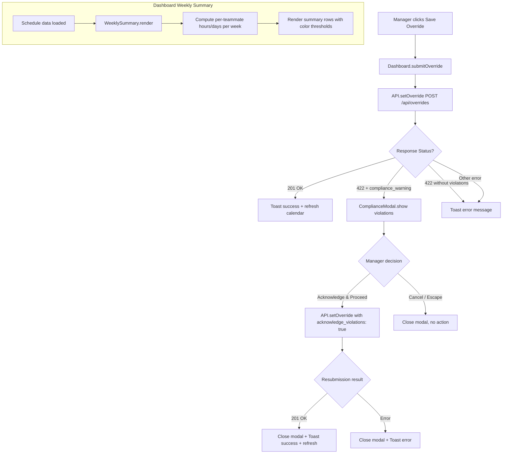

# Design Document: Compliance Warning UI

## Overview

The Compliance Warning UI feature adds two major capabilities to the DC-ShiftMaster HTML frontend:

1. **Compliance Warning Modal** — When a manager submits a shift override that would violate labor compliance rules, the system intercepts the 422 response from `POST /api/overrides`, displays a modal with violation details, and allows the manager to acknowledge and proceed or cancel.

2. **Dashboard Weekly Compliance Summary** — A per-week summary row rendered below each calendar week on the dashboard, showing each teammate's total hours and days worked with color-coded compliance thresholds.

The backend compliance validation already exists (see `dc_shiftmaster/compliance.py` and `dc_shiftmaster_html/routes_overrides.py`). This feature bridges that backend validation with a user-facing warning experience and adds proactive visibility into compliance status on the dashboard.

### Key Design Decisions

- **No framework introduction**: The frontend remains vanilla JavaScript using the existing IIFE module pattern (`var ModuleName = (function() { ... })()`)
- **Reuse existing patterns**: The compliance modal follows the same overlay pattern as the existing override modal in `index.html`
- **Client-side computation for summary rows**: Weekly totals are computed from already-loaded schedule data to avoid additional API calls
- **Accessibility-first modal**: The compliance modal implements full ARIA dialog semantics and focus trapping

## Architecture



### Module Structure

The feature introduces two new JavaScript modules and modifies the existing override submission flow:

| Module | File | Responsibility |
|--------|------|----------------|
| `ComplianceModal` | `js/compliance-modal.js` | Renders and manages the compliance warning modal dialog |
| `WeeklySummary` | `js/weekly-summary.js` | Computes and renders per-week compliance summary rows |
| `Dashboard` (modified) | `js/dashboard.js` | Updated override submission to detect compliance responses; calls WeeklySummary during render |
| `API` (modified) | `js/api.js` | Updated `setOverride` to return raw response for 422 handling |

## Components and Interfaces

### ComplianceModal Module

```javascript
var ComplianceModal = (function () {
    /**
     * Show the compliance warning modal with violation details.
     * @param {Object} options
     * @param {Array} options.violations - Array of violation objects from API response
     * @param {Object} options.overrideData - Original override request data {date, shift_type, name}
     * @param {Function} options.onSuccess - Callback after successful acknowledgment resubmission
     */
    function show(options) { /* ... */ }

    /**
     * Close the compliance warning modal and restore focus.
     */
    function close() { /* ... */ }

    /**
     * Map a violation rule string to a human-readable label.
     * @param {string} rule - One of 'weekly_hours', 'weekly_days', 'daily_hours'
     * @returns {string} Human-readable label
     */
    function ruleLabel(rule) { /* ... */ }

    /**
     * Render a single violation card element.
     * @param {Object} violation - {rule, projected, limit, window_start, window_end}
     * @returns {HTMLElement} The violation card DOM element
     */
    function renderViolationCard(violation) { /* ... */ }

    return { show: show, close: close, ruleLabel: ruleLabel, renderViolationCard: renderViolationCard };
})();
```

### WeeklySummary Module

```javascript
var WeeklySummary = (function () {
    /**
     * Compute shift duration in hours from start and end time strings.
     * Handles overnight shifts by adding 24h when end < start.
     * @param {string} startTime - HH:MM format
     * @param {string} endTime - HH:MM format
     * @returns {number} Duration in hours
     */
    function computeDuration(startTime, endTime) { /* ... */ }

    /**
     * Determine the effective start time for a teammate on a given shift type.
     * Uses custom_start if available, otherwise the shift window default.
     * @param {Object} teammate - Teammate object with optional custom_start
     * @param {string} shiftType - 'day' or 'night'
     * @param {Object} shiftWindows - Shift window config {day: {start, end}, night: {start, end}}
     * @returns {string} Effective start time in HH:MM format
     */
    function getEffectiveStart(teammate, shiftType, shiftWindows) { /* ... */ }

    /**
     * Determine the color class for a given hours value based on compliance thresholds.
     * @param {number} hours - Total weekly hours
     * @returns {string} CSS class name: 'compliance-green', 'compliance-yellow', or 'compliance-red'
     */
    function hoursColorClass(hours) { /* ... */ }

    /**
     * Determine the color class for a given days count.
     * @param {number} days - Total weekly days worked
     * @returns {string} CSS class name: 'compliance-green' or 'compliance-red'
     */
    function daysColorClass(days) { /* ... */ }

    /**
     * Compute weekly summaries for all teammates from schedule slot data.
     * @param {Array} slots - Schedule slot array from API
     * @param {Array} teammates - Teammate array from API
     * @param {Object} shiftWindows - Shift window configuration
     * @param {number} year - Current year
     * @param {number} month - Current month (1-12)
     * @returns {Array} Array of week summary objects
     */
    function computeWeeklySummaries(slots, teammates, shiftWindows, year, month) { /* ... */ }

    /**
     * Render weekly summary rows into the calendar grid.
     * @param {Array} summaries - Output from computeWeeklySummaries
     * @param {HTMLElement} grid - The calendar grid container
     */
    function render(summaries, grid) { /* ... */ }

    return {
        computeDuration: computeDuration,
        getEffectiveStart: getEffectiveStart,
        hoursColorClass: hoursColorClass,
        daysColorClass: daysColorClass,
        computeWeeklySummaries: computeWeeklySummaries,
        render: render
    };
})();
```

### Modified Override Submission Flow (in Dashboard)

The existing `override-submit` click handler in `dashboard.js` is modified to handle 422 compliance responses:

```javascript
// Current flow (throws on non-2xx):
API.setOverride(data).then(success).catch(showErrorToast);

// New flow:
// API.setOverrideRaw returns {status, body} without throwing on 422
API.setOverrideRaw(data).then(function(result) {
    if (result.status === 201) {
        // Success path (unchanged)
    } else if (result.status === 422 && result.body.status === 'compliance_warning') {
        // Show compliance modal
        ComplianceModal.show({
            violations: result.body.violations,
            overrideData: data,
            onSuccess: fetchAndRender
        });
    } else {
        // Default error toast
        Toast.show(result.body.error || 'Request failed', 'error');
    }
}).catch(function(e) { Toast.show(e.message, 'error'); });
```

### API Module Addition

A new `setOverrideRaw` method is added to the `API` module that returns the raw response without throwing on 422:

```javascript
setOverrideRaw: function (data) {
    return fetch('/api/overrides', {
        method: 'POST',
        headers: { 'Content-Type': 'application/json' },
        body: JSON.stringify(data)
    }).then(function (res) {
        return res.json().then(function (body) {
            return { status: res.status, body: body };
        });
    });
}
```

## Data Models

### Violation Object (from API response)

```javascript
{
    rule: "weekly_hours" | "weekly_days" | "daily_hours",
    projected: number,    // e.g. 62.5 or 7
    limit: number,        // e.g. 60 or 6 or 12
    window_start: string | null,  // "2025-01-06" or null for daily_hours
    window_end: string | null     // "2025-01-12" or null for daily_hours
}
```

### Override Data (original request payload)

```javascript
{
    date: "YYYY-MM-DD",
    shift_type: "day" | "night",
    name: "teammate_name"
}
```

### Acknowledgment Resubmission Payload

```javascript
{
    date: "YYYY-MM-DD",
    shift_type: "day" | "night",
    name: "teammate_name",
    acknowledge_violations: true
}
```

### Week Summary Object (internal to WeeklySummary module)

```javascript
{
    weekStart: "YYYY-MM-DD",  // Sunday
    weekEnd: "YYYY-MM-DD",    // Saturday
    teammates: [
        {
            name: "John Doe",
            totalHours: 52.5,
            totalDays: 5,
            hoursColor: "compliance-yellow",
            daysColor: "compliance-green"
        }
    ]
}
```

### Rule Label Mapping

| API Rule Value | Display Label |
|---|---|
| `weekly_hours` | "Weekly Hours Exceeded" |
| `weekly_days` | "Weekly Days Exceeded" |
| `daily_hours` | "Daily Hours Exceeded" |

## Correctness Properties

*A property is a characteristic or behavior that should hold true across all valid executions of a system — essentially, a formal statement about what the system should do. Properties serve as the bridge between human-readable specifications and machine-verifiable correctness guarantees.*

### Property 1: Compliance response interception prevents error toast

*For any* `POST /api/overrides` response with HTTP status 422 and a body containing `status: "compliance_warning"` with a non-empty `violations` array, the Override_Submission_Handler SHALL NOT display an error toast and SHALL pass the violations array to the ComplianceModal.

**Validates: Requirements 1.1, 1.2**

### Property 2: Violation card rendering matches violation data

*For any* violations array containing objects with rule ∈ {"weekly_hours", "weekly_days", "daily_hours"}, arbitrary numeric projected and limit values, and optional window_start/window_end date strings, the ComplianceModal SHALL render exactly one Violation_Card per violation, each displaying the correct human-readable label, the projected value, the limit value, and the date range (when window_start and window_end are non-null).

**Validates: Requirements 2.3, 2.4, 2.5, 2.6, 2.7**

### Property 3: Acknowledgment resubmission sends correct payload

*For any* original override data containing date, shift_type, and name values, when the manager clicks "Acknowledge & Proceed", the resubmission request SHALL contain all original fields plus `acknowledge_violations: true`.

**Validates: Requirements 3.1**

### Property 4: Error message propagation after acknowledgment failure

*For any* error response from the acknowledgment resubmission containing an error message string, the ComplianceModal SHALL close and the Toast_Notification SHALL display that exact error message.

**Validates: Requirements 3.4**

### Property 5: Duration calculation correctness

*For any* start time and end time in HH:MM format, the Duration_Calculator SHALL compute duration as `(end - start)` hours when `end > start`, and `(end - start + 24)` hours when `end ≤ start` (overnight shift). When a teammate has a non-empty `custom_start`, that value SHALL be used instead of the shift window default start time.

**Validates: Requirements 7.3, 7.4**

### Property 6: Weekly summary row count matches calendar weeks

*For any* year and month (1–12), the Dashboard SHALL render exactly as many Weekly_Summary_Row elements as there are distinct calendar weeks (Sunday–Saturday spans) that overlap with that month.

**Validates: Requirements 7.1**

### Property 7: Weekly summary aggregation correctness

*For any* set of schedule slots assigned to teammates within a given work week, the Weekly_Summary_Row SHALL list each teammate who has at least one shift, with total hours equal to the sum of their individual shift durations and total days equal to the count of distinct dates they are assigned.

**Validates: Requirements 7.2**

### Property 8: Compliance threshold color-coding

*For any* numeric hours value, the Weekly_Summary_Row SHALL display green when hours < 50, yellow when 50 ≤ hours ≤ 59, and red when hours ≥ 60. *For any* numeric days value, the display SHALL be red when days ≥ 6, and green otherwise.

**Validates: Requirements 7.5, 7.6, 7.7, 7.8**

## Error Handling

| Scenario | Behavior |
|----------|----------|
| 422 response with `status: "compliance_warning"` | Show ComplianceModal with violations; suppress error toast |
| 422 response without `violations` array | Show default error toast with response error message |
| Network failure during override submission | Show error toast "Request failed" |
| Acknowledgment resubmission returns error | Close ComplianceModal, show error toast with server message |
| Acknowledgment resubmission network failure | Close ComplianceModal, show error toast with generic message |
| Invalid/malformed violation object (missing fields) | Render card with fallback text ("Unknown Rule", "N/A" for missing values) |
| Empty violations array in compliance_warning response | Close modal immediately, show error toast (defensive — should not occur) |

### Focus Management Errors

- If the modal opens but no focusable element exists (defensive), focus remains on the document body
- If focus trap encounters no tabbable elements, Tab/Shift+Tab are no-ops within the modal

## Testing Strategy

### Unit Tests (Jest + jsdom)

Example-based tests covering:
- Modal opens with correct ARIA attributes (`role="dialog"`, `aria-modal="true"`, `aria-labelledby`)
- Cancel button and Escape key close the modal without API calls
- Loading state disables buttons and changes text to "Submitting..."
- Buttons re-enable after request completes
- Focus moves to first focusable element on modal open
- Focus trapping within modal (Tab/Shift+Tab cycle)
- Violation cards have `role="alert"`
- Buttons have descriptive `aria-label` attributes
- No additional API calls during weekly summary rendering
- Summary rows re-render on month change

### Property-Based Tests (Jest + fast-check)

Each correctness property is implemented as a single property-based test with minimum 100 iterations:

- **Property 1**: Generate random violation arrays, mock fetch to return 422 with `compliance_warning`, verify no error toast and violations passed to modal
- **Property 2**: Generate random violations with varying rules/values/dates, render cards, verify DOM content matches input
- **Property 3**: Generate random override data, trigger acknowledgment, capture fetch call payload, verify it includes original data + `acknowledge_violations: true`
- **Property 4**: Generate random error messages, mock fetch to return error, verify modal closes and toast shows the message
- **Property 5**: Generate random HH:MM time pairs, verify duration computation handles normal and overnight cases correctly
- **Property 6**: Generate random year/month, compute expected week count, verify rendered row count matches
- **Property 7**: Generate random shift slot arrays, compute expected totals, verify rendered summary matches
- **Property 8**: Generate random hours/days values across all threshold ranges, verify correct CSS class assignment

**Test Configuration:**
- Library: `fast-check` (already installed, v3.15.0)
- Environment: `jsdom` (already configured in `package.json`)
- Minimum iterations: 100 per property (`{ numRuns: 100 }`)
- Tag format: `Feature: compliance-warning-ui, Property {N}: {title}`
- Test file: `dc_shiftmaster_html/static/js/__tests__/compliance-warning-ui.property.test.js`

### Integration Tests (pytest)

- End-to-end test: submit override → receive 422 → verify response format matches frontend expectations
- Acknowledgment flow: submit with `acknowledge_violations: true` → verify 201 and override persisted
