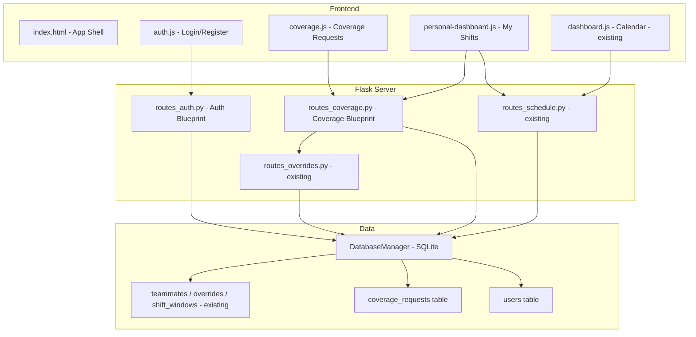

# Design Document: Coverage Requests & User Accounts

## Overview

This feature adds individual user accounts and a coverage request system to DC-ShiftMaster Pro's HTML/Flask application. Currently, the app uses a single shared team password for access. This feature introduces per-user authentication (registration, login, logout) with password hashing, and a coverage request workflow where users can post shifts they need covered, and other teammates can claim them.

Coverage requests are linked to the existing override system — when a teammate claims a coverage request, the system creates an override replacing the original assignee with the claimant. The feature also adds a personal dashboard showing the logged-in user's upcoming shifts and pending coverage requests, plus responsive mobile/tablet support with touch gestures.

### Key Design Decisions

1. **SQLite `users` and `coverage_requests` tables**: Added to the existing `DatabaseManager` rather than a separate database, keeping the single-file persistence model.
2. **werkzeug.security for password hashing**: `generate_password_hash` / `check_password_hash` — already a Flask dependency, no new packages needed.
3. **Manual session management over Flask-Login**: The app already uses Flask sessions for the shared password gate. We extend this with a `user_id` in the session rather than adding a Flask-Login dependency.
4. **New Flask blueprints**: `routes_auth.py` for registration/login/logout, `routes_coverage.py` for coverage request CRUD and claiming.
5. **New JS modules**: `auth.js` (login/register forms), `coverage.js` (coverage request list and claim UI), `personal-dashboard.js` (user's shifts and requests).
6. **CSS media queries**: Mobile (< 480px), tablet (480–1024px), desktop (> 1024px) breakpoints with touch event handlers for swipe navigation and pull-to-refresh.
7. **Coverage → Override linkage**: When a coverage request is claimed, the system calls `DatabaseManager.set_override()` to replace the original assignee with the claimant on that date/shift.

## Architecture

The feature extends the existing layered architecture with two new Flask blueprints and three new frontend JS modules.



### Module Structure (new/modified files)

```
dc_shiftmaster_html/
├── routes_auth.py          # NEW — Auth blueprint (register, login, logout, current user)
├── routes_coverage.py      # NEW — Coverage request blueprint (CRUD, claim, unclaim)
├── server.py               # MODIFIED — Register new blueprints, update auth gate
├── static/
│   ├── js/
│   │   ├── auth.js             # NEW — Login/register form logic
│   │   ├── coverage.js         # NEW — Coverage request list, create, claim UI
│   │   ├── personal-dashboard.js # NEW — Personal shift view and request summary
│   │   └── router.js           # MODIFIED — Add new views to routing
│   ├── css/
│   │   └── theme.css           # MODIFIED — Add responsive breakpoints, touch styles
│   └── index.html              # MODIFIED — Add new nav items and view sections
dc_shiftmaster/
├── database.py             # MODIFIED — Add users and coverage_requests tables
├── models.py               # MODIFIED — Add User and CoverageRequest dataclasses
```

## Components and Interfaces

### DatabaseManager Extensions (`database.py`)

New methods added to the existing `DatabaseManager` class:

```python
# --- User methods ---
def create_user(self, username: str, password_hash: str, display_name: str,
                teammate_name: str = "") -> int:
    """Insert a new user, return the new row ID.
    Raises ValueError if username is empty or already exists."""

def get_user_by_username(self, username: str) -> User | None:
    """Return the User record for the given username, or None."""

def get_user_by_id(self, user_id: int) -> User | None:
    """Return the User record for the given ID, or None."""

def get_all_users(self) -> list[User]:
    """Return all user records."""

# --- Coverage Request methods ---
def create_coverage_request(self, requester_id: int, date: str, shift_type: str,
                            note: str = "") -> int:
    """Insert a coverage request, return the new row ID.
    Raises ValueError if a request already exists for this date/shift/requester."""

def get_coverage_requests(self, status: str = None) -> list[CoverageRequest]:
    """Return coverage requests, optionally filtered by status ('open', 'claimed', 'cancelled')."""

def get_coverage_requests_for_user(self, user_id: int) -> list[CoverageRequest]:
    """Return all coverage requests created by a specific user."""

def claim_coverage_request(self, request_id: int, claimer_id: int) -> None:
    """Mark a coverage request as claimed by the given user.
    Creates an override via set_override() linking the claimer to the shift.
    Raises ValueError if already claimed or cancelled."""

def unclaim_coverage_request(self, request_id: int) -> None:
    """Revert a claimed coverage request back to 'open'.
    Removes the associated override."""

def cancel_coverage_request(self, request_id: int) -> None:
    """Mark a coverage request as cancelled. Removes override if claimed."""
```

### Auth Blueprint (`routes_auth.py`)

```python
auth_bp = Blueprint("auth", __name__)

# POST /api/auth/register  — Create a new user account
# POST /api/auth/login      — Authenticate and create session
# POST /api/auth/logout     — Clear session
# GET  /api/auth/me          — Return current logged-in user info
```

### Coverage Blueprint (`routes_coverage.py`)

```python
coverage_bp = Blueprint("coverage", __name__)

# GET    /api/coverage                — List coverage requests (query param: ?status=open)
# POST   /api/coverage                — Create a new coverage request
# POST   /api/coverage/{id}/claim     — Claim a coverage request
# POST   /api/coverage/{id}/unclaim   — Unclaim (revert) a coverage request
# POST   /api/coverage/{id}/cancel    — Cancel a coverage request
# GET    /api/coverage/my-requests    — Get current user's requests
# GET    /api/coverage/my-shifts      — Get current user's upcoming shifts
```

### Frontend Modules

**auth.js**: Handles the login and registration forms. On successful login, stores user info in `AppState` and redirects to the dashboard. Replaces the current shared-password login page with a user-specific login/register flow.

**coverage.js**: Renders the coverage request board — a list of open requests that teammates can browse and claim. Includes a "Request Coverage" form to post new requests. Shows claimed/cancelled status with visual indicators.

**personal-dashboard.js**: Shows the logged-in user's upcoming shifts (filtered from the schedule by matching their `teammate_name`), their posted coverage requests and their status, and requests they've claimed.

### Server Modifications (`server.py`)

- Register `auth_bp` and `coverage_bp` blueprints
- Update `require_login` to check `session["user_id"]` instead of `session["authenticated"]`
- Allow `/api/auth/login` and `/api/auth/register` without authentication
- Serve a new login/register page instead of the shared-password page

## Data Models

### New Dataclasses (`models.py`)

```python
@dataclass
class User:
    id: int
    username: str
    password_hash: str
    display_name: str
    teammate_name: str  # Links to Teammate.name for shift matching
    created_at: str     # ISO datetime

@dataclass
class CoverageRequest:
    id: int
    requester_id: int
    date: str           # 'YYYY-MM-DD'
    shift_type: str     # 'day' or 'night'
    note: str           # Optional message
    status: str         # 'open', 'claimed', 'cancelled'
    claimer_id: int | None
    created_at: str     # ISO datetime
    claimed_at: str | None
```

### New SQLite Tables

```sql
CREATE TABLE IF NOT EXISTS users (
    id            INTEGER PRIMARY KEY AUTOINCREMENT,
    username      TEXT NOT NULL UNIQUE,
    password_hash TEXT NOT NULL,
    display_name  TEXT NOT NULL,
    teammate_name TEXT NOT NULL DEFAULT '',
    created_at    TEXT NOT NULL DEFAULT (datetime('now'))
);

CREATE TABLE IF NOT EXISTS coverage_requests (
    id            INTEGER PRIMARY KEY AUTOINCREMENT,
    requester_id  INTEGER NOT NULL REFERENCES users(id),
    date          TEXT NOT NULL,
    shift_type    TEXT NOT NULL CHECK(shift_type IN ('day', 'night')),
    note          TEXT NOT NULL DEFAULT '',
    status        TEXT NOT NULL DEFAULT 'open' CHECK(status IN ('open', 'claimed', 'cancelled')),
    claimer_id    INTEGER REFERENCES users(id),
    created_at    TEXT NOT NULL DEFAULT (datetime('now')),
    claimed_at    TEXT
);
```

### Responsive Breakpoints

| Breakpoint | Width | Layout |
|---|---|---|
| Mobile | < 480px | Single column, bottom nav, swipe between views, pull-to-refresh |
| Tablet | 480–1024px | Collapsed sidebar (icon-only), 3-column calendar grid |
| Desktop | > 1024px | Full sidebar, 7-column calendar grid |

