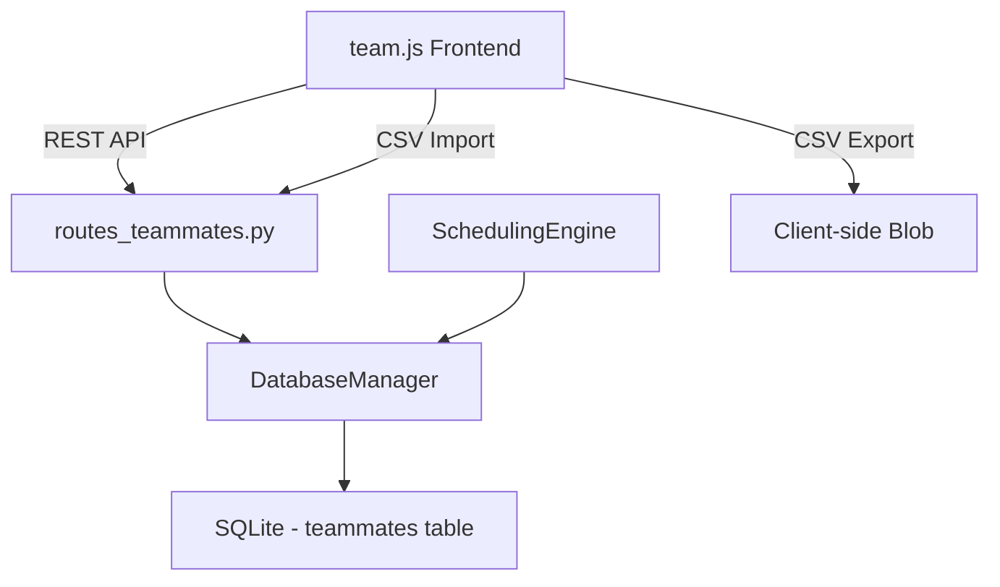

# Design Document: Custom Schedule Shift

## Overview

This feature extends DC-ShiftMaster Pro to support a fifth shift type — "Custom" — allowing teammates to work on individually selected days of the week rather than following the fixed Front Half / Back Half rotation. The implementation touches four layers: the data model (SQLite schema + Teammate dataclass), the REST API (teammate CRUD + CSV endpoints), the scheduling engine (custom day resolution), and the frontend UI (team.js shift selector + day checkboxes + team list display).

The design maintains full backward compatibility with the four existing rotation types (FHD, FHN, BHD, BHN) and extends the CSV import/export format with an additional `custom_days` column.

## Architecture

The feature follows the existing layered architecture of DC-ShiftMaster HTML:



### Key Architectural Decisions

1. **Store custom_days as JSON in SQLite**: A JSON text column on the `teammates` table stores the day abbreviations as `["Mon","Wed","Fri"]`. This avoids a separate junction table for a simple, bounded set (max 7 values).

2. **Scheduling engine branch**: The `compute_annual_schedule` method gains a new code path — when `shift_type == "Custom"`, it checks whether the date's weekday appears in the teammate's `custom_days` list instead of using the front-half/back-half rotation.

3. **CSV format extension**: A fourth column `custom_days` is appended. For standard shift types it is empty; for Custom teammates it contains semicolon-separated day abbreviations (e.g., `Mon;Wed;Fri`). Semicolons are chosen to avoid conflicts with the CSV comma delimiter.

4. **Validation at API boundary**: The server validates that Custom teammates must have at least one day selected. The frontend also performs this validation for immediate feedback.

## Components and Interfaces

### 1. Teammate Data Model (`dc_shiftmaster/models.py`)

```python
@dataclass
class Teammate:
    id: int
    name: str
    shift_type: str          # "FHD" | "FHN" | "BHD" | "BHN" | "Custom"
    custom_start: str = ""   # Optional HH:MM override
    custom_days: list[str] = field(default_factory=list)  # e.g. ["Mon", "Wed", "Fri"]
```

### 2. Database Layer (`dc_shiftmaster/database.py`)

**Schema migration** — adds `custom_days` TEXT column (default `''`):
```sql
ALTER TABLE teammates ADD COLUMN custom_days TEXT NOT NULL DEFAULT '';
```

**CHECK constraint update** — the existing `CHECK(shift_type IN ('FHD','FHN','BHD','BHN'))` must be relaxed to include `'Custom'`. This is handled via migration (recreate table or use a new table definition on fresh installs).

**Serialization**: `custom_days` stored as JSON string in the column, e.g. `'["Mon","Wed","Fri"]'`. Deserialization via `json.loads`.

### 3. API Layer (`dc_shiftmaster_html/routes_teammates.py`)

| Endpoint | Change |
|----------|--------|
| `GET /api/teammates` | Include `custom_days` field in response |
| `POST /api/teammates` | Accept `custom_days` array; validate non-empty when `shift_type == "Custom"` |
| `PUT /api/teammates/<id>` | Accept `custom_days` array; same validation |
| `POST /api/teammates/import-csv` | Parse fourth column as semicolon-separated days |

**Validation constant update**:
```python
VALID_SHIFT_TYPES = {"FHD", "FHN", "BHD", "BHN", "Custom"}
VALID_DAYS = {"Mon", "Tue", "Wed", "Thu", "Fri", "Sat", "Sun"}
```

### 4. Scheduling Engine (`dc_shiftmaster/scheduling.py`)

New logic in `compute_annual_schedule`:
```python
# Custom teammates: check if today's weekday matches their custom_days
WEEKDAY_ABBREVS = ["Mon", "Tue", "Wed", "Thu", "Fri", "Sat", "Sun"]

custom_teammates = teammate_map.get("Custom", [])
for t in custom_teammates:
    day_abbrev = WEEKDAY_ABBREVS[current.weekday()]
    if day_abbrev in t.custom_days:
        # Add to the day shift slot
        day_names.append(t.name)
```

Custom teammates are always added to the **day shift** slot for the days they are scheduled (they don't participate in the front-half/back-half rotation). They appear alongside any rotation teammates assigned that day.

### 5. Frontend (`dc_shiftmaster_html/static/js/team.js`)

**SHIFT_TYPES constant**: Extended to `['FHD', 'FHN', 'BHD', 'BHN', 'Custom']`.

**Add/Edit forms**: When "Custom" is selected in the shift type dropdown, a row of seven labeled checkboxes (Mon–Sun) appears below. Switching away from "Custom" hides the checkboxes.

**Team list display**: Custom teammates show their selected days as a comma-separated string next to their name (e.g., "Mon, Wed, Fri").

**CSV export**: Header row becomes `name,shift_type,custom_start,custom_days`. The `custom_days` value for Custom teammates is semicolon-separated; empty for standard types.

## Data Models

### Teammate Record (API JSON)

```json
{
  "id": 42,
  "name": "Alice",
  "shift_type": "Custom",
  "custom_start": "07:00",
  "custom_days": ["Mon", "Wed", "Fri"]
}
```

### CSV Format

```
name,shift_type,custom_start,custom_days
Alice,Custom,07:00,Mon;Wed;Fri
Bob,FHD,06:00,
Carol,BHN,,
```

### Valid Day Abbreviations

`Mon`, `Tue`, `Wed`, `Thu`, `Fri`, `Sat`, `Sun` — exactly these seven strings (case-sensitive).

### Database Column

| Column | Type | Notes |
|--------|------|-------|
| `custom_days` | TEXT | JSON array string, e.g. `'["Mon","Wed","Fri"]'`. Empty string `''` for standard shift types. |

## Correctness Properties

*A property is a characteristic or behavior that should hold true across all valid executions of a system — essentially, a formal statement about what the system should do. Properties serve as the bridge between human-readable specifications and machine-verifiable correctness guarantees.*

### Property 1: Custom days persistence round-trip

*For any* valid non-empty subset of days from {Mon, Tue, Wed, Thu, Fri, Sat, Sun}, saving a Custom teammate with those days and then retrieving the teammate record SHALL produce the same set of days in `custom_days`.

**Validates: Requirements 3.1, 3.2, 3.3**

### Property 2: Empty custom_days validation rejection

*For any* teammate data with shift_type "Custom" and an empty custom_days array, the API SHALL reject the request with a 400 status and the teammate SHALL NOT be persisted.

**Validates: Requirements 3.4**

### Property 3: CSV export/import round-trip for custom days

*For any* Custom teammate with a non-empty custom_days list, exporting to CSV and then importing that CSV SHALL produce a teammate record with the same custom_days set (order-independent).

**Validates: Requirements 5.1, 5.3**

### Property 4: CSV export produces empty custom_days for standard teammates

*For any* teammate with a standard shift type (FHD, FHN, BHD, or BHN), the exported CSV custom_days column SHALL be an empty string.

**Validates: Requirements 5.2**

### Property 5: CSV import rejects invalid custom_days for Custom rows

*For any* CSV row with shift_type "Custom" where the custom_days field is empty or contains at least one value not in {Mon, Tue, Wed, Thu, Fri, Sat, Sun}, the import SHALL skip that row and include its row number in the skipped_rows list.

**Validates: Requirements 5.4**

### Property 6: Custom teammates scheduled only on their specified weekdays

*For any* teammate with shift_type "Custom" and a given custom_days list, in the computed annual schedule, that teammate's name SHALL appear in a day slot if and only if the slot's date falls on a weekday contained in custom_days.

**Validates: Requirements 6.1, 6.3**

### Property 7: Standard teammates unaffected by Custom teammates

*For any* teammate with a standard shift type, the set of schedule slots containing that teammate's name SHALL be identical regardless of whether Custom teammates exist in the teammate list.

**Validates: Requirements 6.2**

## Error Handling

### Frontend Validation Errors

| Condition | Behavior |
|-----------|----------|
| Custom shift type with no days selected | Toast error: "Please select at least one day" — save blocked |
| Empty name field | Existing validation unchanged — toast error |
| Invalid custom_start format | Existing validation unchanged |

### API Validation Errors (400 responses)

| Condition | Error Message |
|-----------|---------------|
| shift_type "Custom" with empty/missing custom_days | "At least one day must be selected for Custom shift type." |
| custom_days contains invalid values | "Invalid day(s) in custom_days. Valid values: Mon, Tue, Wed, Thu, Fri, Sat, Sun." |
| shift_type not in VALID_SHIFT_TYPES | "Invalid shift type. Must be one of: FHD, FHN, BHD, BHN, Custom." |

### CSV Import Error Handling

| Condition | Behavior |
|-----------|----------|
| shift_type "Custom" with empty custom_days column | Row skipped, row number added to skipped_rows |
| custom_days column contains invalid day abbreviations | Row skipped, row number added to skipped_rows |
| Standard shift type with non-empty custom_days | Ignored — custom_days field cleared/disregarded |

### Database Migration

- The migration adds the column with `DEFAULT ''`, so existing teammates are unaffected.
- No data corruption risk — the column is optional and only meaningful for "Custom" type.
- Existing CHECK constraint on shift_type must be updated to allow "Custom".

## Testing Strategy

### Property-Based Tests (Hypothesis — Python)

Each correctness property is implemented as a property-based test with minimum 100 iterations. Tests are tagged with the property they validate:

```python
# Feature: custom-schedule-shift, Property N: property_title
@settings(max_examples=100)
```

| Property | Test Focus | Generator Strategy |
|----------|-----------|-------------------|
| 1 | Persistence round-trip | Random non-empty subsets of {Mon..Sun} |
| 2 | Validation rejection | Empty lists, always shift_type="Custom" |
| 3 | CSV round-trip | Random Custom teammates with varied days |
| 4 | CSV empty for standard | Random teammates with standard shift types |
| 5 | CSV invalid rejection | Random strings not in valid day set |
| 6 | Scheduling day match | Random Custom teammates + random year dates |
| 7 | Standard unaffected | Standard teammates with/without Custom teammates present |

### Unit Tests (Example-Based)

- Verify SHIFT_TYPES includes all five values
- Verify day selector shows/hides based on dropdown value
- Verify checkboxes reset when switching to Custom
- Verify edit form pre-checks stored days
- Verify Custom group section appears in rendered team list
- Verify Custom group heading shows correct count
- Verify teammate row displays comma-separated day labels

### Integration Tests

- End-to-end: Create Custom teammate via API → generate schedule → verify calendar slots
- CSV workflow: Export team with Custom teammates → import into fresh DB → verify data integrity
- Database migration: Open pre-migration DB → verify upgrade adds column → existing teammates unaffected
