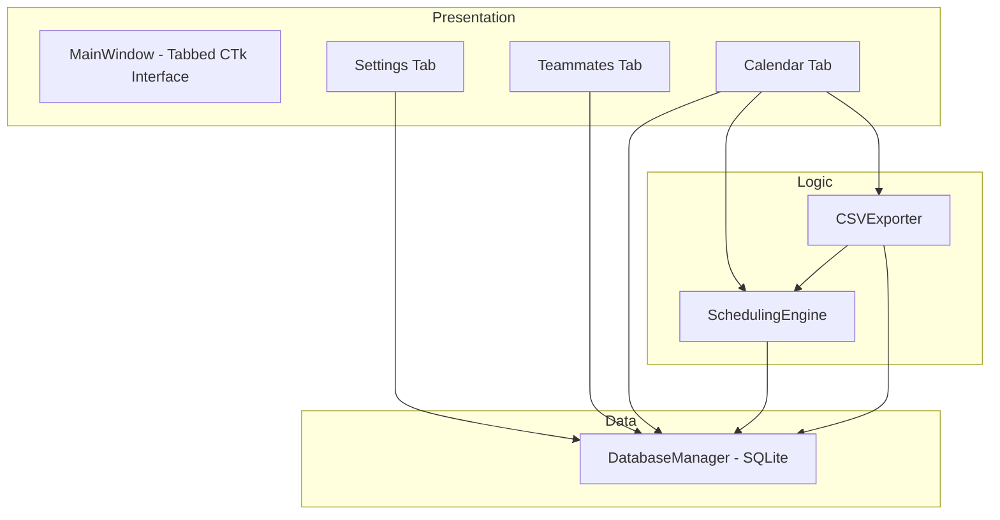

# Design Document: DC-ShiftMaster Pro

## Overview

DC-ShiftMaster Pro is a desktop Python application that manages a repeating 14-day shift rotation cycle for data center teams. It provides an interactive calendar GUI, stores data in SQLite, and exports annual schedules to CSV in a format compatible with the on-call scheduling system's Custom Upload feature.

The application is built with CustomTkinter for a modern dark-themed UI, uses SQLite for local persistence, and targets Windows deployment via PyInstaller. The core scheduling logic computes a deterministic 14-day rotation pattern starting January 1 of any given year, assigning Front Half and Back Half groups to Day and Night shifts with Wednesday as a swing day.

### Key Design Decisions

1. **CustomTkinter over PySide6**: Aligns with the existing codebase patterns (the user already uses CustomTkinter) and simplifies PyInstaller packaging.
2. **SQLite single-file database**: All data (teammates, shift windows, overrides) lives in `teammates.db` — simple, portable, no server needed.
3. **Deterministic scheduling engine**: The 14-day cycle is purely date-driven (no randomness), making it predictable and testable.
4. **CSV format strict compliance**: The export must match `M/D/YYYY H:MM,member_name` exactly — no headers, no leading zeros, "nobody" for unassigned slots.

## Architecture

The application follows a layered architecture with clear separation between data, logic, and presentation.



### Module Structure

```
dc_shiftmaster/
├── main.py              # Entry point, app initialization
├── database.py          # DatabaseManager — SQLite CRUD operations
├── scheduling.py        # SchedulingEngine — 14-day cycle computation
├── csv_export.py        # CSVExporter — Custom Upload format export
├── ui/
│   ├── main_window.py   # MainWindow with tabbed layout
│   ├── settings_tab.py  # Shift window configuration UI
│   ├── teammates_tab.py # Teammate management UI
│   └── calendar_tab.py  # Yearly calendar grid + override UI
├── models.py            # Data classes (Teammate, ShiftWindow, Override, ScheduleSlot)
├── requirements.txt     # Python dependencies
└── build.bat            # PyInstaller build script
```

## Components and Interfaces

### DatabaseManager (`database.py`)

Manages all SQLite operations against `teammates.db`.

```python
class DatabaseManager:
    def __init__(self, db_path: str = "teammates.db"):
        """Open or create the database, run migrations."""

    # Shift Windows
    def get_shift_windows(self) -> dict[str, ShiftWindow]:
        """Return {'day': ShiftWindow, 'night': ShiftWindow}."""
    def update_shift_window(self, shift_type: str, start: str, end: str) -> None:
        """Persist updated start/end times for a shift type."""

    # Teammates
    def get_teammates(self) -> list[Teammate]:
        """Return all teammate records."""
    def add_teammate(self, name: str, shift_type: str) -> int:
        """Insert a teammate, return the new row ID."""
    def update_teammate(self, teammate_id: int, name: str, shift_type: str) -> None:
        """Update an existing teammate's name or shift type."""
    def delete_teammate(self, teammate_id: int) -> None:
        """Remove a teammate record."""

    # Overrides
    def get_overrides(self, year: int) -> list[Override]:
        """Return all overrides for a given year."""
    def set_override(self, date: str, shift_type: str, name: str) -> None:
        """Insert or update an override for a specific date+shift."""
    def remove_override(self, date: str, shift_type: str) -> None:
        """Delete an override, reverting to computed assignment."""
```

### SchedulingEngine (`scheduling.py`)

Computes the deterministic 14-day rotation for a full year.

```python
class SchedulingEngine:
    def compute_annual_schedule(self, year: int, teammates: list[Teammate],
                                 shift_windows: dict[str, ShiftWindow],
                                 overrides: list[Override]) -> list[ScheduleSlot]:
        """
        Compute the full annual schedule for the given year.
        Returns a list of ScheduleSlot objects (2 per day, 730 total for non-leap, 732 for leap).
        Overrides are applied on top of computed assignments.
        """

    def get_day_owner(self, date: date) -> str:
        """
        Determine if a date belongs to 'front_half' or 'back_half'
        based on the 14-day cycle starting Jan 1.
        """

    def get_cycle_day(self, date: date) -> int:
        """
        Return the 0-based day index within the 14-day cycle (0-13).
        Day 0 = Jan 1 of the year (always a cycle start).
        """
```

**14-Day Cycle Logic:**

The cycle repeats every 14 days starting from January 1. Each cycle consists of two weeks:

| Cycle Day | Day of Week | Week | Owner |
|-----------|-------------|------|-------|
| 0 | Sunday | 1 | Front Half |
| 1 | Monday | 1 | Front Half |
| 2 | Tuesday | 1 | Front Half |
| 3 | Wednesday (Swing) | 1 | Front Half |
| 4 | Thursday | 1 | Back Half |
| 5 | Friday | 1 | Back Half |
| 6 | Saturday | 1 | Back Half |
| 7 | Sunday | 2 | Front Half |
| 8 | Monday | 2 | Front Half |
| 9 | Tuesday | 2 | Front Half |
| 10 | Wednesday (Swing) | 2 | Back Half |
| 11 | Thursday | 2 | Back Half |
| 12 | Friday | 2 | Back Half |
| 13 | Saturday | 2 | Back Half |

Note: The cycle is indexed by position (0-13), not by actual day-of-week. January 1 is always cycle day 0 regardless of what weekday it falls on. The "Sunday, Monday, ..." labels in the table represent the conceptual pattern within the cycle, not the actual calendar day-of-week.

- Front Half Day → FHD teammate on Day slot, FHN teammate on Night slot
- Back Half Day → BHD teammate on Day slot, BHN teammate on Night slot

### CSVExporter (`csv_export.py`)

Generates the Custom Upload-compatible CSV.

```python
class CSVExporter:
    def export(self, schedule: list[ScheduleSlot], filepath: str) -> None:
        """
        Write the annual schedule to CSV.
        Format: M/D/YYYY H:MM,member_name (no header, no leading zeros).
        Two rows per day (Day then Night), sorted chronologically.
        """

    def format_datetime(self, dt_date: date, time_str: str) -> str:
        """
        Format a date + time into 'M/D/YYYY H:MM' with no leading zeros.
        e.g., date(2018,6,5) + '14:00' → '6/5/2018 14:00'
        """

    def parse_csv_row(self, row: str) -> tuple[date, str, str]:
        """
        Parse a CSV row back into (date, time, teammate_name).
        Used for round-trip verification.
        """
```

### UI Components (`ui/`)

**MainWindow** (`main_window.py`): Root CTk window with a tabbed interface (Settings, Teammates, Calendar). Coordinates data flow between tabs and the database.

**SettingsTab** (`settings_tab.py`): Two time-entry pairs (start/end) for Day and Night shift windows. Validates HH:MM 24-hour format with inline error display. Saves to DB on confirmation.

**TeammatesTab** (`teammates_tab.py`): Table view of all teammates with name and shift type columns. Add/edit/delete operations with empty-name validation. Shift type selection via dropdown (FHD, FHN, BHD, BHN).

**CalendarTab** (`calendar_tab.py`): Yearly grid showing all 365/366 days. Each cell has two slots (Day/Night) with teammate names. Right-click context menu for overrides. Year navigation controls. "Generate & Export" button triggers CSV export. Color-coded Day vs Night slots.

## Data Models

```python
from dataclasses import dataclass
from datetime import date

@dataclass
class ShiftWindow:
    shift_type: str   # 'day' or 'night'
    start_time: str   # HH:MM format, e.g. '06:00'
    end_time: str     # HH:MM format, e.g. '18:30'

@dataclass
class Teammate:
    id: int
    name: str
    shift_type: str   # One of: 'FHD', 'FHN', 'BHD', 'BHN'

@dataclass
class Override:
    date: str         # 'YYYY-MM-DD'
    shift_type: str   # 'day' or 'night'
    name: str         # Replacement name or 'nobody'

@dataclass
class ScheduleSlot:
    date: date
    shift_type: str   # 'day' or 'night'
    start_time: str   # From ShiftWindow, e.g. '6:00'
    teammate: str     # Assigned name or 'nobody'
    is_override: bool # True if this slot was manually overridden
```

### SQLite Schema

```sql
CREATE TABLE IF NOT EXISTS shift_windows (
    shift_type TEXT PRIMARY KEY,  -- 'day' or 'night'
    start_time TEXT NOT NULL,     -- 'HH:MM'
    end_time   TEXT NOT NULL      -- 'HH:MM'
);

CREATE TABLE IF NOT EXISTS teammates (
    id         INTEGER PRIMARY KEY AUTOINCREMENT,
    name       TEXT NOT NULL,
    shift_type TEXT NOT NULL CHECK(shift_type IN ('FHD','FHN','BHD','BHN'))
);

CREATE TABLE IF NOT EXISTS overrides (
    date       TEXT NOT NULL,     -- 'YYYY-MM-DD'
    shift_type TEXT NOT NULL,     -- 'day' or 'night'
    name       TEXT NOT NULL,     -- replacement name or 'nobody'
    PRIMARY KEY (date, shift_type)
);
```

Default seed data on first run:
```sql
INSERT INTO shift_windows VALUES ('day', '06:00', '18:30');
INSERT INTO shift_windows VALUES ('night', '18:00', '06:30');
```


## Correctness Properties

*A property is a characteristic or behavior that should hold true across all valid executions of a system — essentially, a formal statement about what the system should do. Properties serve as the bridge between human-readable specifications and machine-verifiable correctness guarantees.*

### Property 1: Shift window storage round-trip

*For any* valid shift type ('day' or 'night') and any valid HH:MM time pair, storing a shift window in the database and then retrieving it should return the same start and end times.

**Validates: Requirements 1.1, 1.3**

### Property 2: Time format validation

*For any* string, the time validator should accept it if and only if it matches the HH:MM 24-hour format (hours 00-23, minutes 00-59). All other strings should be rejected.

**Validates: Requirements 1.5**

### Property 3: Teammate CRUD round-trip

*For any* valid teammate name (non-empty, non-whitespace) and valid shift type (FHD, FHN, BHD, BHN), adding the teammate to the database and then retrieving all teammates should include a record with that exact name and shift type. Updating the teammate's name or shift type and re-retrieving should reflect the updated values.

**Validates: Requirements 2.1, 2.2, 2.3**

### Property 4: Empty name rejection

*For any* string composed entirely of whitespace (including the empty string), attempting to add it as a teammate name should be rejected, and the teammate list should remain unchanged.

**Validates: Requirements 2.5**

### Property 5: Deleted teammate becomes "nobody"

*For any* teammate that is deleted, recomputing the annual schedule should produce "nobody" in all slots where that teammate was previously assigned (assuming no other teammate shares the same shift type).

**Validates: Requirements 2.4**

### Property 6: 14-day cycle ownership correctness

*For any* year and any date within that year, the cycle day index (0-13) computed from January 1 should determine the owner as follows: indices 0-3 and 7-9 → Front Half, indices 4-6 and 10-13 → Back Half. Furthermore, for any date D, the owner of D should equal the owner of D + 14 days (if D + 14 is in the same year).

**Validates: Requirements 3.1, 3.2, 3.3, 3.4**

### Property 7: Shift type teammate assignment

*For any* date in the annual schedule, if the date is owned by Front Half, the Day slot should contain the FHD teammate and the Night slot should contain the FHN teammate. If owned by Back Half, the Day slot should contain the BHD teammate and the Night slot should contain the BHN teammate. If no teammate is assigned for a shift type, the slot should contain "nobody".

**Validates: Requirements 3.5, 3.6, 4.4**

### Property 8: Override storage round-trip

*For any* valid override (date string, shift type, replacement name), storing it in the database and retrieving overrides for that year should include the stored override with matching date, shift type, and name.

**Validates: Requirements 5.2, 5.5**

### Property 9: Override takes precedence over computed assignment

*For any* annual schedule with at least one override, the schedule slot matching the override's date and shift type should contain the override's name, not the computed teammate name.

**Validates: Requirements 5.3, 6.7**

### Property 10: Override removal reverts to computed assignment

*For any* slot that has an override, removing the override and recomputing should produce the same teammate name as a schedule computed without any override for that slot.

**Validates: Requirements 5.4, 5.6**

### Property 11: CSV structural invariants

*For any* valid annual schedule exported to CSV: (a) the file should contain no header row, (b) each row should have exactly two comma-separated fields, and (c) the total number of rows should equal 2 × (number of days in the year).

**Validates: Requirements 6.1, 6.2**

### Property 12: CSV date format — no leading zeros

*For any* date and shift window start time, the formatted datetime string in Column A should match the pattern `M/D/YYYY H:MM` with no leading zeros on month, day, or hour. Specifically, for months 1-9, days 1-9, and hours 0-9, the value should be a single digit (except hour 0 which remains `0`).

**Validates: Requirements 6.3**

### Property 13: CSV chronological ordering with day-before-night

*For any* exported CSV, the rows should be in strictly chronological order by date, and for each date the Day shift row should appear before the Night shift row.

**Validates: Requirements 6.5, 6.6**

### Property 14: CSV export/parse round-trip

*For any* valid annual schedule, exporting to CSV and then parsing every row of the CSV back into (date, start_time, teammate_name) tuples should produce a dataset equivalent to the original schedule slots.

**Validates: Requirements 7.1, 7.2**

### Property 15: Database state round-trip

*For any* valid application state (set of teammates, shift windows, and overrides), persisting all data to the database and then loading it back should produce an equivalent state.

**Validates: Requirements 8.2**

## Error Handling

| Scenario | Handling |
|---|---|
| Invalid HH:MM time input | Inline validation error on the Settings tab; input rejected, previous value preserved |
| Empty teammate name | Validation error dialog; add/edit operation rejected |
| Invalid shift type | Dropdown-only selection prevents invalid values; DB CHECK constraint as safety net |
| CSV export to non-writable path | Catch `OSError`/`PermissionError`, display error dialog with the path that failed |
| Database file corrupted | On open failure, prompt user to create a fresh database or exit |
| Database file missing | Auto-create with default schema and seed data (day: 06:00–18:30, night: 18:00–06:30) |
| Override for non-existent date | Silently accept — overrides are keyed by date string, no date range validation needed |
| Duplicate teammate name | Allow — teammates are identified by row ID, not name uniqueness |
| Year with no teammates assigned | Schedule populates all slots with "nobody"; CSV export still produces valid output |

## Testing Strategy

### Dual Testing Approach

The project uses both unit tests and property-based tests for comprehensive coverage.

**Unit Tests** (pytest):
- Specific examples: default shift window values, known cycle day calculations for specific dates
- Edge cases: leap year handling (Feb 29), year boundaries, empty teammate list
- Integration: database creation on first run, CSV file I/O with actual filesystem
- Error conditions: invalid time formats, non-writable export paths, empty names

**Property-Based Tests** (Hypothesis):
- Each correctness property (1–15) is implemented as a single Hypothesis test
- Minimum 100 iterations per property test (`@settings(max_examples=100)`)
- Custom strategies for generating valid teammates, shift windows, dates, and overrides
- Each test is tagged with a comment referencing its design property:
  ```python
  # Feature: dc-shiftmaster-pro, Property 1: Shift window storage round-trip
  ```

**Testing Library**: [Hypothesis](https://hypothesis.readthedocs.io/) — the standard property-based testing library for Python.

**Key Test Strategies (Hypothesis custom strategies)**:
- `valid_time()` — generates HH:MM strings with hours 00-23 and minutes 00-59
- `invalid_time()` — generates strings that do NOT match HH:MM 24-hour format
- `valid_teammate()` — generates (name, shift_type) tuples with non-empty names and valid shift types
- `valid_override()` — generates (date, shift_type, name) tuples within a given year
- `valid_year()` — generates years in a reasonable range (2000-2100)

**Test Organization**:
```
tests/
├── test_scheduling.py      # Properties 6, 7 — cycle logic and teammate assignment
├── test_csv_export.py      # Properties 11, 12, 13, 14 — CSV format and round-trip
├── test_database.py        # Properties 1, 3, 4, 8, 15 — storage round-trips
├── test_overrides.py       # Properties 9, 10 — override precedence and removal
├── test_validation.py      # Properties 2, 5 — input validation
└── conftest.py             # Shared fixtures and Hypothesis strategies
```
