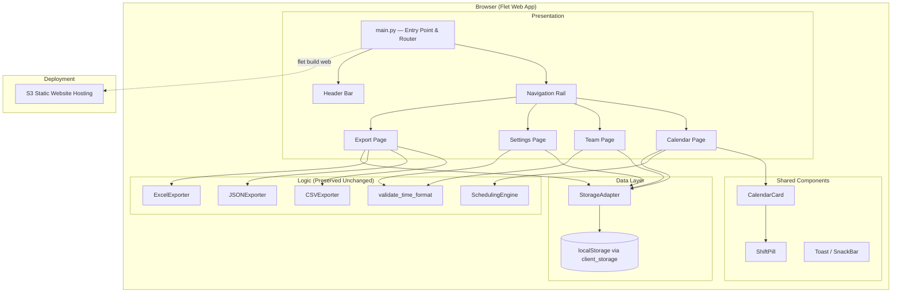

# Design Document: DC-ShiftMaster Web

## Overview

DC-ShiftMaster Web migrates the existing DC-ShiftMaster Pro desktop application from CustomTkinter to a Flet-based web application that compiles to static assets and is hosted on Amazon S3. The core backend modules — `models.py`, `scheduling.py`, `csv_export.py`, `excel_export.py`, and `validation.py` — are preserved unchanged. The SQLite persistence layer (`DatabaseManager`) is replaced by a `StorageAdapter` that uses Flet's `client_storage` API (browser localStorage) with JSON serialization. The UI is rebuilt using Flet's Material 3 component library with a dark "Deepest Navy" theme.

### Key Design Decisions

1. **Flet over a JS framework**: Keeps the entire codebase in Python, reuses existing backend modules directly (no API layer needed), and compiles to static web assets via `flet build web`.
2. **StorageAdapter mirrors DatabaseManager interface**: All existing code that calls `db.get_teammates()`, `db.set_override()`, etc. works with the new adapter by swapping the import — no logic changes needed in scheduling or export modules.
3. **JSON serialization in localStorage**: Each data collection (teammates, shift_windows, overrides) is stored as a single JSON string under a namespaced key. Simple, debuggable, and sufficient for the data volumes involved (~50 teammates, ~365 overrides max).
4. **In-memory buffers for export**: The existing `CSVExporter`, `JSONExporter`, and `ExcelExporter` write to file paths. The web adapter wraps them with `io.StringIO`/`io.BytesIO` buffers and uses Flet's download API to trigger browser downloads — no filesystem access needed.
5. **SQL.js for database migration**: Importing an existing `teammates.db` file uses SQL.js (WebAssembly SQLite) to read the binary database in-browser, extract records, and write them into the StorageAdapter.
6. **ResponsiveRow grid for calendar**: Flet's `ResponsiveRow` with `col` breakpoints handles the 7-column → 1-column responsive layout without custom CSS media queries.

## Architecture



### Module Structure

```
dc_shiftmaster/                    # Existing — preserved unchanged
├── models.py                      # ShiftWindow, Teammate, Override, ScheduleSlot
├── scheduling.py                  # SchedulingEngine (14-day cycle)
├── csv_export.py                  # CSVExporter, JSONExporter, validate_schedule
├── excel_export.py                # ExcelExporter (openpyxl)
└── validation.py                  # validate_time_format

dc_shiftmaster_web/                # New — Flet web application
├── main.py                        # Flet entry point, page init, routing, theme
├── storage.py                     # StorageAdapter (localStorage JSON persistence)
├── theme.py                       # Material 3 dark theme configuration
├── pages/
│   ├── calendar.py                # Calendar/Dashboard view
│   ├── team.py                    # Team management page
│   ├── settings.py                # Settings + DB migration page
│   └── export.py                  # Export page with browser downloads
└── components/
    ├── calendar_card.py           # Single-day Card component
    ├── shift_pill.py              # Shift assignment Chip component
    ├── header_bar.py              # Top bar with year/region display
    └── nav_rail.py                # NavigationRail wrapper
```


## Components and Interfaces

### StorageAdapter (`storage.py`)

Replaces `DatabaseManager` with browser localStorage persistence via Flet's `client_storage` API. Mirrors the same method signatures so that scheduling and export code can use it interchangeably.

```python
class StorageAdapter:
    """Browser localStorage persistence using Flet client_storage.

    Keys:
        dcshift.teammates    — JSON array of teammate dicts
        dcshift.shift_windows — JSON dict of shift window dicts
        dcshift.overrides    — JSON array of override dicts
        dcshift.year         — selected year (string)
        dcshift.region       — selected region code (string)
    """

    def __init__(self, page: ft.Page):
        """Initialize with a Flet page reference for client_storage access."""

    # Shift Windows
    def get_shift_windows(self) -> dict[str, ShiftWindow]:
        """Return {'day': ShiftWindow, 'night': ShiftWindow}."""
    def update_shift_window(self, shift_type: str, start: str, end: str) -> None:
        """Persist updated start/end times for a shift type."""

    # Teammates
    def get_teammates(self) -> list[Teammate]:
        """Return all teammate records."""
    def add_teammate(self, name: str, shift_type: str, custom_start: str = "") -> int:
        """Insert a teammate, return the new ID (max existing + 1)."""
    def update_teammate(self, teammate_id: int, name: str, shift_type: str,
                        custom_start: str = "") -> None:
        """Update an existing teammate."""
    def delete_teammate(self, teammate_id: int) -> None:
        """Remove a teammate record."""

    # Overrides
    def get_overrides(self, year: int) -> list[Override]:
        """Return overrides filtered to the given year."""
    def set_override(self, date: str, shift_type: str, name: str) -> None:
        """Insert or replace an override."""
    def remove_override(self, date: str, shift_type: str) -> None:
        """Delete an override."""

    # Serialization helpers
    def _serialize_teammates(self, teammates: list[Teammate]) -> str:
        """Convert teammate list to JSON string."""
    def _deserialize_teammates(self, json_str: str) -> list[Teammate]:
        """Parse JSON string into Teammate dataclass instances."""
    def _serialize_overrides(self, overrides: list[Override]) -> str:
        """Convert override list to JSON string."""
    def _deserialize_overrides(self, json_str: str) -> list[Override]:
        """Parse JSON string into Override dataclass instances."""
    def _serialize_shift_windows(self, windows: dict[str, ShiftWindow]) -> str:
        """Convert shift windows dict to JSON string."""
    def _deserialize_shift_windows(self, json_str: str) -> dict[str, ShiftWindow]:
        """Parse JSON string into ShiftWindow dict."""

    # Settings
    def get_year(self) -> int:
        """Return the selected year, defaulting to current calendar year."""
    def set_year(self, year: int) -> None:
        """Persist the selected year."""
    def get_region(self) -> str:
        """Return the selected region code, defaulting to empty string."""
    def set_region(self, region: str) -> None:
        """Persist the selected region code."""
```

**JSON serialization format for teammates:**
```json
[
  {"id": 1, "name": "Alice", "shift_type": "FHD", "custom_start": ""},
  {"id": 2, "name": "Bob", "shift_type": "BHN", "custom_start": "19:00"}
]
```

**JSON serialization format for shift windows:**
```json
{
  "day": {"shift_type": "day", "start_time": "06:00", "end_time": "18:30"},
  "night": {"shift_type": "night", "start_time": "18:00", "end_time": "06:30"}
}
```

**JSON serialization format for overrides:**
```json
[
  {"date": "2025-03-15", "shift_type": "day", "name": "Charlie"},
  {"date": "2025-07-04", "shift_type": "night", "name": "nobody"}
]
```

**ID generation strategy:** When adding a new teammate, the adapter reads the current list, finds `max(t.id for t in teammates)` (or 0 if empty), and assigns `max_id + 1`. This avoids collisions without needing an auto-increment database feature.

### Flet App Entry Point (`main.py`)

```python
def main(page: ft.Page):
    """Flet entry point. Configures theme, routing, and initial view."""
    page.title = "DC-ShiftMaster Pro"
    page.theme_mode = ft.ThemeMode.DARK
    page.theme = ft.Theme(
        color_scheme=ft.ColorScheme(
            background="#020617",
            surface="#1E293B",
        )
    )

    storage = StorageAdapter(page)
    engine = SchedulingEngine()

    # Build navigation rail and page container
    nav_rail = build_nav_rail(on_change=route_change)
    content_area = ft.Container(expand=True)
    header = build_header_bar(storage)

    page.add(
        ft.Column([
            header,
            ft.Row([nav_rail, content_area], expand=True),
        ], expand=True)
    )

    # Default to calendar view
    route_change(0)

ft.app(target=main, view=ft.AppView.WEB_BROWSER)
```

### Calendar Page (`pages/calendar.py`)

Renders a monthly grid of `CalendarCard` components using `ft.ResponsiveRow`.

- Each card is a `ft.Card` containing the day number, "F"/"B" label, and `ShiftPill` chips for day/night assignments.
- Month navigation via previous/next `IconButton` controls and a year `Dropdown`.
- Override context menu via `on_long_press` (mobile) or right-click gesture detector.
- Calls `SchedulingEngine.compute_annual_schedule()` on year/month change, caching the full annual schedule and slicing by month for display.

**Calendar grid layout:**
```python
ft.ResponsiveRow(
    columns=7,
    controls=[
        CalendarCard(slot_day, slot_night, col={"xs": 12, "sm": 6, "md": 1})
        for slot_day, slot_night in month_slots
    ]
)
```

### CalendarCard Component (`components/calendar_card.py`)

```python
class CalendarCard(ft.Card):
    """Single day in the calendar grid.

    Displays:
    - Day number and day-of-week abbreviation
    - "F" or "B" ownership label
    - ShiftPill for each day-shift teammate
    - ShiftPill for each night-shift teammate
    - Override indicator (border/icon) when slot is overridden

    Animations:
    - animate_scale on hover (1.0 → 1.02)
    - animate_opacity on hover (0.9 → 1.0)
    """
```

### ShiftPill Component (`components/shift_pill.py`)

```python
class ShiftPill(ft.Chip):
    """Teammate assignment chip within a CalendarCard.

    Color coding:
    - Day shift: amber/gold (#FFD966)
    - Night shift: blue (#4472C4)

    Displays teammate name, optional custom start time suffix,
    and override indicator border when is_override=True.
    """
```

### Export Mechanism (`pages/export.py`)

The existing exporters write to file paths. The web adapter wraps them:

```python
import io
import tempfile

def export_csv(storage: StorageAdapter, engine: SchedulingEngine, page: ft.Page):
    """Generate CSV in memory and trigger browser download."""
    schedule = _compute_schedule(storage, engine)

    # Write to a temporary file, read back as bytes
    with tempfile.NamedTemporaryFile(suffix=".csv", delete=False, mode="w") as tmp:
        CSVExporter().export(schedule, tmp.name)
    with open(tmp.name, "rb") as f:
        content = f.read()

    region = storage.get_region() or "SITE"
    year = storage.get_year()
    filename = f"{region}_{year}_schedule.csv"

    # Trigger browser download via Flet
    page.launch_url(
        f"data:text/csv;base64,{base64.b64encode(content).decode()}"
    )
```

For Excel exports, the same pattern applies using `io.BytesIO` or a temp file, since `openpyxl.Workbook.save()` accepts file paths. The Flet download mechanism uses either `page.launch_url` with a data URI or the `ft.FilePicker` save dialog depending on browser support.

### Theme Configuration (`theme.py`)

```python
DEEPEST_NAVY = ft.Theme(
    color_scheme=ft.ColorScheme(
        background="#020617",       # Deepest navy background
        surface="#1E293B",          # Slate-800 surface
        primary="#3B82F6",          # Blue-500 primary accent
        on_primary="#FFFFFF",
        secondary="#F59E0B",        # Amber-500 for day shifts
        on_secondary="#000000",
        error="#EF4444",            # Red-500 for errors/gaps
        on_background="#F8FAFC",    # Slate-50 text on background
        on_surface="#E2E8F0",       # Slate-200 text on surface
    ),
)

SHIFT_COLORS = {
    "day": "#FFD966",       # Amber/gold for day shift pills
    "night": "#4472C4",     # Blue for night shift pills
    "override": "#EF4444",  # Red border for overridden slots
}
```

### Header Bar (`components/header_bar.py`)

A semi-transparent bar pinned to the top of the viewport:

```python
ft.Container(
    content=ft.Row([
        ft.Text("DC-ShiftMaster Pro", size=18, weight=ft.FontWeight.BOLD),
        ft.Text(f"{region} — {year}", size=14, opacity=0.7),
    ]),
    bgcolor=ft.Colors.with_opacity(0.8, "#1E293B"),
    blur=ft.Blur(10, 10),
    padding=ft.padding.symmetric(horizontal=20, vertical=10),
)
```

### Navigation Rail (`components/nav_rail.py`)

```python
ft.NavigationRail(
    destinations=[
        ft.NavigationRailDestination(icon=ft.Icons.CALENDAR_MONTH, label="Dashboard"),
        ft.NavigationRailDestination(icon=ft.Icons.PEOPLE, label="Team"),
        ft.NavigationRailDestination(icon=ft.Icons.SETTINGS, label="Settings"),
        ft.NavigationRailDestination(icon=ft.Icons.DOWNLOAD, label="Export"),
    ],
    selected_index=0,
    on_change=on_destination_change,
    min_width=80,
    min_extended_width=200,
    extended=True,  # Collapsed to icon-only when viewport < 1024px
)
```

### Data Migration (`settings.py` — Import Database section)

Uses SQL.js (WebAssembly SQLite) loaded via Flet's JavaScript interop or a Python-side `sql.js` wrapper:

```python
def import_database(file_bytes: bytes, storage: StorageAdapter) -> str:
    """Read a teammates.db file and import records into StorageAdapter.

    Uses sql.js to open the binary SQLite data in-browser.
    Returns a summary string like "Imported 12 teammates, 2 shift windows, 5 overrides."
    Merges with existing data, preferring imported values for conflicts.
    """
```

The file picker accepts `.db` files. On selection, the file bytes are passed to `sql.js` which executes `SELECT` queries against the three tables. Extracted records are written into the StorageAdapter, with conflict resolution favoring imported data (same teammate ID → overwrite, same override date+shift_type → overwrite).


## Data Models

The existing data models from `dc_shiftmaster/models.py` are reused unchanged:

```python
@dataclass
class ShiftWindow:
    shift_type: str   # 'day' or 'night'
    start_time: str   # HH:MM format
    end_time: str     # HH:MM format

@dataclass
class Teammate:
    id: int
    name: str
    shift_type: str   # 'FHD', 'FHN', 'BHD', or 'BHN'
    custom_start: str = ""  # Optional HH:MM override

@dataclass
class Override:
    date: str         # 'YYYY-MM-DD'
    shift_type: str   # 'day' or 'night'
    name: str         # Replacement name or 'nobody'

@dataclass
class ScheduleSlot:
    date: date
    shift_type: str
    start_time: str
    teammates: list[str]
    is_override: bool
    teammate_starts: dict[str, str] = None
```

### localStorage Schema

Instead of SQLite tables, data is stored as JSON strings under namespaced keys in `client_storage`:

| Key | Type | Description |
|-----|------|-------------|
| `dcshift.teammates` | JSON array | List of teammate objects with id, name, shift_type, custom_start |
| `dcshift.shift_windows` | JSON object | Dict keyed by 'day'/'night' with start_time, end_time |
| `dcshift.overrides` | JSON array | List of override objects with date, shift_type, name |
| `dcshift.year` | string | Selected year (e.g., "2025") |
| `dcshift.region` | string | Selected DC site code (e.g., "ATL68") |

**Default seed data** (written on first initialization when no data exists):
```json
{
  "day": {"shift_type": "day", "start_time": "06:00", "end_time": "18:30"},
  "night": {"shift_type": "night", "start_time": "18:00", "end_time": "06:30"}
}
```


## Correctness Properties

*A property is a characteristic or behavior that should hold true across all valid executions of a system — essentially, a formal statement about what the system should do. Properties serve as the bridge between human-readable specifications and machine-verifiable correctness guarantees.*

### Property 1: Teammate serialization round-trip

*For any* valid list of Teammate objects (with integer IDs, non-empty names, valid shift types, and optional custom_start times), serializing to JSON and deserializing back should produce an equivalent list of Teammate objects with identical field values.

**Validates: Requirements 2.7**

### Property 2: Override serialization round-trip

*For any* valid list of Override objects (with YYYY-MM-DD date strings, valid shift types, and non-empty names), serializing to JSON and deserializing back should produce an equivalent list of Override objects with identical field values.

**Validates: Requirements 2.8**

### Property 3: Shift window serialization round-trip

*For any* valid dict of ShiftWindow objects keyed by 'day' and 'night' (with HH:MM start and end times), serializing to JSON and deserializing back should produce an equivalent dict of ShiftWindow objects with identical field values.

**Validates: Requirements 2.9**

### Property 4: Teammate ID auto-increment

*For any* sequence of teammate additions to an initially empty StorageAdapter, each newly assigned ID should be strictly greater than all previously assigned IDs, and no two teammates should share the same ID.

**Validates: Requirements 2.5**

### Property 5: Override year filtering

*For any* set of overrides spanning multiple years stored in the StorageAdapter, reading overrides for a specific year should return exactly those overrides whose date starts with that year's prefix, and no overrides from other years.

**Validates: Requirements 2.6**

### Property 6: Empty/whitespace name rejection

*For any* string composed entirely of whitespace characters (including the empty string), attempting to add it as a teammate name via the StorageAdapter should be rejected, and the teammate list should remain unchanged.

**Validates: Requirements 5.4**

### Property 7: Teammate add-then-read

*For any* valid teammate name (non-empty, non-whitespace) and valid shift type (FHD, FHN, BHD, BHN), adding the teammate via the StorageAdapter and then reading all teammates should include a record with that exact name, shift type, and custom_start value.

**Validates: Requirements 5.3**

### Property 8: Teammate delete-then-read

*For any* teammate that exists in the StorageAdapter, deleting that teammate by ID and then reading all teammates should not include any record with that ID.

**Validates: Requirements 5.7**

### Property 9: Calendar card count matches days in month

*For any* valid year and month, the number of CalendarCard components generated for the calendar grid should equal the number of days in that month (28, 29, 30, or 31).

**Validates: Requirements 4.1**

### Property 10: Calendar card content correctness

*For any* date in a computed schedule, the CalendarCard for that date should display the correct day number, the correct day-of-week abbreviation, the correct "F" or "B" ownership label (matching `SchedulingEngine.get_day_owner`), and one ShiftPill per assigned teammate for both day and night shifts. If a teammate has a non-empty `custom_start`, the pill should include that time.

**Validates: Requirements 4.2, 4.3, 4.11**

### Property 11: Teammate grouping by shift type

*For any* list of teammates, grouping them by shift_type should produce groups where every teammate in a group has the matching shift_type, and the union of all groups equals the original list.

**Validates: Requirements 5.1**

### Property 12: CSV teammate import parsing

*For any* valid CSV content where each row is `name,shift_type[,custom_start]` with valid shift types, parsing and importing should produce teammate records matching the CSV rows. Rows with invalid shift types (not FHD, FHN, BHD, BHN) should be skipped, and only valid rows should appear in the StorageAdapter.

**Validates: Requirements 5.9, 5.10**

### Property 13: Export filename pattern

*For any* region string and year integer, the generated export filename should match the pattern `{region}_{year}_schedule.{ext}` where ext is `csv`, `json`, or `xlsx` depending on the export type.

**Validates: Requirements 7.2, 7.3, 7.4**

### Property 14: Invalid schedule blocks export

*For any* schedule that fails `validate_schedule` (e.g., non-chronological order, non-ASCII names), attempting to export should raise a `ValueError` and produce no output file.

**Validates: Requirements 7.5**

### Property 15: Database import merge with conflict resolution

*For any* combination of existing StorageAdapter data and imported database records, after import: (a) all imported records should be present, (b) existing records with no conflicts should be preserved, and (c) for conflicting keys (same teammate ID or same override date+shift_type), the imported values should take precedence.

**Validates: Requirements 10.3, 10.6**


## Error Handling

| Scenario | Handling |
|---|---|
| Browser lacks localStorage support | Display Toast: "Browser storage unavailable. Data will not persist between sessions." App continues in memory-only mode. |
| Empty/whitespace teammate name | StorageAdapter raises `ValueError`; Team_Page displays Toast with "Teammate name must not be empty." |
| Invalid HH:MM time input | `validate_time_format` returns `(False, error_msg)`; Settings/Team page displays inline error, rejects save. |
| Invalid shift type in CSV import | Skip row, collect skipped row numbers, display Toast listing them after import completes. |
| Schedule validation fails on export | `validate_schedule` returns errors; Export_Page displays Toast with first error, cancels download. |
| Invalid .db file for migration | SQL.js fails to open or expected tables missing; display Toast: "Invalid database file. Expected teammates.db format." |
| localStorage quota exceeded | Catch storage write error; display Toast: "Storage full. Please clear browser data or reduce overrides." |
| Export generates empty schedule | All slots are "nobody"; CSV/JSON export still produces valid output (existing exporter behavior preserved). |
| Duplicate teammate name | Allowed — teammates are identified by integer ID, not name uniqueness. |
| Network error loading Flet app | Standard browser error; S3 returns 404/403 if assets missing. No app-level handling needed. |

## Testing Strategy

### Dual Testing Approach

The project uses both unit tests and property-based tests. The existing backend modules (`scheduling.py`, `csv_export.py`, `excel_export.py`, `validation.py`, `models.py`) are already tested by the dc-shiftmaster-pro test suite. The web-specific tests focus on the new `StorageAdapter` and the UI integration layer.

**Unit Tests** (pytest):
- Default seed data: verify StorageAdapter initializes with correct default shift windows when no data exists
- Page title: verify "DC-ShiftMaster Pro" is set
- Default landing page: verify Calendar_View is displayed on init
- Year default: verify year selector defaults to current calendar year
- Navigation destinations: verify 4 destinations (Dashboard, Team, Settings, Export)
- Edge cases: localStorage unavailable, invalid .db file import, storage quota exceeded
- Integration: export flow end-to-end with in-memory buffers

**Property-Based Tests** (Hypothesis):
- Each correctness property (1–15) is implemented as a single Hypothesis test
- Minimum 100 iterations per property test (`@settings(max_examples=100)`)
- Custom strategies for generating valid teammates, shift windows, overrides, dates, and CSV content
- Each test is tagged with a comment referencing its design property:
  ```python
  # Feature: dc-shiftmaster-web, Property 1: Teammate serialization round-trip
  ```

**Testing Library**: [Hypothesis](https://hypothesis.readthedocs.io/) — the standard property-based testing library for Python.

**Key Test Strategies (Hypothesis custom strategies)**:
- `valid_teammate()` — generates Teammate objects with non-empty names, valid shift types (FHD/FHN/BHD/BHN), and optional custom_start in HH:MM format
- `valid_override()` — generates Override objects with YYYY-MM-DD dates, valid shift types (day/night), and non-empty names
- `valid_shift_windows()` — generates dict with 'day' and 'night' ShiftWindow objects with valid HH:MM times
- `valid_csv_row()` — generates CSV rows in `name,shift_type[,custom_start]` format
- `whitespace_string()` — generates strings composed entirely of whitespace (spaces, tabs, newlines)
- `valid_year()` — generates years in range 2000-2100
- `valid_region()` — generates DC site code strings (e.g., "ATL68", "ATL78")

**StorageAdapter Testing Approach**:
The StorageAdapter depends on Flet's `client_storage` API which requires a running Flet page. For unit and property tests, a `MockClientStorage` dict-backed implementation is used to simulate `client_storage` without a browser. This allows testing serialization round-trips, ID generation, and filtering logic in isolation.

```python
class MockClientStorage:
    """Dict-backed mock of Flet's client_storage for testing."""
    def __init__(self):
        self._data: dict[str, str] = {}

    def get(self, key: str) -> str | None:
        return self._data.get(key)

    def set(self, key: str, value: str) -> None:
        self._data[key] = value

    def remove(self, key: str) -> None:
        self._data.pop(key, None)
```

**Test Organization**:
```
tests/
├── test_storage_adapter.py     # Properties 1-8 — serialization, CRUD, ID generation
├── test_calendar_logic.py      # Properties 9-10 — card count and content
├── test_team_logic.py          # Properties 11-12 — grouping, CSV import
├── test_export_web.py          # Properties 13-14 — filename pattern, validation blocking
├── test_migration.py           # Property 15 — database import merge
└── conftest.py                 # Shared fixtures, MockClientStorage, Hypothesis strategies
```
