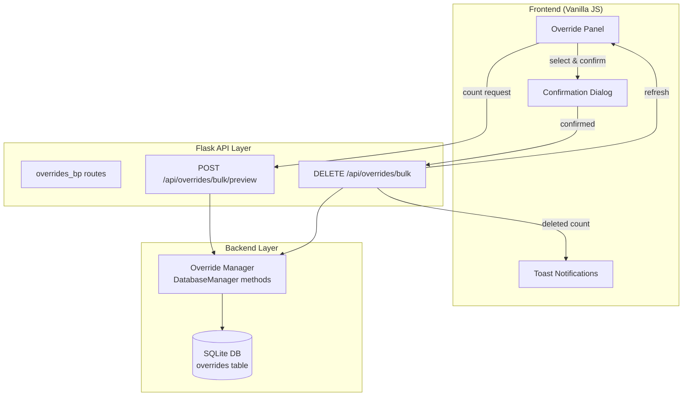

# Design Document: Delete Schedule Overrides

## Overview

This feature extends DC-ShiftMaster Pro with bulk-delete capabilities for schedule overrides. The existing system supports single-override deletion via `DELETE /api/overrides` with a `{date, shift_type}` payload. This design adds a new bulk-delete API endpoint and an Override Panel UI on the Team Management page, enabling users to efficiently remove multiple overrides through date-range filtering, year-wide clearing, or individual selection.

### Design Decisions

1. **Single new endpoint** — A single `DELETE /api/overrides/bulk` endpoint handles all three deletion modes (date range, specific keys, clear-all-year) via request body discrimination. This avoids endpoint sprawl while keeping the existing single-delete endpoint backward-compatible.

2. **Transactional deletion** — All bulk deletes execute within a single database transaction. Either all specified overrides are removed or none are, preventing partial-delete states.

3. **UI placement** — The Override Panel lives on the Team Management page (team view) rather than a separate navigation item, keeping override management co-located with team configuration.

4. **Count-before-delete pattern** — The API returns a preview count before deletion and the actual deleted count after, enabling the confirmation dialog to show accurate numbers.

## Architecture



### Request Flow

1. User opens Override Panel → `GET /api/overrides/<year>` loads the list.
2. User selects deletion mode (date range / select-all-year / checkbox selection).
3. Frontend calls `POST /api/overrides/bulk/preview` to get the count of matching overrides.
4. Confirmation Dialog shows the count and (for clear-all) requires a typed phrase.
5. On confirm, frontend calls `DELETE /api/overrides/bulk` with the same payload.
6. Backend deletes within a transaction, returns `{deleted_count}`.
7. Frontend shows a toast and refreshes the override list and dashboard calendar.

## Components and Interfaces

### Backend Components

#### 1. New DatabaseManager Methods

```python
# dc_shiftmaster/database.py

def count_overrides_in_range(self, start_date: str, end_date: str, team_id: int = None) -> int:
    """Count overrides between start_date and end_date (inclusive)."""

def bulk_delete_overrides_by_range(self, start_date: str, end_date: str, team_id: int = None) -> int:
    """Delete all overrides in [start_date, end_date]. Returns deleted count."""

def bulk_delete_overrides_by_keys(self, keys: list[tuple[str, str]], team_id: int = None) -> int:
    """Delete overrides matching specific (date, shift_type) pairs. Returns deleted count."""

def bulk_delete_overrides_by_year(self, year: int, team_id: int = None) -> int:
    """Delete all overrides for a given year. Returns deleted count."""
```

#### 2. New API Routes (routes_overrides.py)

```python
@overrides_bp.route("/api/overrides/bulk/preview", methods=["POST"])
def preview_bulk_delete():
    """Return the count of overrides that would be deleted.
    
    Request body (one of):
        {"mode": "range", "start_date": "YYYY-MM-DD", "end_date": "YYYY-MM-DD"}
        {"mode": "keys", "keys": [{"date": "...", "shift_type": "..."}]}
        {"mode": "year", "year": 2025}
    
    Returns:
        200: {"count": N}
        400: {"error": "..."}
    """

@overrides_bp.route("/api/overrides/bulk", methods=["DELETE"])
def bulk_delete():
    """Bulk delete overrides.
    
    Request body (same schema as preview):
        {"mode": "range", "start_date": "YYYY-MM-DD", "end_date": "YYYY-MM-DD"}
        {"mode": "keys", "keys": [{"date": "...", "shift_type": "..."}]}
        {"mode": "year", "year": 2025}
    
    Returns:
        200: {"deleted_count": N}
        400: {"error": "..."}
        500: {"error": "..."}
    """
```

### Frontend Components

#### 3. Override Panel (overrides-panel.js)

A new JS module responsible for:
- Rendering the override list grouped by month
- Date range inputs with validation
- Checkbox selection per override
- "Select All" toggle
- "Clear All Year" button
- Triggering confirmation dialogs
- Calling API and refreshing UI

#### 4. Confirmation Dialog Enhancement

Extends the existing DOM modal pattern:
- Shows override count
- For "Clear All Year": requires typed confirmation phrase (e.g., "DELETE ALL")
- Blocks deletion if dialog fails to render

### Interface Contracts

| Endpoint | Method | Request Body | Success Response | Error Response |
|----------|--------|-------------|-----------------|----------------|
| `/api/overrides/bulk/preview` | POST | `{mode, ...params}` | `200 {count: N}` | `400 {error}` |
| `/api/overrides/bulk` | DELETE | `{mode, ...params}` | `200 {deleted_count: N}` | `400 {error}`, `500 {error}` |

## Data Models

### API Request Schema

```typescript
// Mode: date range
interface RangeDeleteRequest {
    mode: "range";
    start_date: string;  // YYYY-MM-DD
    end_date: string;    // YYYY-MM-DD
}

// Mode: specific keys
interface KeysDeleteRequest {
    mode: "keys";
    keys: Array<{date: string; shift_type: string}>;
}

// Mode: clear year
interface YearDeleteRequest {
    mode: "year";
    year: number;
}

type BulkDeleteRequest = RangeDeleteRequest | KeysDeleteRequest | YearDeleteRequest;
```

### API Response Schema

```typescript
interface PreviewResponse {
    count: number;
}

interface BulkDeleteResponse {
    deleted_count: number;
}

interface ErrorResponse {
    error: string;
}
```

### Database Operations

The `overrides` table schema remains unchanged:
```sql
CREATE TABLE overrides (
    date TEXT,
    shift_type TEXT,
    name TEXT,
    team_id INTEGER,
    PRIMARY KEY (date, shift_type)
);
```

New query patterns:
- **Range delete**: `DELETE FROM overrides WHERE date >= ? AND date <= ? AND team_id = ?`
- **Keys delete**: `DELETE FROM overrides WHERE (date = ? AND shift_type = ?) AND team_id = ?` (batched)
- **Year delete**: `DELETE FROM overrides WHERE date LIKE '{year}-%' AND team_id = ?`

### Validation Rules

| Rule | Condition | Response |
|------|-----------|----------|
| Invalid mode | mode not in ("range", "keys", "year") | 400 |
| Range: start > end | start_date > end_date | 400 |
| Range: invalid date format | not YYYY-MM-DD | 400 |
| Keys: empty list | keys array is empty | 400 |
| Keys: invalid entry | any key missing date or shift_type | 400 (reject entire request) |
| Keys: invalid date format | date not YYYY-MM-DD | 400 (reject entire request) |
| Year: invalid | not a 4-digit integer | 400 |


## Correctness Properties

*A property is a characteristic or behavior that should hold true across all valid executions of a system — essentially, a formal statement about what the system should do. Properties serve as the bridge between human-readable specifications and machine-verifiable correctness guarantees.*

### Property 1: Override Display Completeness

*For any* set of overrides for a given year, the grouping function SHALL place every override into the correct month bucket, lose no overrides, introduce no duplicates, and each rendered entry SHALL contain the override's date, shift type, and assigned name.

**Validates: Requirements 1.1, 1.2**

### Property 2: Empty State Biconditional

*For any* list of overrides (including empty), the "no overrides" message SHALL be displayed if and only if the override list is empty — it must appear when the list has zero items and must NOT appear when the list has one or more items.

**Validates: Requirements 1.3**

### Property 3: Range Delete Correctness

*For any* set of overrides and any valid date range [start, end] where start ≤ end, after a bulk-delete-by-range operation: (a) no overrides with dates within the range SHALL remain in the database for the current team, and (b) all overrides with dates outside the range SHALL be preserved unchanged.

**Validates: Requirements 2.1, 5.1**

### Property 4: Invalid Range Rejection

*For any* pair of dates where start_date > end_date, the bulk-delete endpoint SHALL return a 400 error and SHALL NOT delete any overrides from the database.

**Validates: Requirements 2.2**

### Property 5: Year Delete Correctness

*For any* set of overrides spanning multiple years and any target year, after a clear-all-year operation: (a) no overrides for the target year SHALL remain for the current team, and (b) all overrides for other years SHALL be preserved unchanged.

**Validates: Requirements 3.1**

### Property 6: Keys Delete Correctness

*For any* set of overrides and any subset of (date, shift_type) keys selected for deletion, after a keys-based bulk delete: (a) exactly the selected overrides SHALL be removed, and (b) all non-selected overrides SHALL remain unchanged.

**Validates: Requirements 4.3, 5.2**

### Property 7: Deleted Count Accuracy

*For any* bulk-delete operation (range, keys, or year mode), the `deleted_count` returned in the API response SHALL equal the actual number of override rows removed from the database (i.e., count_before − count_after).

**Validates: Requirements 5.3**

### Property 8: Invalid Request All-or-Nothing Rejection

*For any* bulk-delete request containing invalid override identifiers (missing date, missing shift_type, malformed date format, or empty keys list), the system SHALL return a 400 status code AND SHALL NOT delete any overrides — even if some keys in the request are valid.

**Validates: Requirements 5.4**

### Property 9: Team Isolation

*For any* bulk-delete operation executed in the context of team A, all overrides belonging to team B (where B ≠ A) SHALL remain completely unchanged regardless of the deletion mode or parameters.

**Validates: Requirements 5.5**

## Error Handling

| Scenario | HTTP Status | Response Body | User-Facing Behavior |
|----------|-------------|---------------|---------------------|
| Invalid mode value | 400 | `{"error": "Invalid mode. Must be 'range', 'keys', or 'year'."}` | Error toast |
| Range: start > end | 400 | `{"error": "start_date must be on or before end_date."}` | Validation message in panel |
| Range: invalid date format | 400 | `{"error": "Invalid date format. Use YYYY-MM-DD."}` | Validation message in panel |
| Keys: empty list | 400 | `{"error": "keys array must not be empty."}` | Error toast |
| Keys: invalid entry | 400 | `{"error": "Invalid key at index N: missing 'date' or 'shift_type'."}` | Error toast |
| Year: invalid | 400 | `{"error": "year must be a 4-digit integer."}` | Validation message in panel |
| Database error | 500 | `{"error": "Bulk delete failed: {details}"}` | Error toast with retry suggestion |
| Cross-team access (should not happen with proper scoping) | 500 | `{"error": "Internal server error"}` | Error toast |

### Frontend Validation (pre-request)

- Date range: start ≤ end validated before API call; invalid range shows inline error
- Empty selection: delete button disabled when no overrides are selected
- Clear-all confirmation: requires exact phrase match before enabling confirm button

### Transaction Safety

All bulk-delete operations use a single `BEGIN...COMMIT` transaction. On any SQL error, the transaction rolls back and no overrides are deleted. The error is propagated to the API layer as a 500 response.

## Testing Strategy

### Property-Based Tests (pytest + hypothesis)

The following properties will be tested with minimum 100 iterations each using the Hypothesis library:

| Property | Test Module | What Varies |
|----------|-------------|-------------|
| P1: Display Completeness | `test_override_panel_logic.py` | Override sets with random dates/shifts/names |
| P2: Empty State Biconditional | `test_override_panel_logic.py` | Empty and non-empty override lists |
| P3: Range Delete | `test_bulk_delete_props.py` | Override sets × date ranges |
| P4: Invalid Range Rejection | `test_bulk_delete_props.py` | Date pairs where start > end |
| P5: Year Delete | `test_bulk_delete_props.py` | Multi-year override sets × target years |
| P6: Keys Delete | `test_bulk_delete_props.py` | Override sets × random subsets |
| P7: Deleted Count Accuracy | `test_bulk_delete_props.py` | All three modes with random data |
| P8: All-or-Nothing Rejection | `test_bulk_delete_props.py` | Requests with invalid keys mixed with valid ones |
| P9: Team Isolation | `test_bulk_delete_props.py` | Two-team scenarios with all delete modes |

**Configuration:**
- Each property test runs minimum 100 examples (`@settings(max_examples=100)`)
- Tag format: `Feature: delete-schedule-overrides, Property N: {title}`

### Unit Tests (pytest)

- API route handlers: verify correct HTTP status codes and response shapes for each mode
- Input validation: specific invalid payloads return 400 with expected error messages
- Edge cases: deletion of zero overrides returns `deleted_count: 0`, not an error
- Confirmation phrase matching (frontend logic)

### Integration Tests

- End-to-end: create overrides via `POST /api/overrides`, then bulk-delete via the new endpoint, verify via `GET /api/overrides/<year>` that correct overrides are gone
- Multi-team scenario: create overrides for two teams, delete from one, verify other is untouched

### Frontend Tests (Jest)

- Override Panel rendering: grouped-by-month display, checkbox states, select-all behavior
- Confirmation dialog: shows correct count, phrase validation for clear-all
- API integration: correct payloads sent for each deletion mode
- Toast feedback: success/error messages rendered correctly

### PBT Library

- **Backend**: `hypothesis` (already used in the project for override property tests)
- **Frontend**: Not applicable — frontend tests are example-based via Jest
