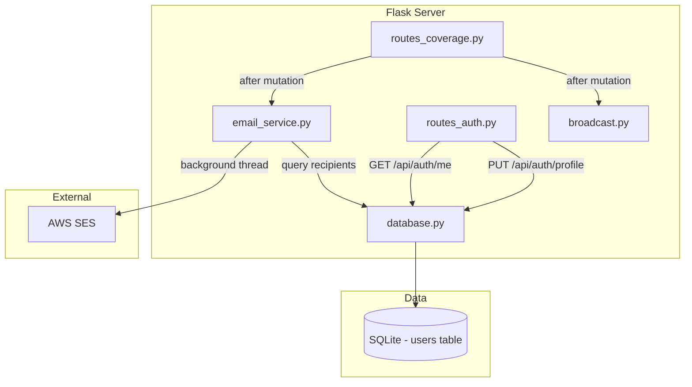

# Design Document: Email Notifications

## Overview

This feature adds email notifications to DC-ShiftMaster Pro so that users receive alerts about coverage request events (created, claimed) even when they are not actively connected to the web application. Emails are sent via AWS SES using boto3, triggered from the same coverage route handlers that already call `broadcast_coverage_event()` for WebSocket notifications.

### Key Design Decisions

1. **New `email_service.py` module**: A standalone module in `dc_shiftmaster_html/` that encapsulates all SES interaction. Coverage routes call a single function (`send_coverage_email`) similar to how they call `broadcast_coverage_event`. This keeps email logic decoupled from route handlers.

2. **Database migration for email fields**: Two new columns (`email` and `email_notifications_enabled`) are added to the existing `users` table via the `_migrate()` method in `DatabaseManager`. This follows the same pattern used for the `custom_start` column on `teammates`.

3. **User model extension**: The `User` dataclass gains `email: str` and `email_notifications_enabled: bool` fields with defaults (`""` and `False`), preserving backward compatibility with existing code that constructs `User` objects.

4. **Profile update endpoint**: A new `PUT /api/auth/profile` route in `routes_auth.py` handles email and notification preference updates. The existing `GET /api/auth/me` endpoint is extended to return the new fields.

5. **Async email via `threading.Thread`**: Each email send is dispatched to a daemon thread. This matches the project's existing threading pattern (broadcast module uses `threading.Lock`) and avoids adding async framework dependencies. The API response returns immediately without waiting for SES.

6. **Graceful degradation**: If `SES_SENDER_EMAIL` is not configured, the email service logs a warning and becomes a no-op. SES errors are caught and logged without propagating to the caller.

7. **Email validation**: Simple validation requiring exactly one `@` with non-empty local and domain parts. No regex-heavy RFC 5322 validation — SES will reject truly invalid addresses at send time.

## Architecture



The email notification flow mirrors the existing WebSocket broadcast flow:

1. Coverage route handler performs the DB mutation
2. Route handler calls `broadcast_coverage_event()` (existing)
3. Route handler calls `send_coverage_email()` (new)
4. `send_coverage_email()` queries the database for eligible recipients
5. For each recipient, a daemon thread is spawned to call SES via boto3
6. The route returns the HTTP response immediately

## Components and Interfaces

### 1. `email_service.py` — New Module

```python
# dc_shiftmaster_html/email_service.py

def validate_email(email: str) -> bool:
    """Return True if email has exactly one '@' with non-empty local and domain parts."""

def send_coverage_email(event_type: str, request_id: int, db: DatabaseManager) -> None:
    """Send email notifications for a coverage event.
    
    Determines the recipient set based on event_type, composes the email,
    and dispatches sending to a background thread.
    
    Args:
        event_type: "created" or "claimed"
        request_id: ID of the coverage request
        db: DatabaseManager instance for looking up users and request details
    """

def _build_email_body(event_type: str, coverage_request, requester, claimer=None) -> tuple[str, str]:
    """Return (subject, body) for the given event type and request details."""

def _send_ses_email(recipient_email: str, subject: str, body: str) -> None:
    """Send a single email via SES. Called in a background thread.
    
    Reads SES_SENDER_EMAIL and SES_AWS_REGION from environment.
    Logs errors without raising.
    """
```

### 2. `routes_auth.py` — Extended

New endpoint added to the existing `auth_bp` blueprint:

```python
@auth_bp.route("/profile", methods=["PUT"])
def update_profile():
    """Update the authenticated user's email and/or notification preference.
    
    Accepts JSON: {"email": "...", "email_notifications_enabled": true/false}
    Returns updated user info or validation error.
    """
```

The existing `_user_info()` helper is extended to include `email` and `email_notifications_enabled` fields, and the `GET /api/auth/me` endpoint automatically returns them.

### 3. `database.py` — Extended

New methods on `DatabaseManager`:

```python
def update_user_profile(self, user_id: int, email: str, 
                        email_notifications_enabled: bool) -> None:
    """Update a user's email and notification preference."""

def get_notification_recipients(self, exclude_user_id: int = None) -> list[User]:
    """Return users with email_notifications_enabled=True and a non-empty email.
    
    Optionally excludes a specific user (e.g., the requester).
    """
```

The `_migrate()` method gains two new `ALTER TABLE` statements for the `email` and `email_notifications_enabled` columns.

### 4. `routes_coverage.py` — Extended

Each mutation endpoint (`create_coverage`, `claim_coverage`) adds a call to `send_coverage_email()` after the existing `broadcast_coverage_event()` call, wrapped in a try/except to prevent email failures from affecting the API response.

### 5. `models.py` — Extended

```python
@dataclass
class User:
    # ... existing fields ...
    email: str = ""
    email_notifications_enabled: bool = False
```

### 6. `.env.example` — Extended

```dotenv
# AWS SES email sender address (e.g. noreply@example.com).
# If not set, email notifications are disabled.
SES_SENDER_EMAIL=

# AWS region for SES (default: us-east-1).
SES_AWS_REGION=us-east-1
```

## Data Models

### Users Table — Updated Schema

```sql
CREATE TABLE IF NOT EXISTS users (
    id                          INTEGER PRIMARY KEY AUTOINCREMENT,
    username                    TEXT NOT NULL UNIQUE,
    password_hash               TEXT NOT NULL,
    display_name                TEXT NOT NULL,
    teammate_name               TEXT NOT NULL DEFAULT '',
    created_at                  TEXT NOT NULL DEFAULT (datetime('now')),
    email                       TEXT NOT NULL DEFAULT '',
    email_notifications_enabled INTEGER NOT NULL DEFAULT 0
);
```

The two new columns are added via migration:

```python
# In DatabaseManager._migrate()
if "email" not in columns_users:
    cursor.execute("ALTER TABLE users ADD COLUMN email TEXT NOT NULL DEFAULT ''")
if "email_notifications_enabled" not in columns_users:
    cursor.execute("ALTER TABLE users ADD COLUMN email_notifications_enabled INTEGER NOT NULL DEFAULT 0")
```

### User Dataclass — Updated

| Field | Type | Default | Description |
|-------|------|---------|-------------|
| id | int | — | Primary key |
| username | str | — | Unique login name |
| password_hash | str | — | Werkzeug hashed password |
| display_name | str | — | UI display name |
| teammate_name | str | "" | Links to Teammate.name |
| created_at | str | — | ISO datetime |
| email | str | "" | User's email address |
| email_notifications_enabled | bool | False | Opt-in flag |

### Recipient Set Logic

| Event Type | Recipients |
|------------|-----------|
| created | All users with `email != ''` AND `email_notifications_enabled = 1` AND `id != requester_id` |
| claimed | The requester only, if `email != ''` AND `email_notifications_enabled = 1` |

### Email Templates

**Created event:**
- Subject: `[ShiftMaster] New Coverage Request from {requester_display_name}`
- Body: `{requester_display_name} needs coverage for the {shift_type} shift on {date}.` + note if present

**Claimed event:**
- Subject: `[ShiftMaster] Your Coverage Request Was Claimed`
- Body: `{claimer_display_name} has claimed your {shift_type} shift on {date}.`


## Correctness Properties

*A property is a characteristic or behavior that should hold true across all valid executions of a system — essentially, a formal statement about what the system should do. Properties serve as the bridge between human-readable specifications and machine-verifiable correctness guarantees.*

### Property 1: Profile update round-trip

*For any* user and any valid email string and boolean notification preference, updating the user's profile via `update_user_profile()` and then reading the user back via `get_user_by_id()` should return a User with the same email and `email_notifications_enabled` values that were written.

**Validates: Requirements 1.1, 1.3, 2.2, 6.2**

### Property 2: Email validation

*For any* string, `validate_email()` returns `True` if and only if the string contains exactly one `@` character, the substring before `@` is non-empty, and the substring after `@` is non-empty. For the empty string, `validate_email()` returns `False`.

**Validates: Requirements 1.4**

### Property 3: Enabling notifications requires an email address

*For any* user whose stored email is empty, attempting to set `email_notifications_enabled` to `True` via the profile update endpoint should return an error and leave the preference unchanged at `False`.

**Validates: Requirements 2.3**

### Property 4: Created event recipient set

*For any* set of users with varying email addresses and notification preferences, and any coverage request "created" event, the set of users who receive an email should be exactly those users who have a non-empty email, `email_notifications_enabled` set to `True`, and are not the requester.

**Validates: Requirements 3.1, 3.2**

### Property 5: Claimed event recipient

*For any* coverage request "claimed" event, the email is sent to the requester if and only if the requester has a non-empty email and `email_notifications_enabled` set to `True`. No other users receive an email for this event type.

**Validates: Requirements 4.1**

### Property 6: Email body completeness

*For any* coverage request with arbitrary display names, dates, shift types, and notes: when the event type is "created", the composed email body contains the requester's display name, the shift date, the shift type, and the note (if non-empty). When the event type is "claimed", the composed email body contains the claimer's display name, the shift date, and the shift type.

**Validates: Requirements 3.3, 4.2**

### Property 7: Missing sender config disables email

*For any* coverage event, if the `SES_SENDER_EMAIL` environment variable is not set (empty or absent), the email service sends zero emails and raises no exceptions.

**Validates: Requirements 5.4**

### Property 8: SES errors do not propagate

*For any* coverage event where the SES client raises an exception, the `send_coverage_email()` function completes without raising an exception, and the calling coverage route returns a successful HTTP response.

**Validates: Requirements 5.5, 7.3**

## Error Handling

| Scenario | Behavior |
|----------|----------|
| `SES_SENDER_EMAIL` not set | Log warning at startup, all `send_coverage_email()` calls become no-ops |
| SES `send_email` raises any exception | Log the error with `logger.exception()`, do not re-raise |
| Invalid email format on profile update | Return HTTP 400 with `{"error": "Invalid email address format"}` |
| Enable notifications without email | Return HTTP 400 with `{"error": "Email address is required to enable notifications"}` |
| Unauthenticated profile update | Return HTTP 401 with `{"error": "Not authenticated"}` |
| Database error during profile update | Return HTTP 500 via the global exception handler in `server.py` |
| Background thread crashes | Daemon thread dies silently; logged via `logger.exception()` |
| Coverage request not found during email send | Log warning, skip email (request may have been deleted between mutation and email lookup) |

## Testing Strategy

### Unit Tests

Unit tests cover specific examples, edge cases, and integration points:

- `validate_email` with known valid/invalid inputs (empty string, missing `@`, multiple `@`, valid format)
- Registration with and without email field
- Profile update endpoint: success, validation errors, 401 for unauthenticated
- `_build_email_body` with specific event types and data
- `GET /api/auth/me` includes email and notification preference fields
- Database migration adds columns without data loss
- `get_notification_recipients` excludes users with empty email or disabled notifications
- Email subject lines match expected format for each event type

### Property-Based Tests

Property-based tests use the **Hypothesis** library (already in use in this project based on `.hypothesis/` directory).

Each property test runs a minimum of 100 iterations and is tagged with a comment referencing the design property.

| Property | Test Description | Tag |
|----------|-----------------|-----|
| Property 1 | Generate random email strings and booleans, write via `update_user_profile`, read back, assert equality | `Feature: email-notifications, Property 1: Profile update round-trip` |
| Property 2 | Generate random strings, run `validate_email`, assert result matches the structural check (exactly one `@`, non-empty parts) | `Feature: email-notifications, Property 2: Email validation` |
| Property 3 | Generate users with empty email, attempt to enable notifications, assert error returned and preference unchanged | `Feature: email-notifications, Property 3: Enabling notifications requires email` |
| Property 4 | Generate random user sets with varying email/preference states, compute recipient set for "created" event, assert it matches the filter criteria | `Feature: email-notifications, Property 4: Created event recipient set` |
| Property 5 | Generate random requester email/preference states, compute recipient for "claimed" event, assert only requester receives email when eligible | `Feature: email-notifications, Property 5: Claimed event recipient` |
| Property 6 | Generate random coverage request data (names, dates, shift types, notes), build email body, assert all required fields appear in the output | `Feature: email-notifications, Property 6: Email body completeness` |
| Property 7 | Generate random coverage events, unset `SES_SENDER_EMAIL`, call `send_coverage_email`, assert no SES calls made and no exceptions raised | `Feature: email-notifications, Property 7: Missing sender config disables email` |
| Property 8 | Generate random coverage events, mock SES to raise exceptions, call `send_coverage_email`, assert no exception propagates | `Feature: email-notifications, Property 8: SES errors do not propagate` |

Each correctness property is implemented by a single property-based test. Unit tests complement these by covering specific examples, edge cases (empty email field acceptance, subject line format), and integration points (endpoint HTTP status codes, database migration).
