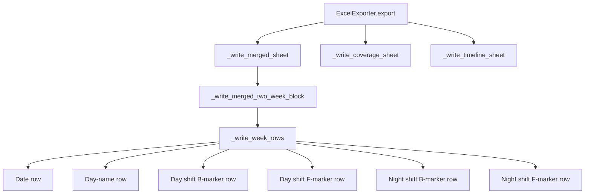

# Design Document: Excel Export Merge

## Overview

This feature modifies the `ExcelExporter` class in `dc_shiftmaster/excel_export.py` to produce a single merged calendar worksheet combining day and night shifts, replacing the current two-sheet approach. Each cell gains shift time annotations, and the two-week block layout expands to include both day and night marker rows per week.

**Key design decisions:**

1. **Single worksheet replaces two** — The `_write_sheet()` method is replaced by a new `_write_merged_sheet()` that renders both shifts in one pass, eliminating the need for users to switch tabs.
2. **Expanded block layout** — Each week within a two-week block grows from 4 rows (date, day-name, B-marker, F-marker) to 6 rows (date, day-name, day-B, day-F, night-B, night-F) with "Day"/"Night" labels in column A.
3. **Shift times in cells** — When `shift_windows` is provided, each marker cell includes the time range (e.g. "06:00–18:30") between the B/F marker and teammate names.
4. **Backward-compatible API** — The `export()` method signature is unchanged; callers get the new layout automatically.
5. **Existing sheets preserved** — Coverage Summary and Timeline sheets are generated identically to today.

## Architecture



The architecture remains a single-class design. The main structural change is:

- `_write_sheet()` → removed (was called twice for day/night)
- `_write_merged_sheet()` → new method, called once, writes both shifts
- `_write_two_week_block()` → replaced by `_write_merged_two_week_block()` which renders 6 rows per week instead of 4
- Helper `_format_cell_content()` → new, builds the multi-line cell text (marker + time + names)

## Components and Interfaces

### ExcelExporter (modified)

```python
class ExcelExporter:
    def export(
        self,
        year: int,
        schedule: list[ScheduleSlot],
        engine: SchedulingEngine,
        filepath: str,
        shift_windows: Optional[dict[str, ShiftWindow]] = None,
    ) -> None:
        """Public API — signature unchanged."""
        ...

    def _write_merged_sheet(
        self,
        ws,
        year: int,
        cycle_start: date,
        year_end: date,
        engine: SchedulingEngine,
        lookup: dict[tuple[str, str], ScheduleSlot],
        shift_windows: Optional[dict[str, ShiftWindow]],
    ) -> None:
        """Write the single merged calendar worksheet."""
        ...

    def _write_merged_two_week_block(
        self,
        ws,
        start_row: int,
        week_start: date,
        year: int,
        engine: SchedulingEngine,
        lookup: dict[tuple[str, str], ScheduleSlot],
        shift_windows: Optional[dict[str, ShiftWindow]],
    ) -> int:
        """Write a 2-week block with day+night rows per week. Returns next row."""
        ...

    def _format_cell_content(
        self,
        marker: str,
        shift_window: Optional[ShiftWindow],
        slot: Optional[ScheduleSlot],
    ) -> str:
        """Build multi-line cell text: marker\\ntime_range\\nnames."""
        ...
```

### Cell Content Format

Each marker cell displays (when shift_windows provided):
```
B
06:00–18:30
Alice, Bob
```

When shift_windows is `None` or missing the relevant key:
```
B
Alice, Bob
```

When teammates are `["nobody"]`, only the marker (and optionally time) are shown.

### Row Layout Per Week (6 rows)

| Row | Content | Column A Label |
|-----|---------|----------------|
| 1 | Dates (D-Mon format) | — |
| 2 | Day names (Wednesday..Tuesday) | — |
| 3 | Day shift B-markers + times + names | "Day" |
| 4 | Day shift F-markers + times + names | — |
| 5 | Night shift B-markers + times + names | "Night" |
| 6 | Night shift F-markers + times + names | — |

### Worksheet Structure

| Sheet Position | Sheet Name | Content |
|---|---|---|
| 1 (leftmost) | `{year} Shift Calendar` | Merged day+night calendar |
| 2 | `Coverage Summary` | Unchanged |
| 3 | `Timeline` | Unchanged |

## Data Models

No new data models are introduced. The feature uses existing models:

- **`ScheduleSlot`** — provides `date`, `shift_type`, `start_time`, `teammates`, `is_override`
- **`ShiftWindow`** — provides `shift_type`, `start_time`, `end_time` for time range display
- **`SchedulingEngine`** — provides `get_day_owner(date)` for B/F determination

The slot lookup dictionary remains `dict[tuple[str, str], ScheduleSlot]` keyed by `(date_iso, shift_type)`.


## Correctness Properties

*A property is a characteristic or behavior that should hold true across all valid executions of a system — essentially, a formal statement about what the system should do. Properties serve as the bridge between human-readable specifications and machine-verifiable correctness guarantees.*

### Property 1: Workbook sheet structure and ordering

*For any* valid year, schedule, and shift_windows, the exported workbook SHALL contain exactly three sheets named `["{year} Shift Calendar", "Coverage Summary", "Timeline"]` in that order, and SHALL NOT contain sheets named "Day Shift {year}" or "Night Shift {year}".

**Validates: Requirements 1.1, 1.2, 5.1, 5.2**

### Property 2: Merged block layout structure

*For any* valid year and schedule, each two-week block in the Calendar_Worksheet SHALL contain exactly 6 rows per week in the order: date row, day-name row, day-shift B-marker row (with "Day" label in column A), day-shift F-marker row, night-shift B-marker row (with "Night" label in column A), night-shift F-marker row.

**Validates: Requirements 1.3, 3.1, 3.2**

### Property 3: Cell content format with shift times

*For any* valid marker (B or F), shift_window, and teammate list, the `_format_cell_content` method SHALL produce a string with lines in the order: (1) the B/F marker, (2) the time range "start–end" (only when shift_window is provided), (3) comma-separated teammate names (only when teammates are not `["nobody"]`). When shift_window is None, the time range line SHALL be absent.

**Validates: Requirements 2.1, 2.2, 2.3**

### Property 4: Color scheme correctness

*For any* date in the calendar, the fill color of a day-shift marker cell SHALL be gold (`FFD966`) for Back_Half or green (`A9D18E`) for Front_Half, and the fill color of a night-shift marker cell SHALL be blue (`B4C6E7`) for Back_Half or purple (`D5A6E6`) for Front_Half.

**Validates: Requirements 1.4**

### Property 5: Wednesday-to-Tuesday week orientation

*For any* two-week block in the exported Calendar_Worksheet, the date row SHALL start on a Wednesday (column 1) and end on a Tuesday (column 7), preserving the Wed–Tue week structure.

**Validates: Requirements 1.5**

### Property 6: Coverage and Timeline sheets preserved

*For any* valid year and schedule, the Coverage_Summary_Sheet SHALL contain the title "Coverage Summary — {year}" and the expected column headers, and the Timeline_Sheet SHALL contain the title "Shift Timeline — {year}" — both unchanged from the pre-merge behavior.

**Validates: Requirements 4.1**

## Error Handling

The error handling strategy remains unchanged from the current implementation:

1. **File save errors** — If `wb.save(filepath)` raises `OSError` or `PermissionError`, the exporter re-raises as `OSError` with a descriptive message: `"Cannot save Excel to '{filepath}': {original_error}"`. This preserves the existing contract (Requirement 4.4).

2. **Missing shift_windows** — When `shift_windows` is `None` or missing a key, the cell content gracefully omits the time range. No exception is raised.

3. **Empty teammate lists** — Slots with `teammates == ["nobody"]` render only the marker (and optionally time range), with no name text. This matches current behavior.

4. **Dates outside the target year** — Dates from the previous December (cycle start) are included if they fall within the cycle. Dates beyond Dec 31 are excluded. This logic is unchanged.

## Testing Strategy

### Property-Based Tests (Hypothesis)

The feature is well-suited for property-based testing because:
- The export logic is deterministic given inputs (year, schedule, shift_windows)
- Universal structural invariants hold across all valid input combinations
- The input space is large (any year × any schedule × any shift times)

**Library:** Hypothesis (already used in the project)
**Minimum iterations:** 100 per property test
**Tag format:** `Feature: excel-export-merge, Property {N}: {title}`

Each correctness property above maps to one property-based test:

| Property | Test Focus | Key Generators |
|----------|-----------|----------------|
| 1 | Sheet names/ordering | `valid_year()`, `full_teammate_set()`, `shift_windows_pair()` |
| 2 | Block row structure | Same + parse worksheet rows |
| 3 | Cell content format | Random markers, shift windows, teammate names |
| 4 | Fill colors | Random dates + engine ownership check |
| 5 | Wed–Tue orientation | Random year + verify date weekdays |
| 6 | Coverage/Timeline preserved | Random year + verify sheet headers |

### Unit Tests (Example-Based)

- **Font size check** — Verify time-range text uses ≤ 8pt font (Requirement 2.4)
- **API signature** — Verify `export()` accepts the documented parameters (Requirement 4.2)
- **OSError on bad path** — Verify descriptive error message (Requirement 4.4)
- **Column width** — Verify columns are ≥ 18 characters wide (Requirement 3.3)
- **Backward compatibility** — Call `export()` with same args as before, verify success (Requirement 4.3)

### Test File Location

- Property tests: `tests/test_excel_export_merge.py`
- Unit tests: `tests/test_excel_export_merge_unit.py`
