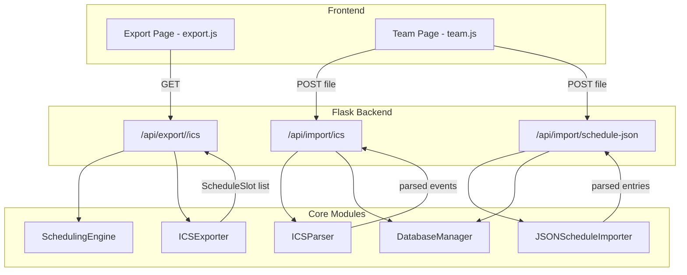

# Design Document: ICS Calendar Export & Import

## Overview

This feature adds ICS (iCalendar RFC 5545) export and import capabilities, plus JSON schedule import, to DC-ShiftMaster Pro. It extends the existing export infrastructure (`routes_export.py`) with a new `/api/export/<year>/ics` endpoint and adds two new import endpoints: `/api/import/ics` for ICS file uploads and `/api/import/schedule-json` for JSON schedule file uploads.

The design follows the established patterns in the codebase:
- Backend: Flask blueprint with route handlers following the same structure as `export_bp` and `import_bp`
- Frontend: Vanilla JS modules extending the existing Export and Team Management pages
- Data flow: ICS export reuses the `_compute_and_validate()` helper; import creates override entries via `DatabaseManager.set_override()`

Key design decisions:
1. **ICS generation is done in-memory** (no temp files) since `.ics` is plain text and schedules fit comfortably in memory
2. **ICS parsing uses a hand-written parser** rather than a third-party library, keeping the dependency footprint minimal and matching the project's approach of no heavy external dependencies for core logic
3. **Import creates overrides** rather than teammates, matching the semantic that imported schedules represent concrete date-specific assignments
4. **Round-trip integrity** is guaranteed by the deterministic ICS format and a parser that maps directly back to the export structure

## Architecture



### Module Layout

```
dc_shiftmaster/
  ics_export.py          # ICSExporter class (formatting logic)
  ics_parser.py          # ICSParser class (parsing logic)
  json_schedule_import.py # JSONScheduleImporter class

dc_shiftmaster_html/
  routes_ics.py          # Flask blueprint: export + import routes
  static/js/
    export.js            # Extended with ICS button
    team.js              # Extended with ICS/JSON import buttons
```

## Components and Interfaces

### ICSExporter

Responsible for converting a list of `ScheduleSlot` objects into RFC 5545 compliant ICS text.

```python
class ICSExporter:
    """Converts ScheduleSlot lists to RFC 5545 ICS format."""

    def export(self, schedule: list[ScheduleSlot], shift_windows: dict[str, ShiftWindow]) -> str:
        """Generate ICS text from schedule slots.
        
        Args:
            schedule: List of ScheduleSlot objects (already filtered by date range).
            shift_windows: Dict with 'day' and 'night' ShiftWindow for end time calculation.
        
        Returns:
            Complete ICS file content as a string with CRLF line endings.
        """
        ...

    def _format_vevent(self, slot: ScheduleSlot, shift_windows: dict[str, ShiftWindow], dtstamp: str) -> str:
        """Format a single ScheduleSlot as a VEVENT component."""
        ...

    def _fold_line(self, line: str) -> str:
        """Fold content lines longer than 75 octets per RFC 5545."""
        ...

    def _format_datetime(self, d: date, time_str: str) -> str:
        """Format date + time as YYYYMMDDTHHMMSS."""
        ...
```

### ICSParser

Responsible for parsing ICS text into structured event data suitable for import.

```python
@dataclass
class ParsedEvent:
    """A single event extracted from an ICS file."""
    dtstart: str          # YYYYMMDDTHHMMSS
    dtend: str            # YYYYMMDDTHHMMSS
    summary: str          # VEVENT SUMMARY value
    uid: str              # VEVENT UID value (optional)

@dataclass
class ParseResult:
    """Result of parsing an ICS file."""
    events: list[ParsedEvent]
    skipped: list[str]    # Descriptions of skipped events (missing DTSTART/DTEND)
    errors: list[str]     # Parse errors


class ICSParser:
    """Parses RFC 5545 ICS files into structured event data."""

    def parse(self, ics_text: str) -> ParseResult:
        """Parse ICS text and extract VEVENT components.
        
        Args:
            ics_text: Raw ICS file content.
        
        Returns:
            ParseResult with events, skipped items, and errors.
        
        Raises:
            ValueError: If text does not begin with BEGIN:VCALENDAR.
        """
        ...

    def _unfold_lines(self, text: str) -> list[str]:
        """Unfold continuation lines (CRLF + whitespace) per RFC 5545."""
        ...

    def _extract_vevents(self, lines: list[str]) -> list[dict[str, str]]:
        """Extract property dicts from VEVENT blocks."""
        ...
```

### JSONScheduleImporter

Responsible for parsing JSON schedule files and validating entries.

```python
@dataclass
class JSONImportEntry:
    """A single validated entry from a JSON schedule file."""
    date: str             # YYYY-MM-DD
    shift_type: str       # 'day' or 'night'
    name: str             # Teammate name for override

@dataclass
class JSONImportResult:
    """Result of parsing a JSON schedule file."""
    entries: list[JSONImportEntry]
    errors: list[str]     # Descriptions of invalid entries


class JSONScheduleImporter:
    """Parses and validates JSON schedule files for import."""

    def parse(self, json_text: str) -> JSONImportResult:
        """Parse JSON text and validate each entry.
        
        Accepts the format produced by /api/export/<year>/json:
        array of objects with at minimum date, shift_type, name fields.
        Extra fields are ignored.
        
        Args:
            json_text: Raw JSON file content.
        
        Returns:
            JSONImportResult with valid entries and error descriptions.
        
        Raises:
            ValueError: If text is not valid JSON or not an array.
        """
        ...
```

### Routes Blueprint (routes_ics.py)

```python
ics_bp = Blueprint("ics", __name__)

@ics_bp.route("/api/export/<int:year>/ics")
def export_ics(year: int):
    """Export schedule as ICS calendar file download."""
    ...

@ics_bp.route("/api/import/ics", methods=["POST"])
def import_ics():
    """Import an ICS file, creating overrides from VEVENT components."""
    ...

@ics_bp.route("/api/import/schedule-json", methods=["POST"])
def import_schedule_json():
    """Import a JSON schedule file, creating overrides from entries."""
    ...
```

### Import Response Format (shared by both ICS and JSON import)

```json
{
    "imported_count": 5,
    "skipped_count": 2,
    "conflicts": [
        {
            "date": "2025-03-15",
            "shift_type": "day",
            "existing_name": "Alice"
        }
    ],
    "errors": [
        "Event at line 42: missing DTSTART property"
    ]
}
```

## Data Models

### Existing Models Used

- **ScheduleSlot**: `(date, shift_type, start_time, teammates, is_override, teammate_starts)` — input to ICS export
- **ShiftWindow**: `(shift_type, start_time, end_time)` — provides end times for VEVENT DTEND
- **Override**: `(date, shift_type, name)` — created by import operations

### New Models

```python
@dataclass
class ParsedEvent:
    """A single calendar event extracted from an ICS file."""
    dtstart: str          # YYYYMMDDTHHMMSS format
    dtend: str            # YYYYMMDDTHHMMSS format  
    summary: str          # Raw SUMMARY property value
    uid: str = ""         # Optional UID property value

@dataclass
class ParseResult:
    """Aggregated result of ICS file parsing."""
    events: list[ParsedEvent]
    skipped: list[str]
    errors: list[str]

@dataclass
class JSONImportEntry:
    """A validated schedule entry ready for override creation."""
    date: str             # YYYY-MM-DD
    shift_type: str       # 'day' or 'night'
    name: str             # Override assignee name

@dataclass
class JSONImportResult:
    """Aggregated result of JSON schedule file parsing."""
    entries: list[JSONImportEntry]
    errors: list[str]
```

### ICS Format Mapping

| ScheduleSlot field | ICS VEVENT property | Format |
|---|---|---|
| date + start_time | DTSTART | YYYYMMDDTHHMMSS |
| date + end_time (from ShiftWindow) | DTEND | YYYYMMDDTHHMMSS |
| shift_type + teammates | SUMMARY | `{shift_type} Shift - {names}` |
| date + shift_type | UID | `{date}-{shift_type}@dc-shiftmaster` |

### Night Shift End Date Logic

When `ShiftWindow.end_time < ShiftWindow.start_time` (e.g., night shift 18:00–06:30), the DTEND date is the day after the slot date:

```
Slot date: 2025-03-15, shift_type: night
start_time: 18:00 → DTSTART:20250315T180000
end_time: 06:30   → DTEND:20250316T063000  (next day)
```

### Import Shift Type Determination

For ICS import, the shift_type is inferred from DTSTART hour:
- Hour 05:00–13:00 inclusive → `day`
- Otherwise → `night`


## Correctness Properties

*A property is a characteristic or behavior that should hold true across all valid executions of a system — essentially, a formal statement about what the system should do. Properties serve as the bridge between human-readable specifications and machine-verifiable correctness guarantees.*

### Property 1: ICS Export-Import Round-Trip

*For any* valid list of ScheduleSlots (with non-"nobody" teammates), exporting via ICSExporter then parsing via ICSParser SHALL produce event records with equivalent date, shift_type, start_time, end_time, and teammate assignments as the original ScheduleSlots.

**Validates: Requirements 7.1, 3.1, 3.2, 3.3, 3.5**

### Property 2: ICS Format Round-Trip

*For any* valid ICS text produced by the ICSExporter, parsing via ICSParser then re-exporting via ICSExporter (with the same DTSTAMP) SHALL produce output byte-equivalent to the original ICS text.

**Validates: Requirements 7.2**

### Property 3: Valid VCALENDAR Structure

*For any* list of ScheduleSlots (including empty lists), the ICSExporter output SHALL begin with `BEGIN:VCALENDAR`, end with `END:VCALENDAR`, and contain the properties `VERSION:2.0`, `PRODID:-//DC-ShiftMaster Pro//EN`, and `CALSCALE:GREGORIAN` in the header section.

**Validates: Requirements 2.1, 2.2**

### Property 4: CRLF Line Endings

*For any* ICS output produced by the ICSExporter, every line SHALL end with CRLF (`\r\n`), and no bare LF (`\n` not preceded by `\r`) SHALL exist in the output.

**Validates: Requirements 2.3**

### Property 5: Line Folding Compliance

*For any* ICS output produced by the ICSExporter, no content line (after unfolding) SHALL exceed 75 octets when encoded as UTF-8, and folded continuations SHALL consist of CRLF followed by exactly one whitespace character.

**Validates: Requirements 2.4**

### Property 6: Date Range Filtering

*For any* list of ScheduleSlots and any valid `from` and `to` dates, filtering the schedule by date range SHALL produce a result where every slot's date is >= `from` and <= `to`, and no slot from the original list falling within the range is excluded.

**Validates: Requirements 1.2, 1.3**

### Property 7: Shift Type Classification from Hour

*For any* DTSTART hour value, the shift type classification SHALL return `day` if the hour is between 5 and 13 inclusive, and `night` otherwise. This mapping SHALL be deterministic and total (defined for all 24 hours).

**Validates: Requirements 5.1**

### Property 8: Name Resolution from SUMMARY

*For any* VEVENT SUMMARY string and any team roster, if the SUMMARY contains a teammate name from the roster, that name SHALL be used for the override. If no roster name matches, the full SUMMARY text SHALL be used as the override name.

**Validates: Requirements 5.2, 5.3**

### Property 9: Invalid JSON Entries Rejected

*For any* JSON schedule entry where the `date` field is missing or not a valid YYYY-MM-DD string, OR the `shift_type` is not "day" or "night", OR the `name` field is missing or empty, the JSONScheduleImporter SHALL reject that entry and include a descriptive error, while still processing remaining valid entries.

**Validates: Requirements 11.3, 11.4, 11.5**

### Property 10: JSON Export-Import Round-Trip

*For any* valid schedule exported via the existing `/api/export/<year>/json` endpoint, importing that JSON file via JSONScheduleImporter SHALL produce override entries equivalent to the shift assignments in the original schedule (matching date, shift_type, and name for each entry).

**Validates: Requirements 13.1, 13.2, 13.3**

### Property 11: Conflict Detection and Overwrite

*For any* set of import entries (ICS or JSON) and any pre-existing overrides in the database, when an imported entry targets the same (date, shift_type) as an existing override: without `overwrite=true` the entry SHALL be skipped and reported in conflicts; with `overwrite=true` the imported value SHALL replace the existing override.

**Validates: Requirements 5.5, 11.6, 11.7**

## Error Handling

### Export Errors

| Condition | HTTP Status | Response |
|---|---|---|
| No teammates configured for year | 400 | `{"error": "No teammates configured..."}` |
| Invalid `from`/`to` date format | 400 | `{"error": "Invalid date format: ..."}` |
| Internal ICS generation error | 500 | `{"error": "ICS export failed: ..."}` |

Export errors follow the same pattern as existing CSV/JSON/XLSX export in `routes_export.py`, reusing the `_compute_and_validate()` helper.

### Import Errors

| Condition | HTTP Status | Response |
|---|---|---|
| No file uploaded | 400 | `{"error": "No file uploaded."}` |
| File > 5 MB | 413 | `{"error": "File too large. Maximum size is 5 MB."}` |
| ICS: Missing BEGIN:VCALENDAR | 400 | `{"error": "Invalid ICS format: file does not begin with BEGIN:VCALENDAR"}` |
| JSON: Not valid JSON | 400 | `{"error": "Invalid JSON: ..."}` |
| JSON: Not an array | 400 | `{"error": "Invalid format: expected a JSON array of schedule entries"}` |
| All events failed to import | 422 | `{"imported_count": 0, "skipped_count": N, "conflicts": [...], "errors": [...]}` |
| Partial success | 200 | `{"imported_count": M, "skipped_count": N, "conflicts": [...], "errors": [...]}` |

### Error Recovery Strategy

- **File validation errors** (400/413): Return immediately, no state changes
- **Parse errors**: Collect all errors, continue processing remaining entries, report in response
- **Conflict errors**: Skip conflicting entries (unless overwrite=true), report in response, import non-conflicting entries
- **Internal errors**: Log exception, return 500 with generic message

## Testing Strategy

### Property-Based Tests (Hypothesis)

The project already uses Hypothesis for property-based testing. Each correctness property above maps to one property-based test function with a minimum of 100 iterations.

**Library**: `hypothesis` (already in project dependencies)
**Configuration**: `@settings(max_examples=100)`

Tests are tagged with comments referencing the design property:
```python
# Feature: ics-calendar-export-import, Property 1: ICS Export-Import Round-Trip
```

**Property test file**: `tests/test_ics_properties.py`

Key generators needed:
- `schedule_slot_strategy()`: Generates random ScheduleSlots with valid dates, shift_types, start_times, and teammate names
- `shift_windows_strategy()`: Generates valid day/night ShiftWindow pairs
- `ics_text_strategy()`: Generates valid ICS text (via the exporter, for format round-trip)
- `json_entry_strategy()`: Generates random JSON schedule entries (valid and invalid)
- `invalid_json_entry_strategy()`: Generates entries with specific validation failures

### Unit Tests

**File**: `tests/test_ics_unit.py`

Example-based tests covering:
- Response headers (Content-Type, Content-Disposition)
- DTSTAMP uses current UTC time (mocked)
- UID determinism (same input → same UID)
- File size limit (413 response)
- Empty schedule export
- Frontend button presence (via HTML fixture)
- Conflict dialog behavior

### Integration Tests

**File**: `tests/test_ics_integration.py`

- Full endpoint tests with Flask test client
- Team context scoping verification
- Database override creation verification
- Overwrite=true replaces existing overrides
- Multiple concurrent team imports don't interfere
