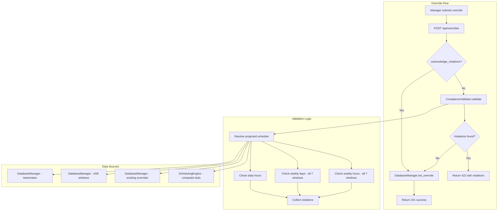

# Design Document: Labor Compliance Validation

## Overview

Labor Compliance Validation adds a pre-override safety layer to DC-ShiftMaster Pro's existing override system. When a manager submits an override request via `POST /api/overrides`, the system intercepts the request and validates the resulting schedule against three labor compliance limits before persisting the change:

1. **Weekly Hours Limit** — No more than 60 hours in any rolling 7-day window
2. **Weekly Days Limit** — No more than 6 days worked in any rolling 7-day window
3. **Daily Hours Limit** — No more than 12 hours in a single calendar day

If a violation is detected, the API returns a warning payload instead of applying the override. The manager may then re-submit with an acknowledgment flag to force the override through. The validation logic is a pure function operating on schedule data, making it highly testable.

### Key Design Decisions

1. **Pure validation module**: The `ComplianceValidator` is a stateless class with pure methods that accept schedule data and return violation results. This keeps it decoupled from the database and easily testable with property-based tests.
2. **Rolling window = 7 overlapping windows**: For any override date, we evaluate up to 7 overlapping 7-day windows (each starting from date-6 through date+0) to catch all possible violations.
3. **Effective start time resolution**: Duration calculations use the teammate's `custom_start` field when present, falling back to the shift window's default start time.
4. **Overnight shift handling**: When end time < start time, we add 24 hours to the end time for duration calculation. The full duration is attributed to the calendar date the shift starts on.
5. **Two-phase override flow**: The first POST validates and returns warnings (if any). A second POST with `acknowledge_violations: true` bypasses validation and persists the override.
6. **Existing overrides included**: The validator resolves the teammate's complete projected schedule by applying all existing overrides before evaluating the proposed new one.

## Architecture



### Module Structure

```
dc_shiftmaster/
├── compliance.py          # ComplianceValidator — pure validation logic
dc_shiftmaster_html/
├── routes_overrides.py    # Modified to integrate compliance checks
tests/
├── test_compliance.py     # Unit tests for compliance validation
├── test_compliance_props.py  # Property-based tests for compliance properties
```

## Components and Interfaces

### ComplianceValidator (`dc_shiftmaster/compliance.py`)

A stateless class containing pure validation logic. All methods accept data as arguments and return results without side effects.

```python
from dataclasses import dataclass
from datetime import date, timedelta


@dataclass
class ComplianceViolation:
    """A single compliance rule violation."""
    rule: str           # 'weekly_hours', 'weekly_days', or 'daily_hours'
    projected: float    # The projected value that exceeds the limit
    limit: float        # The applicable limit (60, 6, or 12)
    window_start: str | None  # 'YYYY-MM-DD' start of violating window (None for daily)
    window_end: str | None    # 'YYYY-MM-DD' end of violating window (None for daily)


@dataclass
class ComplianceResult:
    """Result of a compliance validation check."""
    passed: bool
    violations: list[ComplianceViolation]


class ComplianceValidator:
    """Validates proposed overrides against labor compliance limits.

    All methods are pure functions — they accept schedule data as arguments
    and return results without database access or side effects.
    """

    WEEKLY_HOURS_LIMIT = 60.0
    WEEKLY_DAYS_LIMIT = 6
    DAILY_HOURS_LIMIT = 12.0

    def validate(
        self,
        teammate_name: str,
        override_date: date,
        override_shift_type: str,
        shift_windows: dict[str, "ShiftWindow"],
        teammates: list["Teammate"],
        existing_overrides: list["Override"],
        proposed_override_name: str,
    ) -> ComplianceResult:
        """Run all compliance checks for a proposed override.

        Args:
            teammate_name: The name of the teammate being moved INTO the slot.
            override_date: The date of the proposed override.
            override_shift_type: 'day' or 'night'.
            shift_windows: Current shift window configuration.
            teammates: All teammate records (for custom_start lookup).
            existing_overrides: All overrides in the relevant date range.
            proposed_override_name: The name being assigned in the override.

        Returns:
            ComplianceResult with passed=True if no violations, or
            passed=False with a list of violations.
        """
        ...

    def compute_shift_duration(
        self,
        effective_start: str,
        shift_end: str,
    ) -> float:
        """Calculate shift duration in hours from start to end time.

        Handles overnight shifts by adding 24h when end < start.
        Returns 0.0 when start == end.

        Args:
            effective_start: HH:MM start time.
            shift_end: HH:MM end time.

        Returns:
            Duration in hours as a float.
        """
        ...

    def get_effective_start(
        self,
        teammate_name: str,
        shift_type: str,
        teammates: list["Teammate"],
        shift_windows: dict[str, "ShiftWindow"],
    ) -> str:
        """Resolve the effective start time for a teammate on a shift type.

        Uses custom_start if the teammate has one configured,
        otherwise falls back to the shift window default start.

        Args:
            teammate_name: The teammate's name.
            shift_type: 'day' or 'night'.
            teammates: All teammate records.
            shift_windows: Shift window configuration.

        Returns:
            HH:MM time string.
        """
        ...

    def resolve_teammate_schedule(
        self,
        teammate_name: str,
        date_range: list[date],
        shift_windows: dict[str, "ShiftWindow"],
        teammates: list["Teammate"],
        existing_overrides: list["Override"],
        scheduling_engine: "SchedulingEngine",
        year: int,
    ) -> list[tuple[date, str]]:
        """Resolve all (date, shift_type) pairs where the teammate works.

        Applies existing overrides on top of computed schedule to determine
        the teammate's actual working days within the date range.

        Returns:
            List of (date, shift_type) tuples where the teammate is assigned.
        """
        ...

    def check_weekly_hours(
        self,
        teammate_name: str,
        override_date: date,
        schedule_with_override: list[tuple[date, str]],
        shift_windows: dict[str, "ShiftWindow"],
        teammates: list["Teammate"],
    ) -> list[ComplianceViolation]:
        """Check all 7-day rolling windows for weekly hours violations.

        Evaluates up to 7 overlapping windows that include the override date.

        Returns:
            List of violations (empty if compliant).
        """
        ...

    def check_weekly_days(
        self,
        override_date: date,
        schedule_with_override: list[tuple[date, str]],
    ) -> list[ComplianceViolation]:
        """Check all 7-day rolling windows for weekly days violations.

        Counts distinct dates worked in each window.

        Returns:
            List of violations (empty if compliant).
        """
        ...

    def check_daily_hours(
        self,
        teammate_name: str,
        override_date: date,
        schedule_with_override: list[tuple[date, str]],
        shift_windows: dict[str, "ShiftWindow"],
        teammates: list["Teammate"],
    ) -> list[ComplianceViolation]:
        """Check that total hours on the override date don't exceed 12.

        Sums durations of all shifts assigned to the teammate on that date.

        Returns:
            List of violations (empty if compliant).
        """
        ...
```

### Modified Override API (`dc_shiftmaster_html/routes_overrides.py`)

The existing `POST /api/overrides` endpoint is modified to integrate compliance validation:

```python
@overrides_bp.route("/api/overrides", methods=["POST"])
def set_override():
    """Set an override with compliance validation.

    Request body:
        date: str (YYYY-MM-DD)
        shift_type: str ('day' or 'night')
        name: str (teammate name or 'nobody')
        acknowledge_violations: bool (optional, default False)

    Returns:
        201: Override applied successfully
        422: Compliance violations detected (with violation details)
        500: Internal error
    """
    ...
```

**Response format for violations (422):**
```json
{
    "status": "compliance_warning",
    "violations": [
        {
            "rule": "weekly_hours",
            "projected": 62.5,
            "limit": 60,
            "window_start": "2025-03-10",
            "window_end": "2025-03-16"
        },
        {
            "rule": "daily_hours",
            "projected": 13.0,
            "limit": 12,
            "window_start": null,
            "window_end": null
        }
    ]
}
```

**Response format for acknowledged override (201):**
```json
{
    "date": "2025-03-15",
    "shift_type": "day",
    "name": "Alice",
    "acknowledged_violations": true
}
```

## Data Models

### New Data Classes

```python
@dataclass
class ComplianceViolation:
    """A single compliance rule violation detected during validation."""
    rule: str              # 'weekly_hours' | 'weekly_days' | 'daily_hours'
    projected: float       # Projected value exceeding the limit
    limit: float           # The applicable limit
    window_start: str | None  # Start of violating 7-day window (YYYY-MM-DD), None for daily
    window_end: str | None    # End of violating 7-day window (YYYY-MM-DD), None for daily


@dataclass
class ComplianceResult:
    """Aggregate result of all compliance checks for a proposed override."""
    passed: bool                        # True if no violations
    violations: list[ComplianceViolation]  # Empty list if passed
```

### Existing Models Used (unchanged)

- **ShiftWindow** — provides `start_time` and `end_time` for duration calculation
- **Teammate** — provides `custom_start` for effective start time resolution
- **Override** — existing overrides included in schedule projection
- **ScheduleSlot** — computed schedule used to determine teammate assignments

### No Database Schema Changes

The compliance validation is a read-only check performed before persisting. The only API-level change is the addition of the `acknowledge_violations` field in the override request body. No new tables or columns are required.

## Correctness Properties

*A property is a characteristic or behavior that should hold true across all valid executions of a system — essentially, a formal statement about what the system should do. Properties serve as the bridge between human-readable specifications and machine-verifiable correctness guarantees.*

### Property 1: Shift duration calculation correctness

*For any* pair of valid HH:MM times (effective_start, shift_end), the computed shift duration SHALL equal (shift_end - effective_start) in hours when shift_end ≥ effective_start, and (shift_end - effective_start + 24) in hours when shift_end < effective_start (overnight shift). When effective_start equals shift_end, the duration SHALL be 0.

**Validates: Requirements 1.2, 3.2, 4.3, 4.4**

### Property 2: Effective start time resolution

*For any* teammate and shift type, the effective start time SHALL equal the teammate's custom_start value when it is non-empty, and SHALL equal the shift window's default start time when custom_start is empty. The resolved effective start time must always be a valid HH:MM string.

**Validates: Requirements 4.1, 4.2**

### Property 3: Weekly hours violation if and only if exceeds 60

*For any* teammate schedule and proposed override, the Compliance_Validator SHALL return a weekly_hours violation for a rolling window if and only if the sum of shift durations for that teammate within that 7-day window exceeds 60 hours. The projected value in the violation SHALL equal the computed total hours for that window.

**Validates: Requirements 1.1, 1.3, 1.4**

### Property 4: Weekly days violation if and only if exceeds 6

*For any* teammate schedule and proposed override, the Compliance_Validator SHALL return a weekly_days violation for a rolling window if and only if the count of distinct calendar dates on which the teammate is scheduled to work within that 7-day window exceeds 6. The projected value SHALL equal the day count for that window.

**Validates: Requirements 2.1, 2.2, 2.3**

### Property 5: Daily hours violation if and only if exceeds 12

*For any* teammate schedule and proposed override, the Compliance_Validator SHALL return a daily_hours violation if and only if the sum of all shift durations assigned to the teammate on the override date exceeds 12 hours. When the proposed override assigns the same teammate already in the slot, the duration SHALL NOT be double-counted.

**Validates: Requirements 3.1, 3.3, 3.4, 3.5**

### Property 6: Schedule resolution includes and excludes overrides correctly

*For any* teammate and set of existing overrides within the rolling window, the resolved projected schedule SHALL include shifts where an existing override assigns the teammate by name, SHALL exclude shifts where an existing override replaces the teammate with a different name or "nobody", and SHALL count a date as a scheduled day if and only if the teammate retains at least one shift assignment on that date after all existing overrides are applied.

**Validates: Requirements 7.1, 7.2, 7.3, 7.4**

### Property 7: Acknowledged override always persists

*For any* override request submitted with acknowledge_violations set to true, the override SHALL be applied and persisted regardless of whether compliance violations exist. The resulting schedule SHALL reflect the overridden assignment.

**Validates: Requirements 6.2**

## Error Handling

| Scenario | Handling |
|---|---|
| Teammate shift data unavailable for rolling window | Return error result from validator; API responds 500 with error message; override not applied |
| Invalid override date format | API returns 400 with validation error; override not applied |
| Invalid shift_type in request | API returns 400 with validation error; override not applied |
| Teammate name not found in database | Validation proceeds (name may be a new/external person); no error |
| Compliance validator raises unexpected exception | API returns 500 with generic error; override not applied |
| Acknowledged override fails due to DB error | API returns 500 with error message; override not applied |
| Multiple violations detected simultaneously | All violations returned in a single response (not just the first) |
| Override date outside loaded schedule range | Validator loads additional data as needed; if impossible, returns error |

## Testing Strategy

### Dual Testing Approach

The project uses both unit tests and property-based tests for comprehensive coverage.

**Unit Tests** (pytest):
- Specific examples: known shift durations (06:00→18:30 = 12.5h, 18:00→06:30 = 12.5h)
- Edge cases: start == end (0 hours), midnight crossing, leap year dates
- Integration: API endpoint returns correct status codes and response format
- Error conditions: missing teammate data, invalid request payloads, DB failures
- Acknowledgment flow: override persists when acknowledge_violations=true

**Property-Based Tests** (Hypothesis):
- Each correctness property (1–7) is implemented as a single Hypothesis test
- Minimum 100 iterations per property test (`@settings(max_examples=100)`)
- Custom strategies for generating valid time pairs, teammate schedules, override scenarios, and rolling windows
- Each test is tagged with a comment referencing its design property:
  ```python
  # Feature: labor-compliance-validation, Property 1: Shift duration calculation correctness
  ```

**Testing Library**: [Hypothesis](https://hypothesis.readthedocs.io/) — the standard property-based testing library for Python (already used in this project).

**Key Test Strategies (Hypothesis custom strategies)**:
- `valid_time()` — reuse existing strategy from conftest.py (HH:MM strings, hours 00-23, minutes 00-59)
- `valid_time_pair()` — generates (start, end) time pairs for duration testing
- `teammate_schedule()` — generates a list of (date, shift_type) tuples representing a teammate's working schedule within a date range
- `compliance_scenario()` — generates a complete validation scenario: teammates, shift windows, existing overrides, and a proposed override
- `schedule_exceeding_weekly_hours(limit)` — generates schedules guaranteed to exceed the weekly hours limit
- `schedule_within_weekly_hours(limit)` — generates schedules guaranteed to stay within the weekly hours limit

**Property Test Configuration**:
- Minimum 100 iterations per property test
- Each property test references its design document property
- Tag format: **Feature: labor-compliance-validation, Property {number}: {property_text}**

**Test Organization**:
```
tests/
├── test_compliance.py        # Unit tests — specific examples, edge cases, API integration
├── test_compliance_props.py  # Property-based tests — Properties 1-7
├── conftest.py               # Extended with compliance-specific strategies
```

