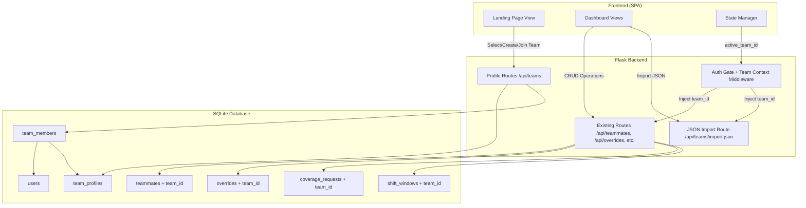
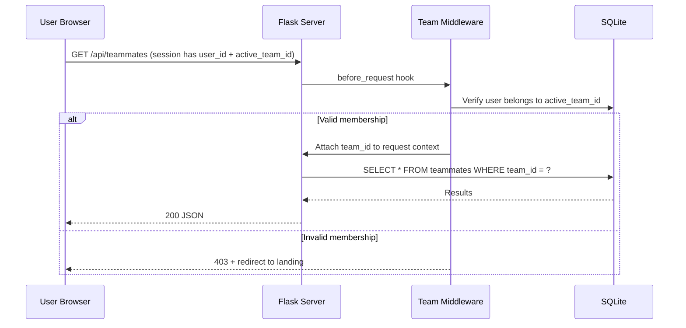
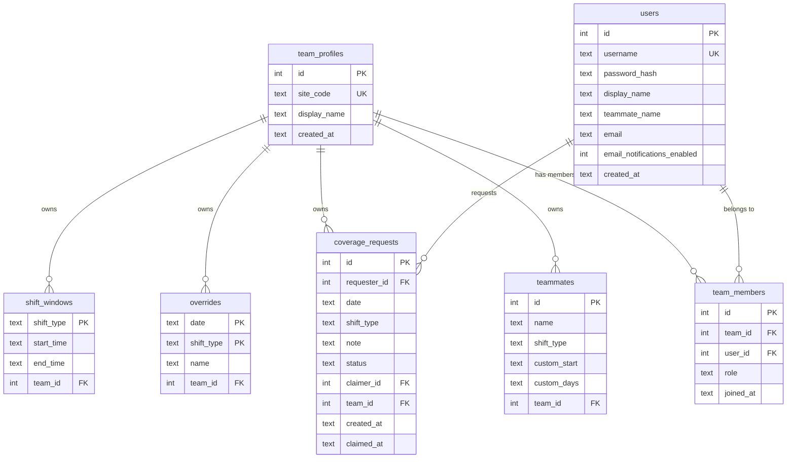

# Design Document: Multi-Team Profiles

## Overview

Multi-Team Profiles introduces multi-tenancy to DC-ShiftMaster Pro, allowing multiple warehouse teams (identified by site codes like ATL068, ATL069, ATL070) to operate isolated dashboards from a single application instance. The system transforms the current single-team SQLite-backed architecture into a team-scoped data model where each Team Profile owns its own teammates, schedules, overrides, coverage requests, and settings.

The design preserves the existing Flask + SQLite + vanilla JS stack and extends it with:
- A `team_profiles` table and `team_members` junction table in SQLite
- A `team_id` foreign key added to all existing data tables (teammates, overrides, coverage_requests, shift_windows)
- A session-based team context (`active_team_id`) attached to the Flask session
- A Team Selection Landing Page in the frontend SPA
- A JSON import endpoint scoped to the active team
- An idempotent migration script that converts existing data into the ATL069 team profile

### Design Decisions and Rationale

| Decision | Rationale |
|----------|-----------|
| SQLite remains the database | The application is deployed as a single-instance service. SQLite with WAL mode handles the concurrency level expected. No need for a separate DB server. |
| `team_id` FK on data tables vs. separate databases per team | FKs keep a single file, simplify backups, and allow cross-team admin queries in the future. Separate DBs would complicate deployment. |
| Session-based team context | Matches the existing Flask session auth pattern. No new auth infrastructure needed. |
| Landing page as a SPA view (not a separate page) | Keeps the single-page application architecture consistent. The router already handles view switching. |
| Idempotent migration | Safe to re-run during development and deployment without data duplication. |

## Architecture



### Request Flow



## Components and Interfaces

### Backend Components

#### 1. ProfileService (`dc_shiftmaster_html/routes_profile.py`)

New Flask Blueprint handling team CRUD and membership operations.

| Endpoint | Method | Description |
|----------|--------|-------------|
| `/api/teams` | GET | List teams the current user belongs to |
| `/api/teams` | POST | Create a new team profile |
| `/api/teams/<team_id>` | DELETE | Delete a team profile (admin only) |
| `/api/teams/<team_id>/join` | POST | Join an existing team by site code |
| `/api/teams/<team_id>/members` | GET | List members of a team |
| `/api/teams/<team_id>/members/<user_id>` | DELETE | Remove a member (admin only, rejects non-members with error) |
| `/api/teams/select` | POST | Set active team for the session |
| `/api/teams/import-json` | POST | Import teammates from JSON file |

**Create Team Request:**
```json
{
  "site_code": "ATL068",
  "display_name": "ATL068 Day Crew"
}
```

**Create Team Response (201):**
```json
{
  "id": 3,
  "site_code": "ATL068",
  "display_name": "ATL068 Day Crew",
  "created_at": "2025-01-15T10:30:00",
  "role": "admin",
  "shift_init_status": "ok"
}
```

> **Resilient Shift Initialization (Req 1.4):** If default shift window creation fails after the profile row is committed, the profile creation still returns 201 with `"shift_init_status": "pending"`. The system retries shift initialization on the next request that accesses that team's shift windows.

**Join Team Request:**
```json
{
  "site_code": "ATL068"
}
```

**JSON Import Request:** Multipart form with `file` field containing JSON.

**JSON Import Response (200):**
```json
{
  "imported_count": 12,
  "skipped_rows": [
    {"index": 3, "reason": "Missing name field"},
    {"index": 7, "reason": "Invalid shift_type: XYZ"}
  ],
  "duplicate_count": 2
}
```

#### 2. Data Isolation Layer (Active Validation)

The Data Isolation Layer is implemented as a combination of the Team Context Middleware and query-level enforcement. Per Requirement 3.1, isolation is **active validation** — not silent filtering. Any request that would access cross-team data is explicitly rejected with an authorization error rather than returning an empty or filtered result set.

**Enforcement points:**
- Middleware injects `g.team_id` and rejects requests without valid team context
- All database query methods require a `team_id` parameter and raise `CrossTeamAccessError` if a referenced resource belongs to a different team
- Direct row-ID lookups (e.g., `DELETE /api/teammates/42`) verify that the target row's `team_id` matches `g.team_id` before executing

#### 3. Team Context Middleware (`dc_shiftmaster_html/team_middleware.py`)

A Flask `before_request` hook that:
1. Reads `active_team_id` from the session
2. Validates the user still belongs to that team
3. Attaches `g.team_id` to the Flask request context
4. Returns 403 if the team context is invalid or missing (for team-scoped endpoints)

```python
from flask import g, session, current_app, jsonify

TEAM_EXEMPT_PREFIXES = (
    "/api/auth/", "/api/teams", "/login", "/static/", "/health",
    "/api/public/"
)

def team_context_middleware():
    """Inject team_id into request context for team-scoped endpoints."""
    from flask import request
    if any(request.path.startswith(p) for p in TEAM_EXEMPT_PREFIXES):
        return  # These routes don't require team context

    active_team_id = session.get("active_team_id")
    if not active_team_id:
        return jsonify({"error": "No team selected", "code": "NO_TEAM"}), 403

    db = current_app.config["db"]
    user_id = session.get("user_id")
    if not db.is_team_member(user_id, active_team_id):
        session.pop("active_team_id", None)
        return jsonify({"error": "Team membership invalid", "code": "INVALID_TEAM"}), 403

    g.team_id = active_team_id


class CrossTeamAccessError(Exception):
    """Raised when a query attempts to access data belonging to a different team."""
    pass


def validate_resource_ownership(db, table, resource_id, team_id):
    """Active validation: reject cross-team access rather than silently filtering."""
    row = db.execute(
        f"SELECT team_id FROM {table} WHERE id = ?", (resource_id,)
    ).fetchone()
    if row is None:
        raise ResourceNotFoundError(f"Resource {resource_id} not found")
    if row["team_id"] != team_id:
        raise CrossTeamAccessError(
            f"Resource {resource_id} belongs to a different team"
        )
```

#### 4. Extended DatabaseManager

The existing `DatabaseManager` class is extended with:
- New tables: `team_profiles`, `team_members`
- `team_id` FK column added to: `teammates`, `overrides`, `coverage_requests`, `shift_windows`
- All existing query methods receive a `team_id` parameter
- All row-level operations (GET by ID, UPDATE, DELETE) perform active ownership validation — raising `CrossTeamAccessError` if the resource's `team_id` does not match the session's active team
- New methods for team profile CRUD and membership management
- Shift window lazy initialization: `get_shift_windows(team_id)` checks if shift windows exist for the team and initializes defaults if they are missing (retry mechanism for Req 1.4)

#### 5. MigrationService (`dc_shiftmaster/migration.py`)

A standalone script that executes as an **atomic operation** (Req 7.6):
1. Wraps ALL steps in a single database transaction
2. Creates the `team_profiles` and `team_members` tables
3. Creates an ATL069 team profile
4. Updates all existing rows in `teammates`, `overrides`, `coverage_requests`, `shift_windows` to reference the ATL069 team
5. Assigns all existing users as members of ATL069
6. Uses a `migrations_applied` tracking table for idempotency
7. IF any step fails, the entire transaction is rolled back — no partial data remains

```python
def run_migration(db):
    """Atomic migration: all-or-nothing with full rollback on failure."""
    try:
        db.execute("BEGIN IMMEDIATE")
        
        # Check idempotency
        if _migration_already_applied(db):
            db.execute("ROLLBACK")
            return {"status": "already_applied"}
        
        # Steps 2-6...
        _create_tables(db)
        team_id = _create_atl069_profile(db)
        _associate_existing_data(db, team_id)
        _assign_users_as_members(db, team_id)
        _record_migration(db)
        
        db.execute("COMMIT")
        return {"status": "success", "team_id": team_id}
    except Exception as e:
        db.execute("ROLLBACK")
        raise MigrationError(f"Migration failed, all changes rolled back: {e}")
```

#### 6. JSON Import Handler (within `routes_profile.py`)

Accepts a JSON file upload, validates entries against the teammate schema, and inserts valid records into the active team's teammate list.

**Validation rules include:**
- Entries missing `name` or `shift_type` are rejected
- Entries with invalid `shift_type` values are rejected
- Entries with `shift_type: "Custom"` and empty/invalid `custom_days` are rejected
- **Entries with a non-Custom `shift_type` that include a `custom_days` field are rejected** (Req 9.7) — reported in `skipped_rows` as "invalid field combination: custom_days not allowed for non-Custom shift types"
- Duplicate names (already existing in team) are reported as duplicates

**Expected JSON format:**
```json
[
  {"name": "Alice Smith", "shift_type": "FHD"},
  {"name": "Bob Jones", "shift_type": "Custom", "custom_start": "07:00", "custom_days": ["Mon", "Wed", "Fri"]},
  {"name": "Charlie Brown", "shift_type": "BHN"}
]
```

**Invalid entry example (non-Custom with custom_days — rejected per Req 9.7):**
```json
{"name": "Dave Wilson", "shift_type": "FHD", "custom_days": ["Mon", "Tue"]}
```
This entry is skipped with reason: `"Invalid field combination: custom_days not allowed for non-Custom shift_type"`

### Frontend Components

#### 7. Landing Page View (`dc_shiftmaster_html/static/js/landing.js`)

New SPA view that renders when no team is selected. Displays:
- List of user's teams (site code + display name)
- "Create Team" form (site code + display name)
- "Join Team" form (enter site code)

**Fallback behavior (Req 4.1):** If the Landing Page fails to load (network error, rendering failure), the application falls back to automatically selecting the user's most recently active team (tracked by last `selected_at` timestamp in `team_members` or local storage). This ensures the user is never stuck on a broken landing page.

#### 8. Extended State Manager (`state.js`)

New state functions:
- `getActiveTeam()` / `setActiveTeam(team)` — stores/retrieves active team from session
- `clearActiveTeam()` — removes team context
- `getLastActiveTeam()` — retrieves the most recently active team for Landing Page fallback (Req 4.1)

#### 9. Header Display Update

The header-info element shows the active team's site code alongside the year.

## Data Models

### New Tables

```sql
CREATE TABLE IF NOT EXISTS team_profiles (
    id          INTEGER PRIMARY KEY AUTOINCREMENT,
    site_code   TEXT NOT NULL UNIQUE,
    display_name TEXT NOT NULL,
    created_at  TEXT NOT NULL DEFAULT (datetime('now'))
);

CREATE TABLE IF NOT EXISTS team_members (
    id          INTEGER PRIMARY KEY AUTOINCREMENT,
    team_id     INTEGER NOT NULL REFERENCES team_profiles(id) ON DELETE CASCADE,
    user_id     INTEGER NOT NULL REFERENCES users(id),
    role        TEXT NOT NULL DEFAULT 'member' CHECK(role IN ('admin', 'member')),
    joined_at   TEXT NOT NULL DEFAULT (datetime('now')),
    UNIQUE(team_id, user_id)
);

CREATE TABLE IF NOT EXISTS migrations_applied (
    migration_name TEXT PRIMARY KEY,
    applied_at     TEXT NOT NULL DEFAULT (datetime('now'))
);
```

### Modified Tables (add team_id FK)

```sql
-- Add team_id to teammates
ALTER TABLE teammates ADD COLUMN team_id INTEGER REFERENCES team_profiles(id) ON DELETE CASCADE;

-- Add team_id to overrides
ALTER TABLE overrides ADD COLUMN team_id INTEGER REFERENCES team_profiles(id) ON DELETE CASCADE;

-- Add team_id to coverage_requests
ALTER TABLE coverage_requests ADD COLUMN team_id INTEGER REFERENCES team_profiles(id) ON DELETE CASCADE;

-- Add team_id to shift_windows (convert from global to per-team)
ALTER TABLE shift_windows ADD COLUMN team_id INTEGER REFERENCES team_profiles(id) ON DELETE CASCADE;
```

### Data Model Diagram



### Site Code Validation

Site codes must match the regex pattern: `^[A-Z]{3}[0-9]{3}$`

Examples: ATL069, ATL068, DFW001, ORD123

### JSON Import Schema

```json
{
  "$schema": "http://json-schema.org/draft-07/schema#",
  "type": "array",
  "items": {
    "type": "object",
    "required": ["name", "shift_type"],
    "properties": {
      "name": { "type": "string", "minLength": 1 },
      "shift_type": { "type": "string", "enum": ["FHD", "FHN", "BHD", "BHN", "Custom"] },
      "custom_start": { "type": "string", "pattern": "^([01]\\d|2[0-3]):[0-5]\\d$" },
      "custom_days": {
        "type": "array",
        "items": { "type": "string", "enum": ["Mon", "Tue", "Wed", "Thu", "Fri", "Sat", "Sun"] },
        "minItems": 1
      }
    }
  }
}
```

**Additional validation rules (beyond JSON Schema):**
- If `shift_type` is "Custom", `custom_days` MUST be present and non-empty with valid day values.
- If `shift_type` is NOT "Custom", `custom_days` MUST NOT be present. Entries with a non-Custom `shift_type` that include `custom_days` are rejected as invalid field combinations (Req 9.7).

## Correctness Properties

*A property is a characteristic or behavior that should hold true across all valid executions of a system — essentially, a formal statement about what the system should do. Properties serve as the bridge between human-readable specifications and machine-verifiable correctness guarantees.*

### Property 1: Site code validation accepts only valid codes

*For any* string, the Profile_Service SHALL accept it as a site code if and only if it matches the pattern `^[A-Z]{3}[0-9]{3}$`. All other strings SHALL be rejected with a validation error.

**Validates: Requirements 1.3, 1.5**

### Property 2: Team creation assigns creator as admin with resilient shift initialization

*For any* valid site code and display name, creating a Team_Profile SHALL produce a team where the creating user has the "admin" role. IF shift initialization succeeds, the team SHALL have exactly two shift windows: day (06:00–18:30) and night (18:00–06:30). IF shift initialization fails, the profile SHALL still exist and shift windows SHALL be initialized on the next access.

**Validates: Requirements 1.1, 1.4**

### Property 3: Site code uniqueness

*For any* site code that is already associated with an existing Team_Profile, attempting to create a new Team_Profile with that same site code SHALL be rejected.

**Validates: Requirements 1.2**

### Property 4: Team deletion cascades all associated data but preserves users

*For any* Team_Profile with associated teammates, overrides, coverage requests, shift windows, and members, deleting that team SHALL remove all associated data rows AND all membership rows, while all user accounts that were members continue to exist.

**Validates: Requirements 2.1, 2.3, 2.4**

### Property 5: Admin-only operations reject non-admin users

*For any* Team_Profile and any user with "member" role (not "admin"), attempting to delete the team or remove a team member SHALL be rejected with a permission error.

**Validates: Requirements 2.2, 6.2**

### Property 6: Data isolation with active cross-team rejection

*For any* two distinct Team_Profiles (A and B) with their own data, querying teammates, overrides, coverage requests, or shift windows from team A's context SHALL return only team A's data. Furthermore, any request that explicitly references a resource (by ID) belonging to team B while in team A's context SHALL be actively rejected with an authorization error — not silently filtered.

**Validates: Requirements 3.1, 3.2, 3.3, 3.4, 3.5**

### Property 7: Team selection updates session context

*For any* user who is a member of a team, selecting that team SHALL store the team's identifier in the session as `active_team_id`, and subsequent requests SHALL carry that context.

**Validates: Requirements 4.2, 8.1**

### Property 8: Team-scoped endpoints reject missing or invalid team context

*For any* team-scoped API endpoint, if the session has no `active_team_id` or the `active_team_id` references a team the user does not belong to, the request SHALL be rejected and the invalid team context SHALL be cleared from the session.

**Validates: Requirements 8.2, 8.3, 8.4**

### Property 9: Join creates membership; duplicate join is rejected

*For any* user and existing Team_Profile, joining SHALL create a membership record with a `joined_at` timestamp. Attempting to join the same team again SHALL be rejected with an existing-membership error.

**Validates: Requirements 5.1, 5.2, 5.4**

### Property 10: Multi-team membership

*For any* user and any set of distinct Team_Profiles, the user SHALL be able to hold simultaneous membership in all of them.

**Validates: Requirements 5.3**

### Property 11: Member removal revokes access

*For any* Team_Profile and Team_Member, when a Team_Admin removes that member, the member SHALL no longer appear in the team's member list and the team SHALL no longer appear in the removed user's team list.

**Validates: Requirements 6.1, 6.5**

### Property 12: Non-member removal rejection

*For any* Team_Profile and any user who is NOT a member of that team, when a Team_Admin attempts to remove that user, the Profile_Service SHALL reject the request and return an error indicating the user is not a team member.

**Validates: Requirements 6.4**

### Property 13: Sole admin self-removal prevention

*For any* Team_Profile with exactly one admin, that admin SHALL NOT be able to remove themselves. If the team has two or more admins, an admin SHALL be able to remove themselves.

**Validates: Requirements 6.3**

### Property 14: Migration atomicity

*For any* database state, if the Migration_Service encounters a failure at any step during execution, it SHALL roll back all changes so that the database remains in its original pre-migration state with no partial data.

**Validates: Requirements 7.6**

### Property 15: Migration idempotence

*For any* database state, running the Migration_Service once and then running it again SHALL produce an identical database state (same team profile, same membership records, same team_id associations).

**Validates: Requirements 7.7**

### Property 16: JSON import creates valid entries and filters invalid ones

*For any* JSON array containing a mix of valid teammate objects and invalid ones (missing name, invalid shift_type, Custom with empty/invalid days, non-Custom with custom_days present), the import SHALL create records only for valid entries and SHALL report all invalid entries in the skipped_rows list with appropriate reasons.

**Validates: Requirements 9.1, 9.2, 9.3, 9.5, 9.6, 9.7**

### Property 17: Non-Custom shift_type with custom_days is rejected

*For any* JSON import entry that has a shift_type other than "Custom" and also includes a `custom_days` field, that entry SHALL be rejected and reported in `skipped_rows` with reason indicating an invalid field combination.

**Validates: Requirements 9.7**

### Property 18: JSON import deduplication

*For any* team with existing teammates and a JSON import containing entries with names that already exist in that team, those duplicate entries SHALL be skipped and reported, while new unique names SHALL be imported.

**Validates: Requirements 9.4**

### Property 19: JSON export/import round-trip

*For any* team with teammates, exporting the teammate list as JSON and then importing that JSON into a fresh team SHALL produce an identical set of teammate records (same names, shift types, custom starts, and custom days).

**Validates: Requirements 9.8**

### Property 20: Import summary counts invariant

*For any* JSON import, the sum of `imported_count` + number of entries in `skipped_rows` + `duplicate_count` SHALL equal the total number of entries in the input JSON array.

**Validates: Requirements 9.9**

## Error Handling

### Backend Errors

| Error Condition | HTTP Status | Error Code | Response |
|----------------|-------------|------------|----------|
| Invalid site code format | 400 | `INVALID_SITE_CODE` | `{"error": "Site code must be 3 uppercase letters followed by 3 digits"}` |
| Duplicate site code | 409 | `SITE_CODE_EXISTS` | `{"error": "Site code ATL069 is already in use"}` |
| Non-admin attempts admin action | 403 | `PERMISSION_DENIED` | `{"error": "Only team admins can perform this action"}` |
| No team context in session | 403 | `NO_TEAM` | `{"error": "No team selected"}` |
| Invalid team membership | 403 | `INVALID_TEAM` | `{"error": "Team membership invalid"}` |
| Team not found | 404 | `TEAM_NOT_FOUND` | `{"error": "Team not found"}` |
| Already a member | 409 | `ALREADY_MEMBER` | `{"error": "You are already a member of this team"}` |
| Sole admin self-removal | 400 | `SOLE_ADMIN` | `{"error": "Cannot remove the only admin. Promote another member first."}` |
| User not a member of team | 400 | `NOT_A_MEMBER` | `{"error": "User is not a member of this team"}` |
| Cross-team data access | 403 | `CROSS_TEAM_ACCESS` | `{"error": "Access denied: resource belongs to a different team"}` |
| Invalid JSON import file | 400 | `INVALID_FILE` | `{"error": "File must be valid JSON containing an array of teammate objects"}` |
| JSON parse error | 400 | `JSON_PARSE_ERROR` | `{"error": "Failed to parse JSON file"}` |
| Invalid field combination (non-Custom with custom_days) | — | — | Reported in `skipped_rows`: `{"index": N, "reason": "Invalid field combination: custom_days not allowed for non-Custom shift_type"}` |
| Migration failure | 500 | `MIGRATION_FAILED` | `{"error": "Migration failed, all changes rolled back: <detail>"}` |
| Shift initialization failure (non-blocking) | — | — | Profile creation succeeds; shift windows initialized on next access |

### Frontend Error Handling

- **NO_TEAM response**: Auto-redirect to Landing Page, show toast "Please select a team"
- **INVALID_TEAM response**: Clear local team state, redirect to Landing Page, show toast "Your team membership has changed"
- **CROSS_TEAM_ACCESS response**: Show toast "Access denied", redirect to Landing Page
- **Landing Page load failure (Req 4.1)**: Fall back to selecting the user's most recently active team (from local storage `lastActiveTeamId`). If no previous team exists, show an error state with retry button.
- **Network errors**: Show toast with retry suggestion
- **Validation errors**: Display inline error messages on form fields

### Migration Error Handling

- **Atomic execution (Req 7.6)**: The entire migration runs in a single SQLite transaction. If ANY step fails, the transaction is rolled back — no partial data remains.
- If migration encounters a pre-existing ATL069 team (re-run scenario), it skips creation (idempotency)
- If `team_id` columns already exist, skip ALTER TABLE statements
- Migration logs progress to stdout for operator visibility
- On rollback, a `MigrationError` is raised with details of which step failed

## Testing Strategy

### Property-Based Tests (using Hypothesis for Python)

Property-based tests will validate the 20 correctness properties defined above. Each test runs a minimum of 100 iterations with randomly generated inputs.

**Library:** `hypothesis` (Python)

**Test file:** `tests/test_multi_team_props.py`

**Configuration:**
```python
from hypothesis import given, settings, strategies as st

@settings(max_examples=100)
```

**Tag format:** Each test is tagged with:
```python
# Feature: multi-team-profiles, Property {N}: {property_text}
```

**Key generators needed:**
- `valid_site_code()` — generates strings matching `^[A-Z]{3}[0-9]{3}$`
- `invalid_site_code()` — generates strings NOT matching that pattern
- `teammate_json_entry()` — generates valid/invalid teammate JSON objects (including non-Custom entries with custom_days for Req 9.7)
- `team_with_data()` — generates a team profile with associated data (teammates, overrides, etc.)
- `non_member_user()` — generates a user who is NOT a member of a given team (for Req 6.4)
- `migration_failure_step()` — generates a step number at which to simulate migration failure (for Req 7.6 atomicity)

### Unit Tests (example-based)

**Test file:** `tests/test_multi_team_unit.py`

| Test Case | Validates |
|-----------|-----------|
| Migration creates ATL069 team with all existing teammates | Req 7.1 |
| Migration associates overrides with ATL069 | Req 7.2 |
| Migration associates coverage requests with ATL069 | Req 7.3 |
| Migration associates shift windows with ATL069 | Req 7.4 |
| Migration assigns all users as ATL069 members | Req 7.5 |
| Landing page shows user's teams when no active team | Req 4.1 |
| Landing page falls back to most recently active team on load failure | Req 4.1 |
| Landing page displays site code and display name | Req 4.4 |
| Header shows active team site code | Req 4.5 |
| Dashboard loads selected team's data | Req 4.3 |
| Profile creation succeeds even if shift init fails | Req 1.4 |
| Shift windows auto-initialize on next access after deferred init | Req 1.4 |
| Remove non-member returns NOT_A_MEMBER error | Req 6.4 |
| Cross-team resource access returns CROSS_TEAM_ACCESS error | Req 3.1 |
| Migration rollback on failure leaves DB unchanged | Req 7.6 |
| Non-Custom entry with custom_days rejected in import | Req 9.7 |

### Integration Tests

**Test file:** `tests/test_multi_team_integration.py`

- Full request lifecycle: register → create team → add teammates → switch teams → verify isolation
- Cross-team access by resource ID returns 403 CROSS_TEAM_ACCESS (active rejection)
- WebSocket events scoped to active team
- JSON import with real file upload via test client
- JSON import with mixed valid/invalid entries including non-Custom+custom_days combo
- Migration atomic rollback under simulated IO failure

### Frontend Tests

**Test file:** `dc_shiftmaster_html/static/js/__tests__/landing.test.js`

- Landing page renders team list
- Landing page falls back to last active team on fetch failure
- Create team form validates site code format
- Join team form submits correct request
- Team selection triggers state update and view switch

