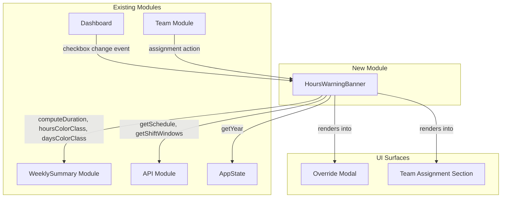

# Design Document: Proactive Hours Warning

## Overview

The Proactive Hours Warning feature adds a client-side, pre-submission informational banner that displays a teammate's current weekly hours and projected hours whenever a manager selects them for a shift assignment. Unlike the existing `ComplianceModal` (which fires reactively after a 422 API response), this feature computes and presents hours data proactively—before the manager clicks "Save Override" or confirms a team assignment.

The feature integrates into two existing UI surfaces:
1. **Override Modal** — the dashboard modal where managers assign teammates to specific date/shift overrides
2. **Team Assignment Section** — the team management view where managers edit teammate shift groups

It reuses the `WeeklySummary` module's `computeDuration`, `getEffectiveStart`, `hoursColorClass`, and `daysColorClass` functions to maintain consistency with the existing compliance summary rows. The banner is purely informational and never blocks submission.

## Architecture



### Design Decisions

1. **Single module, two integration points**: A single `HoursWarningBanner` IIFE module handles all computation and rendering. Dashboard and Team modules call into it when selections change. This avoids duplicating logic.

2. **Reuse WeeklySummary computation functions**: Rather than reimplementing duration/color logic, the banner calls `WeeklySummary.computeDuration`, `WeeklySummary.hoursColorClass`, and `WeeklySummary.daysColorClass` directly. This guarantees threshold consistency.

3. **Client-side only, no new API endpoints**: The banner computes projected hours from schedule data already fetched by the dashboard. For the Team section (which doesn't normally load schedule data), a single `API.getSchedule()` call fetches the current month's slots on demand.

4. **Informational only, never blocking**: The banner never prevents form submission. It uses `role="status"` and `aria-live="polite"` for non-intrusive screen reader announcements.

5. **Sorted by risk**: When multiple teammates are selected, entries are sorted by projected hours descending so the highest-risk teammate appears first.

## Components and Interfaces

### HoursWarningBanner Module

```javascript
var HoursWarningBanner = (function () {
    // Public API
    return {
        /**
         * Compute and display hours warning for selected teammates in the Override Modal.
         * @param {Object} options
         * @param {Array<string>} options.selectedNames - Names of checked teammates
         * @param {string} options.date - Override date (YYYY-MM-DD)
         * @param {string} options.shiftType - 'day' or 'night'
         * @param {Array} options.slots - Schedule slot array (already loaded by dashboard)
         * @param {Array} options.teammates - Full teammate objects array
         * @param {Object} options.shiftWindows - Shift window config
         * @param {HTMLElement} options.container - DOM element to render into
         */
        updateOverrideModal: function (options) {},

        /**
         * Compute and display hours warning for a single teammate in Team Assignment.
         * @param {Object} options
         * @param {Object} options.teammate - Teammate object
         * @param {string} options.shiftType - Target shift type
         * @param {HTMLElement} options.container - DOM element to render into
         */
        updateTeamAssignment: function (options) {},

        /**
         * Hide/clear the banner from a container.
         * @param {HTMLElement} container - DOM element containing the banner
         */
        clear: function (container) {},

        /**
         * Compute a single teammate's weekly hours and days for a given week.
         * Pure computation, no DOM interaction.
         * @param {string} teammateName - Name of the teammate
         * @param {string} weekStart - Sunday date (YYYY-MM-DD)
         * @param {string} weekEnd - Saturday date (YYYY-MM-DD)
         * @param {Array} slots - Schedule slot array
         * @param {Object} teammate - Teammate object (for custom_start)
         * @param {Object} shiftWindows - Shift window config
         * @returns {{currentHours: number, currentDays: number}}
         */
        computeTeammateWeeklyHours: function (teammateName, weekStart, weekEnd, slots, teammate, shiftWindows) {},

        /**
         * Compute projected hours by adding pending shift duration to current hours.
         * @param {number} currentHours - Current weekly hours
         * @param {string} shiftType - 'day' or 'night'
         * @param {Object} teammate - Teammate object (for custom_start)
         * @param {Object} shiftWindows - Shift window config
         * @returns {number} Projected total hours
         */
        computeProjectedHours: function (currentHours, shiftType, teammate, shiftWindows) {},

        /**
         * Determine the work week (Sunday–Saturday) containing a given date.
         * @param {string} dateStr - YYYY-MM-DD
         * @returns {{start: string, end: string}} Week boundaries
         */
        getWeekForDate: function (dateStr) {},

        /**
         * Get the text label for a compliance color class.
         * @param {string} colorClass - 'compliance-green', 'compliance-yellow', or 'compliance-red'
         * @returns {string} 'OK', 'Caution', or 'Over Limit'
         */
        colorToLabel: function (colorClass) {}
    };
})();
```

### Integration Points

**Dashboard module (override modal)**:
- On checkbox `change` event inside `#override-teammate-list`, call `HoursWarningBanner.updateOverrideModal()` with the current selections, date, shift type, and cached schedule data.
- On modal close/cancel, call `HoursWarningBanner.clear()`.

**Team module (team assignment section)**:
- On edit action that changes a teammate's shift type, call `HoursWarningBanner.updateTeamAssignment()`.
- On cancel/save, call `HoursWarningBanner.clear()`.

## Data Models

### TeammateHoursEntry (internal to HoursWarningBanner)

```javascript
{
    name: string,           // Teammate display name
    currentHours: number,   // Total hours already scheduled this week
    currentDays: number,    // Distinct days already scheduled this week
    projectedHours: number, // currentHours + pending shift duration
    projectedDays: number,  // currentDays + 1 (if date not already scheduled)
    hoursColor: string,     // CSS class from WeeklySummary.hoursColorClass(projectedHours)
    daysColor: string,      // CSS class from WeeklySummary.daysColorClass(projectedDays)
    hoursLabel: string,     // 'OK', 'Caution', or 'Over Limit'
    daysLabel: string       // 'OK' or 'Over Limit'
}
```

### Week Boundaries

```javascript
{
    start: string,  // YYYY-MM-DD (Sunday)
    end: string     // YYYY-MM-DD (Saturday)
}
```

### Compliance Thresholds (reused from WeeklySummary)

| Metric | Green | Yellow | Red |
|--------|-------|--------|-----|
| Hours  | < 50  | 50–59  | ≥ 60 |
| Days   | < 6   | —      | ≥ 6  |

### Shift Duration Computation

```
duration = (endTime - startTime)
if duration <= 0: duration += 24 hours  // overnight
duration -= 30 minutes  // FHD/BHD handoff deduction
```

Uses `WeeklySummary.computeDuration(effectiveStart, endTime)` where `effectiveStart` is determined by `WeeklySummary.getEffectiveStart(teammate, shiftType, shiftWindows)`.


## Correctness Properties

*A property is a characteristic or behavior that should hold true across all valid executions of a system—essentially, a formal statement about what the system should do. Properties serve as the bridge between human-readable specifications and machine-verifiable correctness guarantees.*

### Property 1: Week boundary computation is correct

*For any* valid date string (YYYY-MM-DD), `getWeekForDate(date)` SHALL return a `start` that is a Sunday on or before the date and an `end` that is the following Saturday, such that `start <= date <= end` and `end - start == 6 days`.

**Validates: Requirements 1.1, 5.2**

### Property 2: Weekly hours summation matches slot durations

*For any* teammate name, valid week boundaries, and set of schedule slots, `computeTeammateWeeklyHours` SHALL return `currentHours` equal to the sum of `WeeklySummary.computeDuration(effectiveStart, endTime)` for all slots within the week that include that teammate, and `currentDays` equal to the count of distinct dates among those slots.

**Validates: Requirements 1.1, 2.1**

### Property 3: Projected hours equals current hours plus shift duration

*For any* current hours value (≥ 0), shift type ('day' or 'night'), teammate object (with or without custom_start), and valid shift windows configuration, `computeProjectedHours` SHALL return `currentHours + WeeklySummary.computeDuration(effectiveStart, shiftWindows[shiftType].end)` where `effectiveStart` is `teammate.custom_start` if present, otherwise `shiftWindows[shiftType].start`.

**Validates: Requirements 2.1, 2.2, 2.3**

### Property 4: Color classification matches compliance thresholds

*For any* non-negative hours value, the assigned color class SHALL be `'compliance-green'` when hours < 50, `'compliance-yellow'` when 50 ≤ hours < 60, and `'compliance-red'` when hours ≥ 60. *For any* non-negative days count, the assigned color class SHALL be `'compliance-green'` when days < 6 and `'compliance-red'` when days ≥ 6.

**Validates: Requirements 3.1, 3.2, 3.3, 3.4**

### Property 5: Rendered entries match selected teammates

*For any* non-empty set of selected teammate names and corresponding schedule data, the banner SHALL render exactly one entry per selected name, and each entry SHALL contain the teammate's name, current hours value, projected hours value, and a compliance color indicator.

**Validates: Requirements 4.2, 4.4, 7.1**

### Property 6: Entries are sorted by projected hours descending

*For any* list of two or more teammate hours entries, the rendered order SHALL have each entry's projected hours greater than or equal to the next entry's projected hours (i.e., sorted descending).

**Validates: Requirements 7.2**

### Property 7: Red threshold warning count is accurate

*For any* set of teammate hours entries, the displayed warning count SHALL equal the number of entries whose projected hours are ≥ 60. When the count is zero, no warning summary SHALL be displayed.

**Validates: Requirements 4.5, 7.3**

### Property 8: Accessibility labels contain name and compliance status

*For any* teammate hours entry, the rendered element SHALL include an `aria-label` attribute containing the teammate's name, the projected hours value, and a text status label ('OK', 'Caution', or 'Over Limit') that corresponds to the compliance color classification. The text label SHALL not rely solely on color.

**Validates: Requirements 8.2, 8.3, 8.4**

## Error Handling

| Scenario | Behavior |
|----------|----------|
| Schedule data not yet loaded | Display a "Loading hours..." indicator with a spinner; compute once data arrives |
| Teammate not found in schedule slots | Display "0.0h current" (no slots = no hours) |
| Shift windows not available | Fall back to default windows: day 06:00–18:30, night 18:00–06:30 |
| Invalid date string passed | Gracefully return empty/hidden banner; log warning to console |
| API call fails (Team section) | Show "Hours unavailable" message in banner; do not block submission |
| Zero-duration shift (start == end after handoff deduction) | Display 0.0h projected addition; WeeklySummary.computeDuration already clamps to 0 |

The banner never throws exceptions that could break the parent modal or form submission flow. All computation is wrapped in try/catch with fallback to a safe hidden state.

## Testing Strategy

### Unit Tests (Example-Based)

- **UI trigger tests**: Verify checkbox change events trigger banner updates in Override Modal
- **Team section trigger**: Verify shift assignment action triggers banner with current week
- **Loading state**: Verify loading indicator appears when slots are null
- **Cancel/dismiss**: Verify banner clears when modal is closed
- **Accessibility attributes**: Verify `role="status"`, `aria-live="polite"` are present on the banner container
- **Non-blocking**: Verify submit button remains enabled regardless of banner state
- **Edge cases**: Empty teammate list, single teammate, teammate with no scheduled slots

### Property-Based Tests (fast-check)

The project uses vanilla JavaScript in the browser. Property tests will use **fast-check** as the PBT library, running in a Jest/jsdom environment alongside the existing test infrastructure.

Each property test must:
- Run a minimum of **100 iterations**
- Reference its design document property via a tag comment
- Use the format: `// Feature: proactive-hours-warning, Property {N}: {title}`

**Properties to implement:**
1. Week boundary computation (Property 1)
2. Weekly hours summation (Property 2)
3. Projected hours computation (Property 3)
4. Color classification thresholds (Property 4)
5. Rendered entries match selections (Property 5)
6. Sort order by projected hours (Property 6)
7. Red threshold warning count (Property 7)
8. Accessibility label content (Property 8)

### Integration Tests

- **Override Modal end-to-end**: Open modal → check teammates → verify banner appears with correct data → submit override → verify banner doesn't interfere
- **Team section data fetch**: Verify that when schedule data isn't cached, a single API call is made and banner renders after response
- **Consistency with WeeklySummary**: Verify banner hours match the weekly summary row values for the same teammate/week
