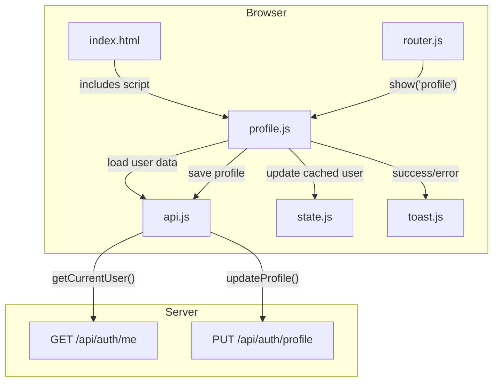

# Design Document: Profile UI

## Overview

This feature adds a Profile view to the DC-ShiftMaster Pro HTML frontend, allowing users to view and update their email address and email notification preference. The backend already provides `GET /api/auth/me` (returns user info including `email` and `email_notifications_enabled`) and `PUT /api/auth/profile` (accepts `{email, email_notifications_enabled}`). The frontend currently has no UI for these fields.

The Profile view follows the same vanilla HTML/CSS/JS IIFE-module pattern used by existing views (Settings, Coverage, My Shifts). It consists of:

1. A new `profile.js` module that renders the form and handles submission
2. A new `<section id="profile-view">` in `index.html`
3. Navigation items in both the sidebar and mobile bottom nav
4. An `updateProfile` method added to the `API` module
5. Router registration so the view loads and highlights correctly

### Key Design Decisions

1. **Follow existing patterns exactly**: The profile module uses the same IIFE + global loader function pattern as `settings.js`. HTML is built via string concatenation in the `load()` function, matching the project convention (no templates, no framework).

2. **Single form, single PUT**: The email input and notification toggle are submitted together in one `PUT /api/auth/profile` request, matching the backend's single-endpoint design.

3. **Reuse existing CSS classes**: The view uses `settings-section`, `form-group`, `form-control`, and `btn` classes already defined in `theme.css`. No new CSS is needed.

4. **Update `AppState.user` on success**: After a successful profile save, the locally cached `AppState.user` object is updated with the new values so other parts of the app see current data without a full page reload.

5. **Profile nav placement**: The sidebar item goes after "My Shifts" (last in the current list). The bottom nav gets a Profile item appended at the end.

## Architecture



User flow:

1. User clicks "Profile" in sidebar or bottom nav
2. `Router.show('profile')` hides other views, shows `#profile-view`, calls `loadProfile()`
3. `Profile.load()` calls `API.getCurrentUser()` to fetch fresh data
4. Form is rendered with current email and notification preference
5. User edits fields and clicks "Save"
6. `API.updateProfile({email, email_notifications_enabled})` sends `PUT /api/auth/profile`
7. On success: Toast shown, `AppState.user` updated with response data
8. On error: Toast shown with backend error message, save button re-enabled

## Components and Interfaces

### 1. `profile.js` — New Module

```javascript
// dc_shiftmaster_html/static/js/profile.js

var Profile = (function () {
    function load() {
        // 1. Render the profile view HTML into #profile-view
        //    - h2 heading "Profile"
        //    - settings-section with read-only display name and username
        //    - settings-section with email input (type="email") and notification checkbox
        //    - Save button (btn btn-primary)
        // 2. Call API.getCurrentUser() to populate fields
        // 3. Attach submit handler to Save button
        //    - Disable button during request
        //    - Call API.updateProfile({email, email_notifications_enabled})
        //    - On success: Toast.show('Profile updated', 'success'), update AppState.user
        //    - On error: Toast.show(err.message, 'error')
        //    - Re-enable button in finally
    }

    return { load: load };
})();

function loadProfile() { Profile.load(); }
```

### 2. `api.js` — Extended

Add one new method to the returned object:

```javascript
updateProfile: function (data) { return json('PUT', '/api/auth/profile', data); }
```

This follows the same `json(method, url, data)` pattern used by `updateTeammate`, `setRegion`, etc.

### 3. `index.html` — Extended

New elements added:

- Sidebar: `<li class="nav-item" data-view="profile">` after the "My Shifts" item
- Bottom nav: `<li class="bottom-nav-item" data-view="profile">` appended to the list
- Main content: `<section id="profile-view" class="view" hidden></section>` after `my-shifts-view`
- Script tag: `<script src="/static/js/profile.js"></script>` before `</body>`

### 4. `router.js` — Extended

Add `'profile'` to the `views` array and add a loader entry:

```javascript
var views = ['dashboard', 'team', 'settings', 'export', 'login', 'coverage', 'my-shifts', 'profile'];
// in loaders:
profile: function () { if (typeof loadProfile === 'function') loadProfile(); }
```

### 5. `state.js` — No Changes

`AppState.user` is already a plain object set by `auth.js` after login. The profile module updates it directly: `AppState.user = responseData;`

## Data Models

### Backend Response: `GET /api/auth/me` and `PUT /api/auth/profile`

Both endpoints return the same JSON shape:

```json
{
    "id": 1,
    "username": "jdoe",
    "display_name": "Jane Doe",
    "teammate_name": "Jane",
    "email": "jane@example.com",
    "email_notifications_enabled": true
}
```

### `PUT /api/auth/profile` Request Body

```json
{
    "email": "jane@example.com",
    "email_notifications_enabled": true
}
```

Both fields are optional in the request — the backend defaults to the current stored value for any omitted field.

### `AppState.user` — Client-Side

After login or profile update, `AppState.user` holds the same object shape as the backend response. The profile module reads `AppState.user.email` and `AppState.user.email_notifications_enabled` for initial form values (as a fast path), then refreshes from the server via `API.getCurrentUser()`.

### Profile View HTML Structure

```
#profile-view
  h2 "Profile"
  .settings-section  (read-only info)
    Display Name: <span>
    Username: <span>
  .settings-section  (editable form)
    .form-group
      label "Email Address"
      input#profile-email[type=email].form-control
    .form-group
      label
        input#profile-notifications[type=checkbox]
        "Enable email notifications"
    button#profile-save.btn.btn-primary "Save"
```


## Correctness Properties

*A property is a characteristic or behavior that should hold true across all valid executions of a system — essentially, a formal statement about what the system should do. Properties serve as the bridge between human-readable specifications and machine-verifiable correctness guarantees.*

### Property 1: Router view switching shows exactly one view and activates correct nav items

*For any* view name in the registered views list, calling `Router.show(name)` should result in exactly one `<section>` being visible (the one matching `name`), all other sections being hidden, and the sidebar and bottom-nav items with `data-view` equal to `name` having the `active` class while all others do not.

**Validates: Requirements 1.3, 1.4**

### Property 2: Profile data population matches user object

*For any* user object with arbitrary `display_name`, `username`, `email`, and `email_notifications_enabled` values returned by `GET /api/auth/me`, after the profile view loads, the email input value should equal `user.email`, the notification checkbox checked state should equal `user.email_notifications_enabled`, and the read-only display should contain `user.display_name` and `user.username`.

**Validates: Requirements 2.2, 2.3, 2.4**

### Property 3: Form submission sends correct payload

*For any* email string entered in the email input and any boolean state of the notification checkbox, clicking the Save button should produce a single `PUT /api/auth/profile` request whose JSON body contains `{email: <input value>, email_notifications_enabled: <checkbox state>}`.

**Validates: Requirements 3.2, 4.2, 5.1, 6.2**

### Property 4: Successful save updates AppState.user

*For any* profile update response containing `email` and `email_notifications_enabled` values, after a successful `PUT /api/auth/profile`, `AppState.user.email` should equal the response's `email` and `AppState.user.email_notifications_enabled` should equal the response's `email_notifications_enabled`.

**Validates: Requirements 5.4**

## Error Handling

| Scenario | Behavior |
|----------|----------|
| `GET /api/auth/me` fails (network error or non-2xx) | `Toast.show(err.message, 'error')` is called; form remains empty |
| `PUT /api/auth/profile` returns 400 (invalid email) | `Toast.show(err.message, 'error')` with backend message; Save button re-enabled |
| `PUT /api/auth/profile` returns 400 (notifications without email) | `Toast.show(err.message, 'error')` with backend message; Save button re-enabled |
| `PUT /api/auth/profile` returns 401 (session expired) | `Toast.show(err.message, 'error')`; user may need to re-login |
| Network failure during save | `Toast.show('Request failed (0)', 'error')`; Save button re-enabled |
| Save button double-click | Button is disabled immediately on click, preventing duplicate requests |

## Testing Strategy

### Unit Tests

Unit tests cover specific examples, edge cases, and integration points. These are written using a DOM testing approach (e.g., jsdom or browser-based test runner) since this is a frontend feature:

- Profile nav item exists in sidebar and bottom nav after page load (Req 1.1, 1.2)
- `loadProfile()` is called when `Router.show('profile')` is invoked (Req 1.5)
- `API.getCurrentUser()` is called when profile view loads (Req 2.1)
- Error toast shown when `GET /api/auth/me` fails (Req 2.5)
- Email input has `type="email"` attribute (Req 3.5)
- Success toast shown after successful profile update (Req 3.3, 4.4)
- Error toast shown for invalid email format response (Req 3.4)
- Error toast shown for "notifications without email" response (Req 4.3)
- Save button is disabled during request and re-enabled after (Req 5.2, 5.3)
- `API.updateProfile` method exists and calls `PUT /api/auth/profile` (Req 6.1)
- Profile view uses `settings-section`, `form-group`, `form-control`, `btn` CSS classes (Req 7.1, 7.2)

### Property-Based Tests

Property-based tests use the **fast-check** library (JavaScript PBT library suitable for this vanilla JS frontend project). Each property test runs a minimum of 100 iterations.

| Property | Test Description | Tag |
|----------|-----------------|-----|
| Property 1 | Generate a random view name from the views list, call `Router.show()`, assert exactly one section is visible and correct nav items are active | `Feature: profile-ui, Property 1: Router view switching shows exactly one view and activates correct nav items` |
| Property 2 | Generate random user objects with arbitrary strings for display_name/username/email and random booleans for email_notifications_enabled, mock `API.getCurrentUser()` to return them, load profile, assert form fields match | `Feature: profile-ui, Property 2: Profile data population matches user object` |
| Property 3 | Generate random email strings and random booleans, set form input values, trigger Save, intercept the fetch call, assert the request body matches `{email, email_notifications_enabled}` | `Feature: profile-ui, Property 3: Form submission sends correct payload` |
| Property 4 | Generate random response objects with email and notification fields, mock a successful PUT response, trigger Save, assert `AppState.user` fields match the response | `Feature: profile-ui, Property 4: Successful save updates AppState.user` |

Each correctness property is implemented by a single property-based test. Unit tests complement these by covering specific examples (structural checks, error cases, button state transitions) and integration points (API method existence, toast calls).
